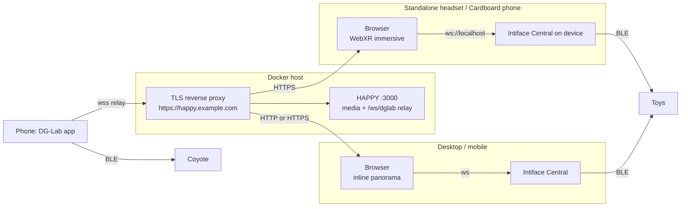
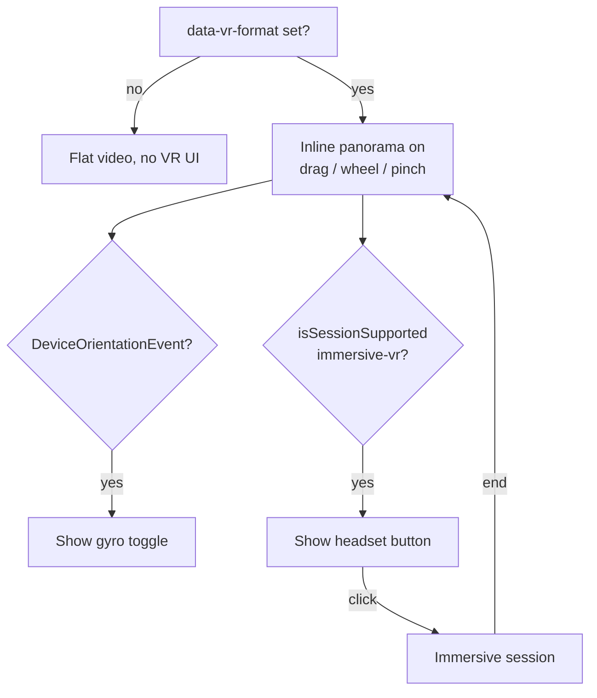

# Plan: VR180 playback (inline panorama + WebXR)

VR-detected videos get two device-dependent viewing modes, both rendering the same `<video>` element through one shared WebGL2 projection:

| Mode | Devices | Navigation | Requirements |
| --- | --- | --- | --- |
| **Inline panorama** (like YouTube 360) | Desktop, tablet, phone, also headset browsers in 2D | Mouse drag, touch drag, wheel/pinch zoom; optional gyroscope ("magic window") on mobile | WebGL2 only; works over plain HTTP (gyroscope needs HTTPS) |
| **Immersive** (`immersive-vr`) | Standalone headsets, Cardboard on Chrome Android | Head tracking; controller/screen tap | WebXR + HTTPS |

The inline panorama is the default for VR files on every device; immersive mode is an extra button shown only when `immersive-vr` is supported.

**Delivery order:**

1. **Stage 0 — Foundation:** mode-agnostic shared code plus the one refactor of existing code (drag guard for the skin's tap gestures). No visible change.
2. **Stage 1 — PC and phone:** inline panorama with mouse/touch/gyro navigation. Ships on its own, no deployment changes.
3. **Stage 2 — VR headsets:** WebXR immersive mode, added on top of Stage 0/1 without reworking them (new renderer, new mode value, new button).

Phone-tethered glasses (e.g. USB-C display glasses driven by a phone) remain unsupported: the browser only sees the phone's IMU, not the glasses. Cardboard works because the phone itself is on the head.

## Key constraints

- Stage 0/1 need no deployment changes. Inline mode needs no secure context: mouse/touch navigation works on `http://<lan-ip>:3000`. Only `DeviceOrientationEvent` (gyroscope) requires HTTPS, and iOS additionally requires `DeviceOrientationEvent.requestPermission()` from a click.
- WebXR requires a **secure context of the page origin**. A client loading `http://<lan-ip>:3000` has no `navigator.xr`, regardless of where Intiface runs.
- HTTPS is therefore required for immersive mode. It can stay LAN-only: TLS reverse proxy + local DNS (e.g. `https://happy.example.com`). Media is served from the same origin (`/api/media/:id`), so there is no mixed content or CORS (also required for WebGL texture upload: cross-origin video would taint the texture).
- Intiface on the client device is simpler: an HTTPS page may connect to `ws://localhost:12345` (localhost is exempt from mixed-content blocking). No `wss` proxy and no change to `normalizeIntifaceAddress()` in `src/client/index.ts`.
- Non-HTTPS fallback (discouraged): an SSH tunnel on the client (`ssh -N -L 3000:<server>:3000`) and `http://localhost:3000`. DG-Lab pairing then needs the existing pairing-host override in `src/client/components/haptic/dglab/coyoteBackend.ts`, because a phone cannot reach `localhost`.
- Never auto-enter immersive VR because a headset is present; only an explicit button click starts a session. Auto-enabling the *inline* panorama for VR files is fine.
- Device handling is **capability-based**, not user-agent sniffing: `immersive-vr` support decides the headset button, `pointer`/touch events drive inline navigation, `DeviceOrientationEvent` presence decides the gyro toggle.

## Architecture

## Stage 0: Foundation (no visible change)

Goal: everything both modes share is built and tested once, so Stage 2 only adds a renderer, a mode value and a button. Current codebase facts: no WebGL or matrix helpers exist (only 2D canvases in the haptic visualizer); haptic sync in `src/client/components/funscriptSync.ts` is a `setTimeout` tick reading the store, so it is independent of any render loop and needs no refactor.

1. **Format parser** — `src/shared/vrFormat.ts`:
   - `parseVrFormat(filename): { fov: 180; layout: 'sbs' | 'tb' } | null`.
   - Case-insensitive tokens at `_ . -` or space boundaries: `180` + `LR`/`SBS`/`3DH` → `sbs`; `180` + `TB`/`OU`/`3DV` → `tb`; `VR180` alone → `sbs`. Anything else → `null` (no button).
   - Tests in `test/client/vrFormat.test.ts`.
2. **Mark tracks as VR** (depends on 1):
   - Add optional `vr` to `PlaybackRequest` in `src/shared/types.ts`, filled from `TrackInfo.filename` where requests are built (`src/client/components/player/controller.ts`).
   - `PlaybackSession.loadSlot()` in `src/client/components/player/session.ts` sets/removes `data-vr-format` (`180-sbs` | `180-tb`) on `<video-player>`. Both slots are handled independently; each player owns its own VR state.
3. **Camera math** — `src/client/components/vr/camera.ts`, pure functions, no DOM/GL (parallel with 1–2):
   - `perspective(fovY, aspect)`, `rotation(yaw, pitch)` → `Float32Array` 4×4.
   - `applyDrag(state, dxPx, dyPx, viewportHeightPx)`: angle per pixel = `fovY / viewportHeight`, so content follows the pointer 1:1; drag right → look left (YouTube behavior).
   - `clampView(state)`: pitch ±90°; yaw clamped to ±(90° − hFov/2) so the inline view never shows the black back hemisphere (fall back to 0 when hFov ≥ 180°); `fovY` clamped to ~30°–100° for zoom.
   - `fromDeviceOrientation(alpha, beta, gamma, screenAngle)` → yaw/pitch offset relative to a captured baseline.
   - Tests in `test/client/vrCamera.test.ts`.
4. **Shared projection** — `src/client/components/vr/projection.ts`, no Video.js imports (parallel with 1–3):
   - `createVrProjection(gl, format)` → `{ upload(video), draw(viewport, projection, rotation, eye), dispose() }`.
   - The API takes arbitrary projection/rotation matrices and an eye, so `XRView`s plug in unchanged in Stage 2 even though Stage 1 only draws the left eye.
   - One fullscreen triangle; the shader reconstructs the ray from `inverse(projection)` and the **rotation-only** view matrix (no translation, so the image does not shift with head movement). Equivalent to texturing a hemisphere interior, without a mesh.
   - Longitude/latitude → UV over 180°; `eye: 'left' | 'right'` picks the left/top or right/bottom half; outside ±90° longitude renders black.
   - `upload` calls `texImage2D(video)` only when `readyState >= 2`; `LINEAR`, `CLAMP_TO_EDGE`, `UNPACK_FLIP_Y`.
5. **Mode contract** — `src/client/components/vr/types.ts`:
   - `type VrMode = 'flat' | 'inline' | 'immersive'` (Stage 1 only uses the first two).
   - `interface VrView { start(): Promise<void>; stop(): void }`, implemented by `InlineVrView` (Stage 1) and `ImmersiveVrSession` (Stage 2). The feature switches modes only through this interface.
6. **Drag guard (refactor of existing code)** — the skin's tap gestures in `@/components/videojs/video/skin.html` (`<media-gesture type="tap" action="togglePaused" pointer="mouse" region="center">`, `type="tap" action="toggleControls" pointer="touch"`, `type="doubletap" action="toggleFullscreen"`) would fire at the end of every panorama drag.
   - First check how `<media-gesture>` detects taps (which element it listens on, `pointerup` vs `click`).
   - Add a small capture-phase listener on `<media-container>` that tracks pointer movement and, after a drag (> ~6 px), stops the terminating event before the gestures see it. Keep it generic and inactive unless the player has `data-vr-format`, so flat playback is untouched.
   - Real taps keep reaching the existing gestures, so neither mode needs its own play/pause tap handling.

## Stage 1: PC and phone (inline panorama)

Ships independently over plain HTTP; only the gyroscope toggle needs HTTPS.

1. **Inline view** — `src/client/components/vr/inline.ts`, implements `VrView` (depends on Stage 0):
   - API: `new InlineVrView(container, video, format)`, `start()`, `stop()`, `setGyro(enabled): Promise<boolean>`, `resetView()`.
   - Inserts a `<canvas>` directly above the `<video>` inside the media container (below the controls), hides the video visually (`opacity: 0`, not `display: none`, so decoding continues). Fullscreen and PiP of the container keep working; PiP shows the raw frame.
   - Mono rendering: left eye only, `perspective(fovY, canvas aspect)`.
   - Size via `ResizeObserver` × `devicePixelRatio` (cap DPR at 2).
   - Render loop: `video.requestVideoFrameCallback` for uploads where available, `requestAnimationFrame` for redraws while dragging/gyro; idle when paused and not interacting.
   - Input with Pointer Events (`touch-action: none` on the canvas): single pointer drag rotates; two pointers pinch-zoom; `wheel` zooms (`preventDefault`, passive: false). Events bubble to the container, where the Stage 0 drag guard decides whether the skin's tap/double-tap gestures fire.
   - Gyro: `setGyro(true)` calls `DeviceOrientationEvent.requestPermission?.()` (must be inside a click), captures a baseline, then adds the orientation offset to the drag yaw/pitch. Handle `screen.orientation` changes.
   - `stop()` removes the canvas and listeners, restores the video, disposes GL; the last yaw/pitch/fov is kept so a later `start()` resumes the same view.
2. **Feature** — `@/components/videojs/features/vr.ts`, modeled on `features/loop.ts`:
   - State `{ vrFormat, vrMode, vrGyroAvailable, vrGyro, setVrMode(mode), toggleVrGyro(), resetVrView() }`, shaped so Stage 2 only adds fields.
   - `attach`: `vrGyroAvailable = 'DeviceOrientationEvent' in window && isSecureContext && matchMedia('(pointer: coarse)').matches`. Observes `data-vr-format` on the player element (`MutationObserver`); `vrMode` becomes `'inline'` for VR tracks and `'flat'` otherwise, and the user's choice persists for the current track only.
   - `setVrMode` stops the current `VrView` and starts the new one on `target.media`.
   - Register in `@/components/videojs/player.ts`; export `selectVr`.
3. **Buttons** — `@/components/videojs/ui/vr-*-button.ts` (+ CSS), modeled on `ui/loop-button.ts`. All `hidden` unless `data-vr-format` is present (audio-only players never show them):
   - `<media-vr-view-button>` → toggles `'inline'` ↔ `'flat'` (raw SBS/TB frame); icon `badge-vr` / `badge-vr-fill`.
   - `<media-vr-gyro-button>` → `toggleVrGyro`; additionally hidden unless `vrGyroAvailable` and `vrMode === 'inline'`; icon `phone`.
   - Add to `@/components/videojs/video/skin.html` (controls row, next to `<media-loop-button>`) and import in `skin.ts`; collapse into one menu if the control bar gets crowded on mobile.
4. **Device specifics:**
   - **Desktop**: drag with mouse, wheel zoom, click = play/pause (only without drag), double-click fullscreen. Initial view centered (yaw 0, pitch 0, `fovY` 75°).
   - **Mobile**: touch drag, pinch zoom, tap = toggle controls (existing behavior); gyro opt-in via button (iOS permission prompt). Fullscreen recommended.
   - Performance risk: 8K may be too slow with a per-frame texture upload on mobile; start with 4K–5.7K.
5. **Docs:**
   - User docs (`docs/library.md` or a new page linked from `docs/index.md`): filename conventions, mouse/touch/gyro navigation, the view and gyro buttons, gyro needs HTTPS.
   - `ARCHITECTURE.md` and `docs/developer/client.md`: VR section describing camera / projection / mode contract / inline view, the drag guard and the Video.js feature split.
6. **Verification:**
   - `npm run build` and `npm test` pass.
   - Desktop Chrome/Firefox on `http://<lan-ip>:3000`: VR-named files open as panorama; drag rotates (clamped at the image edges), wheel zooms, click toggles play only without drag, view toggle shows the raw frame; flat files and audio unchanged; fullscreen works; both player slots behave independently.
   - Mobile browser: touch drag/pinch, tap toggles controls; over HTTPS the gyro button appears and works (iOS permission prompt).

## Stage 2: VR headsets (immersive WebXR)

Starts after Stage 1 has shipped. Adds files and fields only; Stage 0/1 code is reused as-is.

1. **Device checks (manual, before coding)** — open `https://immersive-web.github.io/webxr-samples/immersive-vr-session.html` in the headset (or Cardboard phone) browser:
   - The browser exposes `immersive-vr` and head movement rotates the view. Desktop Linux Chromium/Firefox do not ship WebXR headset support; an Android/OpenXR browser is required. Without it, only inline mode is available.
   - An Intiface Central build for the device architecture (often ARM64) runs and finds the toys via BLE.
   - The page reaches `ws://localhost:12345`.
2. **Deployment (no code)**:
   - Local DNS: LAN-only hostname (e.g. `happy.example.com`) → Docker host.
   - Any TLS reverse proxy (Caddy, Traefik, nginx, Nginx Proxy Manager, …): Let's Encrypt via **DNS-01** challenge, since the host is not internet-reachable.
   - Enable WebSocket forwarding (DG-Lab relay), target HAPPY `:3000`; optionally disable response buffering for large range requests.
   - Set `TRUST_PROXY=1` on the container.
   - The DG-Lab phone must use the same local DNS so it resolves the pairing host.
3. **Immersive session** — `src/client/components/vr/immersive.ts`, implements `VrView`:
   - API: `new ImmersiveVrSession(video, format, { onSelect, onEnd })`, `start()`, `stop()`.
   - `start()` must run inside the click handler: `navigator.xr.requestSession('immersive-vr')`, `requestReferenceSpace('local')`, offscreen canvas with `getContext('webgl2', { xrCompatible: true })`, `XRWebGLLayer`.
   - Per `XRView`: `draw(viewport, view.projectionMatrix, rotation-only view.transform.inverse, view.eye === 'right' ? 'right' : 'left')`. Cardboard yields two views like a headset; no special case.
   - `select` → `onSelect`; `squeeze` (if available) → end session; session `end` → `onEnd` and release all GL resources.
4. **Feature extension** — in `features/vr.ts`:
   - Add `vrImmersiveSupported` (checked once via `navigator.xr?.isSessionSupported('immersive-vr')`) and allow `setVrMode('immersive')`.
   - Entering exits fullscreen/PiP and stops the inline view (its camera state is kept); `onEnd` returns to `'inline'`.
   - `onSelect` toggles `media.play()` / `media.pause()` so the store, `PlaybackSession.promote()`, footer and haptics stay in sync.
5. **Button** — `<media-vr-headset-button>` → `setVrMode('immersive')`; additionally hidden unless `vrImmersiveSupported`; icon `headset-vr`.
6. **Device specifics:**
   - **Standalone headset browser**: the 2D page shows the inline panorama; the headset button starts immersive mode. Controller trigger = play/pause, squeeze = exit.
   - **Cardboard (Chrome Android, HTTPS)**: headset button starts the stereo Cardboard session; screen tap = `select` = play/pause; exit via the system back gesture/X.
   - Intiface runs on the client device at `ws://localhost:12345`; no code change needed.
   - DG-Lab: the app stays on a phone; pair via the QR code before entering immersive VR.
7. **Docs:**
   - `docs/installation.md`: "VR headset playback" section — why HTTPS is required (and why Intiface on localhost does not replace it), generic reverse proxy + DNS-01 setup, `TRUST_PROXY=1`, headset/Cardboard setup.
   - User docs: the headset button. Developer docs: the immersive renderer.
8. **Verification:**
   - `npm run build` and `npm test` pass.
   - Desktop Chrome on `http://localhost:3000` with the Immersive Web Emulator extension: headset button appears, correct half per eye, head rotation works, exit returns to the inline view with the previous camera.
   - On the headset (and Cardboard) over the HTTPS hostname: enter VR, trigger/tap toggles play/pause, exit returns to the same position; Intiface on localhost and the DG-Lab relay keep driving devices. Haptic sync must not drift over several minutes (the `setTimeout` tick may be throttled while the page is hidden behind the XR session); if it does, drive the sync tick from `XRSession.requestAnimationFrame` while in VR.

## Out of scope

360° and fisheye projections, in-VR seek bar/UI, WebXR media layers (`XRMediaBinding`), WebXR `inline` sessions (the custom inline view replaces them), keyboard navigation of the panorama (arrow keys stay seek/volume), stereo anaglyph inline rendering, per-track format override UI, phone-tethered display glasses. The SSH-tunnel path is documented only as a fallback.
