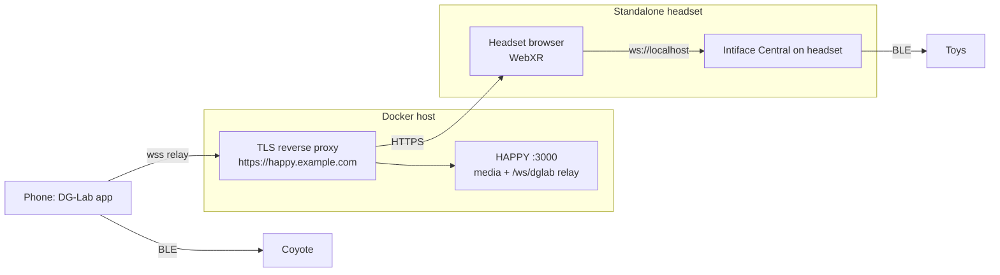

# Plan: VR180 playback via WebXR

Add a VR button to the Video.js v10 player for VR-detected videos. Clicking it plays the same `<video>` element in a WebXR `immersive-vr` session through a custom WebGL2 renderer.

The client is a **standalone headset** that opens HAPPY in its own browser and runs Intiface Central locally. Phone-tethered headsets/glasses are not supported: Chrome Android only offers Cardboard WebXR, which tracks with the phone IMU and never with the headset.

## Key constraints

- WebXR requires a **secure context of the page origin**. A client loading `http://<lan-ip>:3000` has no `navigator.xr`, regardless of where Intiface runs.
- HTTPS is therefore required. It can stay LAN-only: TLS reverse proxy + local DNS (e.g. `https://happy.example.com`). Media is served from the same origin (`/api/media/:id`), so there is no mixed content or CORS.
- Intiface on the client device is simpler: an HTTPS page may connect to `ws://localhost:12345` (localhost is exempt from mixed-content blocking). No `wss` proxy and no change to `normalizeIntifaceAddress()` in `src/client/index.ts`.
- Non-HTTPS fallback (discouraged): an SSH tunnel on the client (`ssh -N -L 3000:<server>:3000`) and `http://localhost:3000`. DG-Lab pairing then needs the existing pairing-host override in `src/client/components/haptic/dglab/coyoteBackend.ts`, because a phone cannot reach `localhost`.
- Never auto-enter VR because a headset is present; only an explicit button click starts a session.

## Architecture

## Phase 0: Device checks (manual, before coding)

Open `https://immersive-web.github.io/webxr-samples/immersive-vr-session.html` in the headset browser.

1. The browser exposes `immersive-vr` and head movement rotates the view. **This is the blocker** — desktop Linux Chromium/Firefox do not ship WebXR headset support; an Android/OpenXR browser is required.
2. An Intiface Central build for the headset architecture (often ARM64) runs and finds the toys via BLE.
3. The page reaches `ws://localhost:12345`.

## Phase 1: Deployment (no code)

1. Local DNS: LAN-only hostname (e.g. `happy.example.com`) → Docker host.
2. Any TLS reverse proxy (Caddy, Traefik, nginx, Nginx Proxy Manager, …): Let's Encrypt via **DNS-01** challenge, since the host is not internet-reachable.
3. Enable WebSocket forwarding (DG-Lab relay), target HAPPY `:3000`; optionally disable response buffering for large range requests.
4. Set `TRUST_PROXY=1` on the container.
5. The DG-Lab phone must use the same local DNS so it resolves the pairing host.

## Phase 2: Shared code

1. **Format parser** — `src/shared/vrFormat.ts`:
   - `parseVrFormat(filename): { fov: 180; layout: 'sbs' | 'tb' } | null`.
   - Case-insensitive tokens at `_ . -` or space boundaries: `180` + `LR`/`SBS`/`3DH` → `sbs`; `180` + `TB`/`OU`/`3DV` → `tb`; `VR180` alone → `sbs`. Anything else → `null` (no button).
   - Tests in `test/client/vrFormat.test.ts`.
2. **Mark tracks as VR** (depends on 1):
   - Add optional `vr` to `PlaybackRequest` in `src/shared/types.ts`, filled from `TrackInfo.filename` where requests are built.
   - `PlaybackSession.loadSlot()` in `src/client/components/player/session.ts` sets/removes `data-vr-format` (`180-sbs` | `180-tb`) on `<video-player>`.
3. **`VRRenderer`** — `src/client/components/vr/renderer.ts`, no Video.js imports (parallel with 1–2):
   - API: `new VRRenderer(video, format, { onSelect, onEnd })`, `start(): Promise<void>`, `stop()`.
   - `start()` must run inside the click handler: `navigator.xr.requestSession('immersive-vr')`, `requestReferenceSpace('local')`, offscreen canvas with `getContext('webgl2', { xrCompatible: true })`, `XRWebGLLayer`.
   - Per view, one fullscreen triangle; the shader reconstructs the ray from `inverse(projectionMatrix)` and the **rotation-only** view matrix (no translation, so the image does not shift with head movement). Equivalent to texturing a hemisphere interior, without a mesh.
   - Longitude/latitude → UV over 180°; left eye (`view.eye !== 'right'`) samples the left/top half, right eye the right/bottom half; outside ±90° longitude renders black.
   - `texImage2D(video)` only when `readyState >= 2`; `LINEAR`, `CLAMP_TO_EDGE`, `UNPACK_FLIP_Y`.
   - `select` → `onSelect`; `squeeze` (if available) → end session; session `end` → `onEnd` and release all GL resources.
4. **Feature** — `@/components/videojs/features/vr.ts`, modeled on `features/loop.ts` (depends on 3):
   - State `{ vrSupported, vrActive, enterVr(), exitVr() }`; `attach` checks `navigator.xr?.isSessionSupported('immersive-vr')` once.
   - `enterVr` reads `data-vr-format` from the player element, exits fullscreen/PiP, starts `VRRenderer` on `target.media`.
   - `onSelect` toggles `media.play()` / `media.pause()` so the store, `PlaybackSession.promote()`, footer and haptics stay in sync.
   - Register in `@/components/videojs/player.ts`; export `selectVr`.
5. **Button** — `@/components/videojs/ui/vr-button.ts` (+ CSS), modeled on `ui/loop-button.ts` (depends on 4):
   - Tag `<media-vr-button>`, `createButton({ onActivate: enterVr })`.
   - `hidden` unless `vrSupported` **and** `data-vr-format` is present (audio-only players never show it).
   - Add to the minimal video skin under `@/components/videojs/skins/video/minimal/`; Bootstrap icon `badge-vr`.

## Phase 3: Headset specifics

- Input: controller trigger = play/pause, squeeze = exit.
- Intiface runs on the headset at `ws://localhost:12345`; no code change needed.
- DG-Lab: the app stays on a phone; pair via the QR code before entering VR.
- Performance risk: 8K may be too slow with a per-frame texture upload; start with 4K–5.7K.

## Phase 4: Docs

- `docs/installation.md`: "VR playback" section — why HTTPS is required (and why Intiface on localhost does not replace it), generic reverse proxy + DNS-01 setup, `TRUST_PROXY=1`, filename conventions, headset setup.
- `ARCHITECTURE.md`: short WebXR section describing the `VRRenderer` / Video.js split.

## Verification

1. `npm run build` and `npm test` pass.
2. Desktop Chrome on `http://localhost:3000` with the Immersive Web Emulator extension: button only for VR-named files, correct half per eye, head rotation works.
3. On the headset over the HTTPS hostname: enter VR, trigger toggles play/pause, exit returns to the same position; Intiface on localhost and the DG-Lab relay keep driving devices. Haptic sync must not drift over several minutes; if it does, drive the sync tick from `XRSession.requestAnimationFrame` while in VR.

## Out of scope

360° and fisheye projections, in-VR seek bar/UI, WebXR media layers (`XRMediaBinding`), per-track format override UI, phone-tethered headsets/glasses. The SSH-tunnel path is documented only as a fallback.
