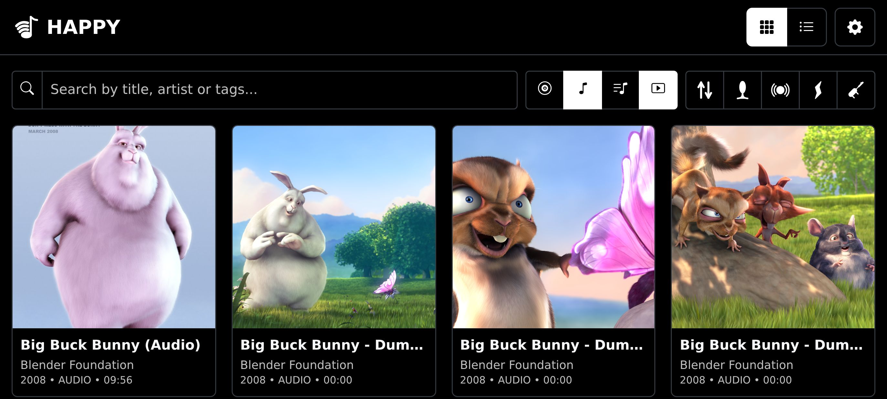
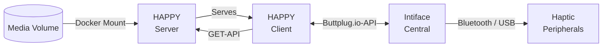
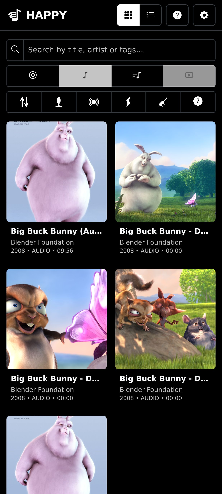
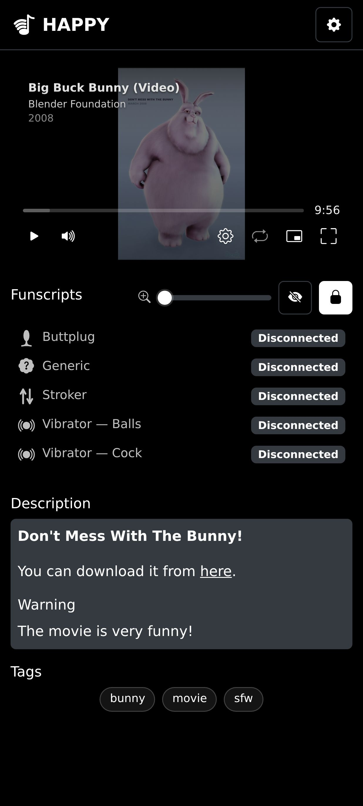

# HAPPY ⸺ Docker Haptic Player

**HAPPY** is a self-hosted **hap**tic **p**la**y**er for audio and video files.



Key features:

- Minimally intrusive: no internet required, only read-access to your media volume.
- No SQL database; everything is stored in the media files themselves and optionally markdown files.
- [Intiface Central](https://intiface.com/) as robust hardware bridge to your haptic toys.
- Widespread `.funscript` format is used for haptic control
- Multiple haptic toys in parallel are supported!
- Modern [Video.JS v10](https://videojs.org/blog/videojs-v10-release-candidate) framework for audio and video playback.
- Modern [Bootstrap](https://getbootstrap.com/) OLED-friendly, mobile-first UI.
- Prebuilt Docker image for easy setup.

What it tries not to be:

- A funscript editor. There are plenty of good tools already.
- A media file metadata editor. Use [Mp3tag](https://www.mp3tag.de/) (Win) or [Puddletag](https://docs.puddletag.net/) (Linux) instead.

## Overview



## Installation

### Intiface Central

For haptic support you will need to install [Intiface Central](https://intiface.com/#intiface-central).
Intiface Central connects to your toys directly and provides a generic API for haptic control. That makes it easy for this application to work with arbitrary haptic toys.

If you haven't used Intiface Central yet, check out their [Quickstart Guide](https://intiface.com/docs/intiface-central/quickstart). In short: start the server with the big "play" button, then press "start scan". If your devices are in pairing mode and are supported, it should be able to find the devices. Each device will expose different features like a "linear", "vibrate" or "rotate" feature. Each feature can be assigned to the same or different funscripts.

### Library Setup

HAPPY works with just your audio and video files. But if you want a more polished experience with tagging, file description and synchronization of haptic toys with your files, consider the following structure.

```
media/
├── audio.mp3
├── audio.md                 --> tags, description
├── audio.stroker.funscript  --> funscript for stroker toy
├── audio.buttplug.funscript --> funscript for buttplug toy
├── ...
├── video.mp4
├── video-extras/             --> related files don't need to be in same directory
│   └── video.md
│   └── video.stroker.funcscript
└── playlists/
    └── favorites.m3u        --> playlists are only supported as .m3u files
```

#### Funscripts

Funscripts must at least contain an `actions` field with an array of `at/pos` structures.

```json
// <audio_or_video_name>.<toy-suffix>.funscript
{
  "metadata": {
    "title": "",
    "creator": "",
    "tags": [],
    "chapters": [] // Currently not used; may be used in the future to show chapters in video player.
  },
  "actions": [
    {"at": 0,   "pos": 0},
    {"at": 100, "pos": 100},
    ...
  ]
}
```

In case want two scripts of the same type, name them as follows. The second suffix is arbitrary.

```
file.mp4
file.vibrator.cock.funscript
file.vibrator.balls.funscript
```

Funscripts without a recognised toy suffix (`file.funscript`) are still picked up and listed as
**Generic**. They can be assigned to any device just like typed scripts.

#### Markdown Descriptors

For tagging and file descriptions to work, create a Markdown `<audio_or_video_name>.md` file that contains tagging frontmatter and text to show.
Consider this is the most optional part of setting up your library. Tagging becomes more useful with growing library. And file descriptions may become interesting for files that come with instructions to the listener/viewer.

```markdown
---
tags:
  - sfw
  - vanilla
  - funny
---

This is a description that will be rendered using Markdown-it.
```

#### Media Metadata

The server uses [music-metadata](https://www.npmjs.com/package/music-metadata) to extract cover art, artist, date and name from the media files themselves.
The markdown files are only used to add a description with markup and tagging, both of which are not natively supported by `.mp3`, `.mp4` or similar files.
I recommend to use [Mp3tag](https://www.mp3tag.de/) (Win) or [Puddletag](https://docs.puddletag.net/) (Linux) to add that metadata to your files.

### Docker Setup

Create a `docker-compose.yml`. If you have one media directory with multiple subfolders, you can mount it to `/media` as follows.

```yaml
services:
  app:
    image: ghcr.io/lumbar-spine-support/docker-haptic-player:latest
    ports:
      - "8069:3000"
    volumes:
      - ./media:/media:ro # Audio, Video, Playlists, Funscripts (read-access)
      - ./config:/config # Persistent application settings (read/write access)
    restart: unless-stopped
```

In case you want to mount multiple folders, mount them as subfolders in `/media`. HAPPY does not care how the media is sorted. It connects media files with metadata and funscript files using their name only.

```yaml
volumes:
  - ./media/audio:/audio:ro # Audio, Funscripts (read-only)
  - ./media/video:/video:ro # Video, Funscripts (read-only)
  - ./media/playlists:/playlists:ro # Playlists (read-only)
  - ./config:/config # Persistent application settings (write-access required)
```

Now start the app using `docker compose up -d`. After a few seconds the app should be reachable under `http://<HOST>:8069`.

After the initial docker container startup, you should be able to find a `settings.yaml` in the directory you mounted at `/config` inside the container. Inside the generated file you will have some settings you may want to tweak in case you need to stick to another naming pattern for funscripts and or suffixes. For example you may want to have `file-prostate.funscript` not `file.buttplug.funscript`. To achieve that you could change the settings to:

```yaml

...
# Character that separates filename from funscript suffix
FUNSCRIPT_SUFFIX_SEPARATOR: "-"

# Suffix for buttplug funscript files
FUNSCRIPT_SUFFIX_BUTTPLUG: "prostate"
...
```

Note that you can also set all YAML-variables as environment variables instead. Environment variables have prescedence over YAML settings. This means you don't need a `/config/` mount, you can also set everything through environment variables in your `docker-compose.yml`.

## Planned Features

- [ ] Authentication layer. For obvious reasons
- [ ] Video.JS player improvements
  - [ ] Funscript chapters shown in Video.JS player for navigation.
  - [ ] VR Video support once Video.JS v10 matures.
- [ ] Playlist editor and a seperate mount with write-access.
- [ ] Improve Library viewer for large amount of files in database.

## Screenshots

| Library View                                          | Player View                                         |
| ----------------------------------------------------- | --------------------------------------------------- |
|  |  |

## License

This project is licensed under the MIT License — see [LICENSE](LICENSE).

Test media included in this repository may be subject to different licenses. See [LICENSES.md](LICENSES.md) for details on third-party content and attribution requirements.
