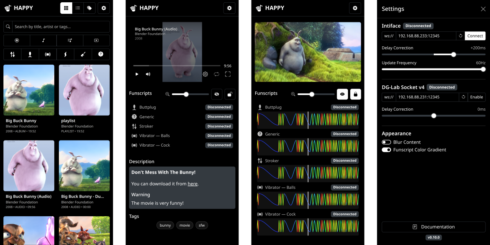

# HAPPY ⸺ Docker Haptic Player


[](https://github.com/lumbar-spine-support/docker-haptic-player/actions/workflows/npm-audit.yml)


**HAPPY** is a self-hosted **hap**tic **p**la**y**er for audio and video files.



⭐ Key features:

- Easily self-hosted using the prebuilt Docker image.
- [Intiface](https://intiface.com/) interface for wide-raning haptic toys support.
- Multiple `.funscript` files can be played in parallel.
- Modern [Video.JS v10](https://videojs.org/blog/videojs-v10-release-candidate) framework for audio and video playback.
- [Bootstrap](https://getbootstrap.com/) OLED-friendly, mobile-first UI.

🧪 Experimental features:

- [Dungeon Lab](https://www.dungeon-lab.com/) Coyote 3.0 E-stim haptic support

❌ What it tries not to be:

- A funscript editor. There are plenty of good tools already ([HapticsEditor-v2](https://github.com/ilor1/HapticsEditor-v2)).
- A media file metadata editor. Use [Mp3tag](https://www.mp3tag.de/) (Win) or [Kid3](https://kid3.kde.org/) (Linux) instead.
- Do Video Transcoding; Please make sure your browser has the relevant decoding capabilities.

🚀 Planned:

- [ ] VR Video support once Video.JS v10 matures and VR plugins arrive.
- [ ] Playlist/Queue editor and a seperate mount with write-access.

📱 Here you can find a [demo video](docs/videos/demo-player.mp4)!

## Quick Start

### 1. Docker Compose Setup

Create a [service](https://docs.docker.com/reference/compose-file/services/) in a `docker-compose.yml` and run it using `docker compose up`. The web interface should be accessible shortly after.

```yaml
services:
  happy:
    image: ghcr.io/lumbar-spine-support/docker-haptic-player:stable
    ports:
      - "8069:8069"
    environment:
      PASSWORD: "happy"
      PORT: 8069
    volumes:
      - ./media:/media:ro
      - ./config:/config
    restart: unless-stopped
```

→  [docs/installation.md](docs/installation.md), [docs/configuration.md](docs/configuration.md)

### 2. Media Library Setup

Put your files into the folder you mounted as `./media`. Funscripts and optional descriptions are matched by file name not by folder.

```
media/
├── audio.mp3
├── audio.vibrator.mp3
├── video.mp4
├── video.stroker.funscript
└── playlists/favorites.m3u
```

→  [docs/library.md](docs/library.md)

### 3. Intiface Central (Required for Haptic Support)

Install [Intiface Central](https://intiface.com/#intiface-central). It is recommended to install it on the device you are using to listen/watch your files.

Once Intiface server is running and your toys are connected, find the IP-address of the device running Intiface. If you are running Intiface on the same device as your HAPPY client will be running (ideally your phone), you can leave the IP-address in HAPPY as `localhost`. Open the settings panel in HAPPY and enter the IP-address, then press connect. You should now see a list of your toys and their features. You can now assign individual features of each toy to a funscript.

→  [docs/intiface.md](docs/intiface.md)

## Documentation

Note: All docs are also available through the web interface at `http://<HOST>:8069/docs`.

- [Overview](docs/index.md)
- [Installation](docs/installation.md)
- [Intiface Central](docs/intiface.md)
- [DG-Lab Coyote 3.0 (experimental)](docs/dg-lab.md)
- [Library Setup](docs/library.md)
- [Configuration](docs/configuration.md)

## License

Copyright (c) 2025 docker-haptic-player (HAPPY) contributors.

This project is licensed under the GNU General Public License v3.0 or later — see [LICENSE](LICENSE). Releases up to and including 0.12.0 were published under the MIT License.

Test media included in this repository may be subject to different licenses. See [LICENSES.md](LICENSES.md) for details on third-party content and attribution requirements.
