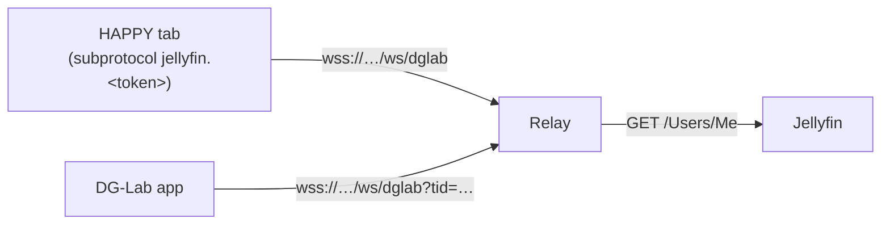

# HAPPY DG-Lab relay

A small WebSocket relay between one HAPPY browser tab (the *controller*) and the DG-Lab app, speaking the [DG-Lab v4.0 WebSocket protocol](https://github.com/dungeonlab-open/dglab-websocket-server). It is its own Docker image (`ghcr.io/lumbar-spine-support/happy-dglab-relay`), released separately from HAPPY (release-please component `dglab-relay`, tags `dglab-relay-v*`), because only Coyote owners need it and it rarely changes. User setup: [docs/dg-lab.md](../docs/dg-lab.md#the-relay).

## Behaviour

- **One slot each.** One controller and one app; the last to connect wins. The previous one is closed with `4000`.
- **Authentication.** A tab offers `happy` and `jellyfin.<token>` as WebSocket subprotocols. The relay checks the token with `GET /Users/Me` on `JELLYFIN_URL`, caching the answer (`src/jellyfinAuth.ts`), and selects only `happy`, so the token is never echoed. The app has no token. It connects with `?tid=<controller id>`, the unguessable id the controller got in `hello`.
- **Grace.** A controller that closes keeps its app paired for 5 minutes (`DGLAB_DETACH_GRACE_MS` in `src/shared/dglab.ts`), so a backgrounded mobile tab can come back.
- **Housekeeping.** Native pings every 10 s, with 3 missed pongs allowed. A JSON `heartbeat` every 30 s. An unpaired controller is closed after 5 minutes. Frames are limited to 64 KiB.
- **Paths.** The WebSocket endpoint is any path ending in `/ws/dglab`, so a reverse proxy may forward a prefixed path unchanged. `GET /health` answers `ok`.
- It never parses device commands; it only stamps the sender id on `message` frames.
- **Diagnostics.** `src/peerLink.ts` keeps per-socket timings (remote address, preferring `X-Forwarded-For`; last frame; native ping round trip; send backlog) only to log them. At `info` it logs connects, closes with code, reason and who closed, and the grace period. At `warn` it logs abnormal closes, a pinging peer that stays silent over 5 s, slow (> 1 s) or missing pongs, a send backlog over 16 KiB, refused sign-ins, and event-loop stalls over 500 ms (`src/index.ts`). The table in [docs/dg-lab.md](../docs/dg-lab.md#debugging) explains them for users.

## Configuration (environment)

| Variable | Default | Meaning |
| --- | --- | --- |
| `JELLYFIN_URL` | (required) | Jellyfin as the relay reaches it, for the token check |
| `PORT` | `8070` | Listening port |
| `LOG_LEVEL` | `info` | `error`, `warn`, `info`, `debug` |

## Code, build, test

| File | Role |
| --- | --- |
| `src/index.ts` | Entry: environment, start, shutdown |
| `src/server.ts` | HTTP server, upgrade dispatch and authentication |
| `src/relay.ts` | The relay itself (`DglabRelay`) |
| `src/peerLink.ts` | Per-socket connection diagnostics for the log |
| `src/jellyfinAuth.ts` | Cached Jellyfin token check |
| `test/` | `node:test` suites, part of the root `npm test` |

- The source shares `src/shared/dglab.ts` (path, subprotocols, grace period) with the client. The root `tsconfig.json` type-checks it.
- `npm run build` in this folder bundles everything, `ws` included, into `dist/index.js` with esbuild.
- The image builds from the repository root: `docker build -f dglab-relay/Dockerfile .`. `Dockerfile.dockerignore` keeps the context small.
- The local dev Jellyfin (`npm run dev:jellyfin`, [docs/developer/local-jellyfin.md](../docs/developer/local-jellyfin.md)) runs it on port 8070 and points the plugin at `ws://localhost:8070`.
