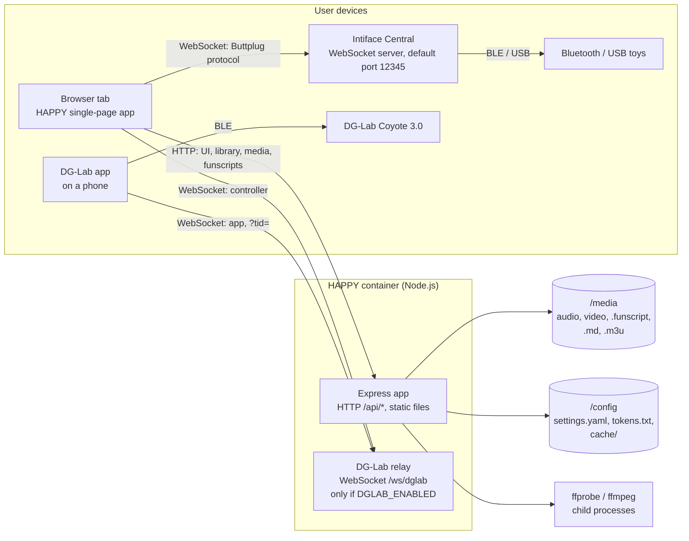
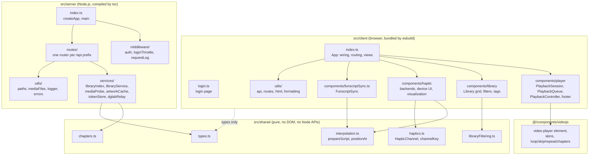
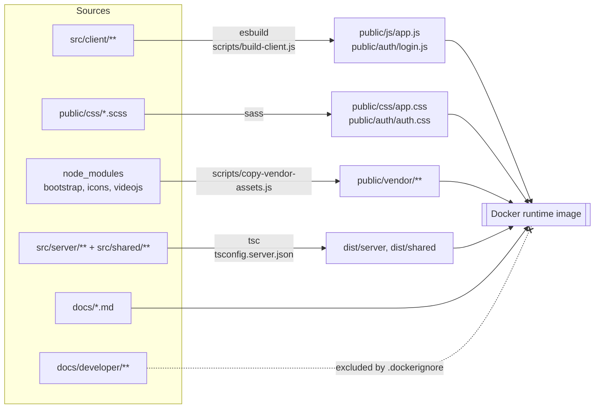

[← Developer Guide](README.md)

# Architecture overview

HAPPY is one Node.js process that serves a single-page app. The server indexes and streams media. **Everything that happens in real time runs in the browser**: playback, funscript interpolation and device output. The server never talks to a toy.

## System context

Which processes exist and who opens which connection.

Key points:

- The browser connects to **Intiface directly**. The server is not involved, so the Intiface address must be reachable from the browser's device, not from the container.
- The DG-Lab app cannot reach a browser tab, so the server hosts a small **relay**. Both the browser tab and the app connect to it, and the relay forwards messages between them without interpreting them. See [Pair a DG-Lab Coyote](use-cases/coyote-pairing.md).
- `/config/cache` only holds derived data (library index, extracted covers). It is safe to delete.

## Code layers

`src/` is split into three layers. `shared/` holds types and pure logic that both sides import. The client and server never import from each other.

## Runtime responsibilities

| Concern | Where it runs | Main module |
| --- | --- | --- |
| Scan media folder, read tags, chapters | Server | `libraryService.buildLibrary()` behind `libraryIndex` |
| Cache the library across restarts | Server | `libraryIndex` → `/config/cache/library.json` |
| Extract cover art | Server | `routes/artwork.ts` + `artworkCache` |
| Stream media with range requests | Server | `routes/media.ts` |
| Serve raw funscript JSON | Server | `routes/funscript.ts` |
| Password login, tokens | Server | `middleware/auth.ts`, `routes/auth.ts`, `tokenStore` |
| Relay DG-Lab messages | Server | `services/dglabRelay.ts` |
| Routing, views, library grid | Browser | `App` in `client/index.ts`, `Library` |
| Playback with two players | Browser | `PlaybackSession`, `PlaybackController` |
| Funscript interpolation | Browser | `shared/interpolation.ts` |
| Timing loop that drives devices | Browser | `FunscriptSync` (one per backend) |
| Talking to Intiface | Browser | `ButtplugClientManager` |
| Talking to the DG-Lab app | Browser | `CoyoteBackend` → `DglabV4Socket` |

## Build and deployment

| Command | What it does |
| --- | --- |
| `npm run build` | `build:server` (tsc) → `build:client` (sass + esbuild) → `build:vendor` |
| `npm run dev:client` | esbuild in watch mode with source maps |
| `npm start` | `node dist/server/index.js` |
| `npm test` | `node --test` with `tsx` over `test/server` and `test/client` |
| `npm run docs:env` | Regenerates the environment variable table in `docs/configuration.md` |

## Code map

| Diagram | Based on |
| --- | --- |
| System context | [src/server/index.ts](../../src/server/index.ts), [src/server/services/dglabRelay.ts](../../src/server/services/dglabRelay.ts), [src/client/components/haptic/buttplugClient.ts](../../src/client/components/haptic/buttplugClient.ts) |
| Code layers | `src/client`, `src/shared`, `src/server`, [@/components/videojs](../../@/components/videojs/player.ts) |
| Build | [package.json](../../package.json), [scripts/build-client.js](../../scripts/build-client.js), [Dockerfile](../../Dockerfile), [.dockerignore](../../.dockerignore) |
