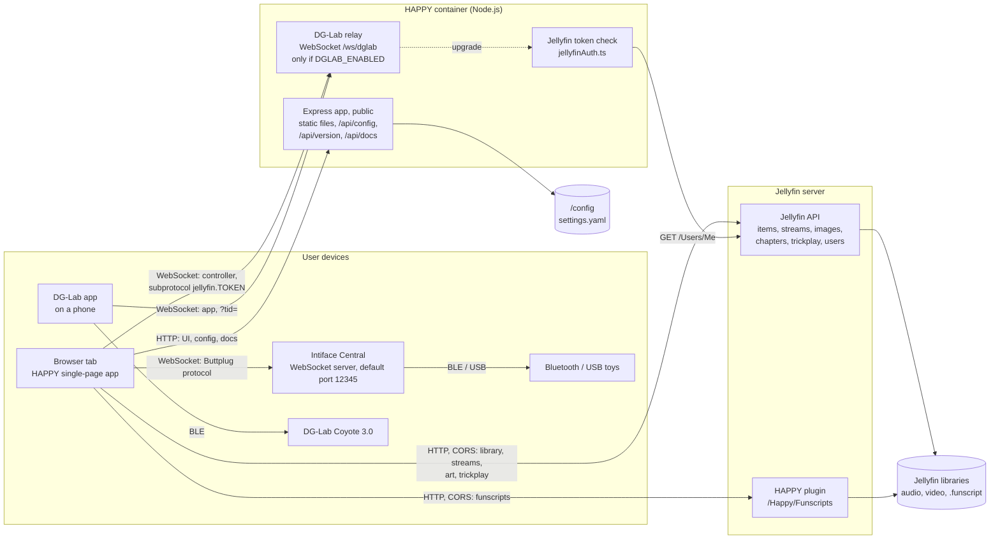
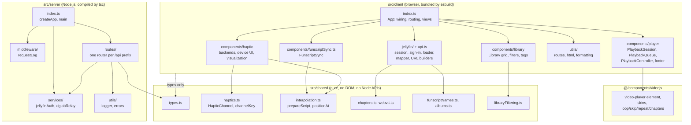
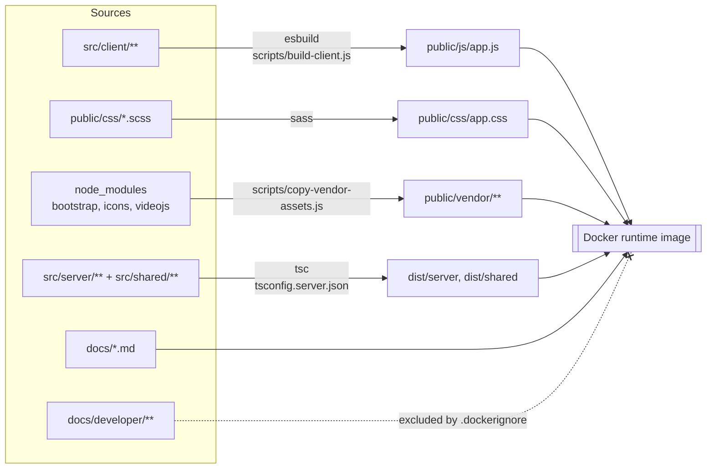

[← Developer Guide](README.md)

# Architecture overview

HAPPY is one Node.js process that serves a single-page app, next to a Jellyfin server that owns the media library. The browser loads the library and streams directly from Jellyfin; the HAPPY server only serves the app, its configuration, the docs and the DG-Lab relay. **Everything that happens in real time runs in the browser**: playback, funscript interpolation and device output. Neither server ever talks to a toy.

## System context

Which processes exist and who opens which connection.

Key points:

- The browser connects to **Intiface directly**. The server is not involved, so the Intiface address must be reachable from the browser's device, not from the container.
- The DG-Lab app cannot reach a browser tab, so the server hosts a small **relay**. Both the browser tab and the app connect to it, and the relay forwards messages between them without interpreting them. See [Pair a DG-Lab Coyote](use-cases/coyote-pairing.md).
- The browser also connects to **Jellyfin directly**, so `JELLYFIN_URL` must be the address the browser uses, not one only the container can resolve. Jellyfin is another origin, which is why media elements use CORS mode (see [client.md](client.md#jellyfin-data-layer)).
- The [HAPPY plugin](jellyfin-plugin.md) is the only HAPPY code inside Jellyfin. It indexes funscripts and serves them to signed-in users.

## Code layers

`src/` is split into three layers. `shared/` holds types and pure logic that both sides import. The client and server never import from each other.

## Runtime responsibilities

| Concern | Where it runs | Main module |
| --- | --- | --- |
| Scan media, read tags, chapters, cover art | Jellyfin | — |
| Stream media with range requests, trickplay | Jellyfin | `/Videos/{id}/stream`, `/Audio/{id}/stream` (`static=true`) |
| Index and serve funscripts | Jellyfin plugin | `FunscriptIndex`, `HappyController` |
| Jellyfin sign-in, library model | Browser | `JellyfinConnection`, `loadLibrary()`, `buildLibrary()` |
| Check Jellyfin tokens of relay controllers | Server | `services/jellyfinAuth.ts`, `attachWebSocketUpgradeHandlers()` |
| Relay DG-Lab messages | Server | `services/dglabRelay.ts` |
| Routing, views, library grid | Browser | `App` in `client/index.ts`, `Library` |
| Playback with two players | Browser | `PlaybackSession`, `PlaybackController` |
| Funscript interpolation | Browser | `shared/interpolation.ts` |
| Timing loop that drives devices | Browser | `FunscriptSync` (one per backend) |
| Talking to Intiface | Browser | `ButtplugClientManager` |
| Talking to the DG-Lab app | Browser | `CoyoteBackend` → `DglabV4Socket` |

## Build and deployment

| Command | What it does |
| --- | --- |
| `npm run build` | `build:server` (tsc) → `build:client` (sass + esbuild) → `build:vendor` |
| `npm run dev:client` | esbuild in watch mode with source maps |
| `npm start` | `node dist/server/index.js` |
| `npm test` | `node --test` with `tsx` over `test/server` and `test/client` |
| `npm run test:jellyfin` | Integration tests against a real Jellyfin (see [jellyfin-plugin.md](jellyfin-plugin.md#testing-against-a-real-jellyfin)) |
| `npm run docs:env` | Regenerates the environment variable table in `docs/configuration.md` |

## Code map

| Diagram | Based on |
| --- | --- |
| System context | [src/server/index.ts](../../src/server/index.ts), [src/server/services/dglabRelay.ts](../../src/server/services/dglabRelay.ts), [src/client/components/haptic/buttplugClient.ts](../../src/client/components/haptic/buttplugClient.ts), [src/client/jellyfin/](../../src/client/jellyfin/library.ts), [jellyfin-plugin/](../../jellyfin-plugin/Jellyfin.Plugin.Happy/Api/HappyController.cs) |
| Code layers | `src/client`, `src/shared`, `src/server`, [@/components/videojs](../../@/components/videojs/player.ts) |
| Build | [package.json](../../package.json), [scripts/build-client.js](../../scripts/build-client.js), [Dockerfile](../../Dockerfile), [.dockerignore](../../.dockerignore) |
