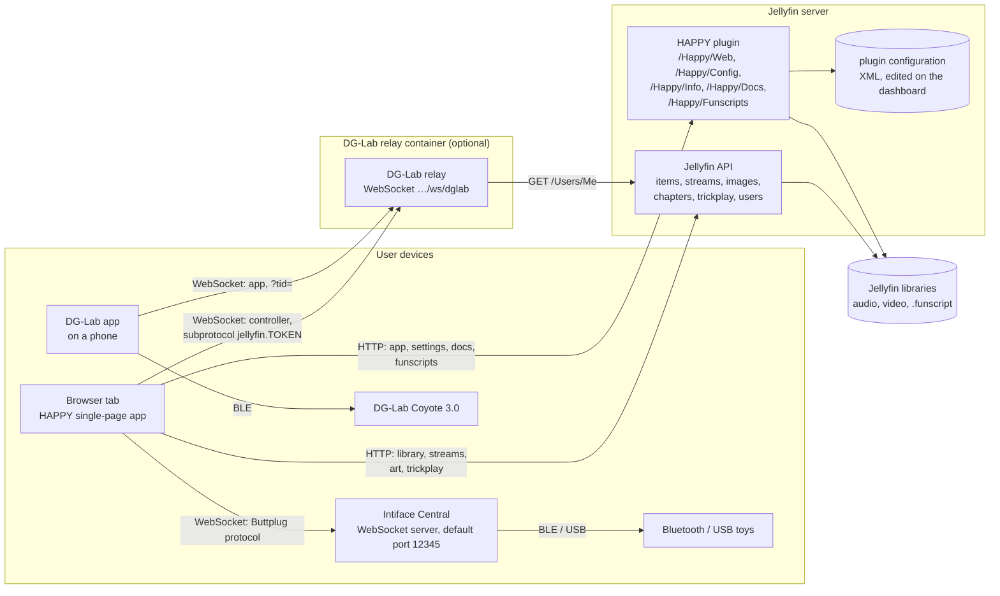
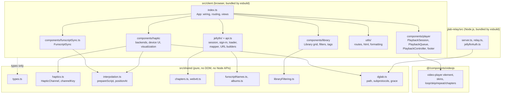
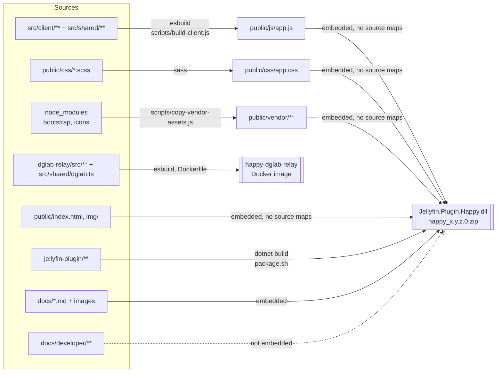

[← Developer Guide](README.md)

# Architecture overview

HAPPY is a single-page app that runs inside a Jellyfin server. The HAPPY plugin serves the app at `<jellyfin>/Happy/Web/`, together with its settings, version, docs and the funscripts; Jellyfin owns the media library and streams it. There is no HAPPY server of its own. The only separate process is the optional DG-Lab relay, for Coyote owners. **Everything that happens in real time runs in the browser**: playback, funscript interpolation and device output. Neither Jellyfin nor the relay ever talks to a toy.

## System context

Which processes exist and who opens which connection.

Key points:

- The browser connects to **Intiface directly**. Jellyfin is not involved, so the Intiface address must be reachable from the browser's device, not from the Jellyfin server.
- The page comes from Jellyfin itself, so the app, the Jellyfin API, streams and images share one origin. The client derives Jellyfin's address from its own URL (see [client.md](client.md#jellyfin-data-layer)); there is nothing to configure.
- The DG-Lab app cannot reach a browser tab, so both connect to a small **relay**, which forwards messages between them without interpreting them. It is its own Docker image ([dglab-relay/README.md](../../dglab-relay/README.md)); the browser finds it through the `dglabRelayUrl` setting. See [Pair a DG-Lab Coyote](use-cases/coyote-pairing.md).
- The [HAPPY plugin](jellyfin-plugin.md) is the only HAPPY code inside Jellyfin.

## Code layers

`src/` is split into two layers. `shared/` holds types and pure logic; the client imports it, and so does the relay (`dglab.ts` only). The plugin is C# and shares only the JSON shapes (`ClientSettings` in `types.ts` ↔ `Configuration/ClientSettings.cs`).

## Runtime responsibilities

| Concern | Where it runs | Main module |
| --- | --- | --- |
| Scan media, read tags, chapters, cover art | Jellyfin | — |
| Stream media with range requests, trickplay | Jellyfin | `/Videos/{id}/stream`, `/Audio/{id}/stream` (`static=true`) |
| Serve the app and the user docs | Jellyfin plugin | `WebController`, `DocsController` |
| Client settings and version | Jellyfin plugin | `HappyController`, `ClientSettings`, `configPage.html` |
| Index and serve funscripts | Jellyfin plugin | `FunscriptIndex`, `HappyController` |
| Jellyfin sign-in, library model | Browser | `JellyfinConnection`, `loadLibrary()`, `buildLibrary()` |
| Check Jellyfin tokens of relay controllers | DG-Lab relay | `jellyfinAuth.ts`, `server.ts` |
| Relay DG-Lab messages | DG-Lab relay | `DglabRelay` (`relay.ts`) |
| Routing, views, library grid | Browser | `App` in `client/index.ts`, `Library` |
| Playback with two players | Browser | `PlaybackSession`, `PlaybackController` |
| Funscript interpolation | Browser | `shared/interpolation.ts` |
| Timing loop that drives devices | Browser | `FunscriptSync` (one per backend) |
| Talking to Intiface | Browser | `ButtplugClientManager` |
| Talking to the DG-Lab app | Browser | `CoyoteBackend` → `DglabV4Socket` |

## Build and deployment

HAPPY and the plugin share one version (plugin `x.y.z.0`). Each release attaches the plugin zip to the GitHub release and adds it to the plugin repository's `manifest.json`, from which Jellyfin installs and updates it (see [jellyfin-plugin.md](jellyfin-plugin.md#releases-and-the-plugin-repository)). The relay has its own release cycle and image ([dglab-relay/README.md](../../dglab-relay/README.md)).

| Command | What it does |
| --- | --- |
| `npm run build` | `build:client` (sass + esbuild) → `build:vendor`; a Release plugin build needs this first |
| `npm run dev:client` / `npm run dev:css` | esbuild / sass in watch mode |
| `npm test` | `node --test` with `tsx` over `test/client`, `test/scripts` and `dglab-relay/test` |
| `npm run test:plugin` | `dotnet test` of the plugin in the .NET SDK container |
| `npm run dev:jellyfin` | Local Jellyfin with the fixtures and the working-tree plugin (see [local-jellyfin.md](local-jellyfin.md)) |
| `npm run test:jellyfin` | Integration tests against a real Jellyfin (see [jellyfin-plugin.md](jellyfin-plugin.md#testing-against-a-real-jellyfin)) |

## Code map

| Diagram | Based on |
| --- | --- |
| System context | [jellyfin-plugin/…/Api/](../../jellyfin-plugin/Jellyfin.Plugin.Happy/Api/HappyController.cs), [src/client/jellyfin/serverUrl.ts](../../src/client/jellyfin/serverUrl.ts), [src/client/jellyfin/](../../src/client/jellyfin/library.ts), [src/client/components/haptic/buttplugClient.ts](../../src/client/components/haptic/buttplugClient.ts), [dglab-relay/src/server.ts](../../dglab-relay/src/server.ts) |
| Code layers | `src/client`, `src/shared`, [dglab-relay/src](../../dglab-relay/src/relay.ts), [@/components/videojs](../../@/components/videojs/player.ts) |
| Build | [package.json](../../package.json), [scripts/build-client.js](../../scripts/build-client.js), [Jellyfin.Plugin.Happy.csproj](../../jellyfin-plugin/Jellyfin.Plugin.Happy/Jellyfin.Plugin.Happy.csproj), [package.sh](../../jellyfin-plugin/package.sh), [dglab-relay/Dockerfile](../../dglab-relay/Dockerfile), [.github/workflows/release.yml](../../.github/workflows/release.yml) |
