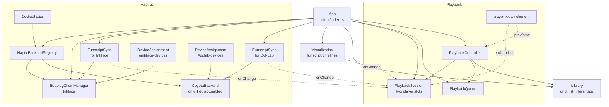
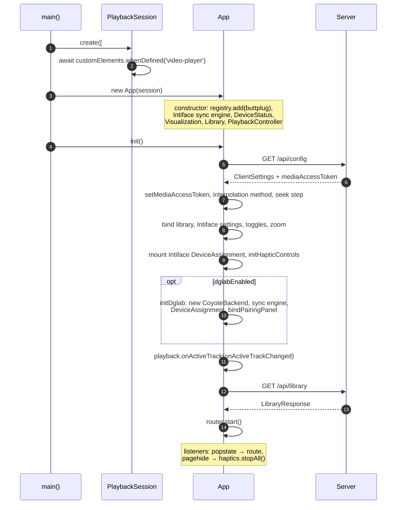
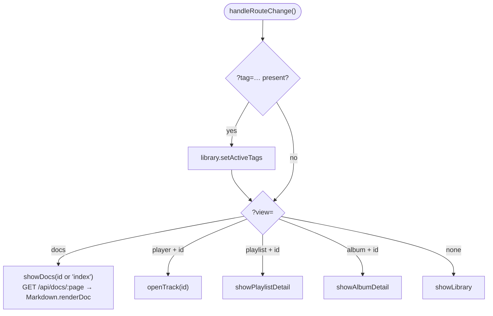
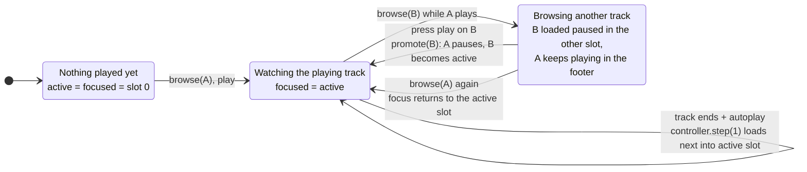
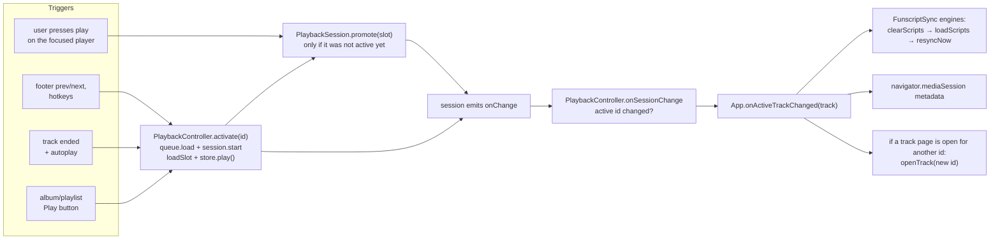

[← Developer Guide](README.md)

# Client

The client is a single-page app bundled from [src/client/index.ts](../../src/client/index.ts). It uses no framework: plain TypeScript classes, Bootstrap for layout and Video.js 10 (`<video-player>`) for the players. The login page is a separate bundle from [src/client/login.ts](../../src/client/login.ts).

## Object graph

`App` creates every long-lived object once at startup. The arrows point from owner to the thing it creates or subscribes to.



Note that each `FunscriptSync` engine and each `DeviceAssignment` list is bound to **one backend**, not to the registry, because each backend has its own delay slider and settings section. Only `DeviceStatus` and the `pagehide` → `stopAll()` handler use the registry.

## Player theming

The Video.js skin takes its look from Bootstrap's CSS variables. The mapping lives in [public/css/scss/_videojs.scss](../../public/css/scss/_videojs.scss):

- `:root` sets the accent color and font.
- An unlayered `.media-skin` block sets the control size (the height of a `.btn`), the radii (`--bs-border-radius*`) and the focus ring (`--bs-focus-ring-*`). It must stay unlayered so it overrides the skin's `@layer base.theme` defaults.

To restyle the player, change the Bootstrap theme instead of the skin CSS.

## Bootstrap



User settings live in `localStorage` (all keys start with `happy-`). Server values from `/api/config` are only **defaults** for keys that have no stored value. Simple values go through `storedSetting(key, fallback)` in `utils/storedSetting.ts`, which parses to the fallback's type.

The settings panel is wired by small modules instead of `App`: `components/settings/intiface.ts` (address, scheme, Connect), `components/settings/haptics.ts` (delay and update-rate sliders), `components/settings/toggle.ts` (blur and color-gradient switches) and `components/haptic/dglab/pairingPanel.ts` (DG-Lab relay and QR code).

Auto-reconnect: `happy-intiface-last-state` / `happy-dglab-last-state` become `connected` on a successful connection and `disconnected` only on an explicit Disconnect click. `happy-dglab-last-seen` is refreshed on every relay frame (heartbeats every 30 s) and on `pagehide`; DG-Lab reconnects only while it is younger than `DGLAB_DETACH_GRACE_MS` (`src/shared/dglab.ts`), otherwise the section stays *Disconnected*.

Intiface drops are retried by `bindIntifaceSettings()` with backoff (1 s doubling to 15 s) and on `visibilitychange`, but only after a connection made in the same page session and while `happy-intiface-last-state` is `connected`. Intiface pings only after 10 s without traffic and drops the client after the next 10 s without a pong, which happens when Android Chrome freezes the tab with the screen off. `keepScreenOnWhilePlaying()` (`utils/wakeLock.ts`) therefore holds a screen wake lock while the active player is playing and the page is visible, unless the `happy-keep-screen-on` toggle is off.

## Routing

All state that should survive a reload is in the query string. The `Router` in `router.ts` maps it onto handlers that `App` supplies. `router.navigateTo(url)` pushes history and calls `handleRouteChange()`, and so does the browser back button. Playlist and album pages are rendered by `DetailView` (`components/library/detail.ts`).



| URL | View |
| --- | --- |
| `./` | Library grid or list, filters in `localStorage` |
| `./?tag=a&tag=b` | Library filtered by tags |
| `./?view=album&id=…` | Album detail |
| `./?view=playlist&id=…` | Playlist detail |
| `./?view=player&id=<trackId>` | Track page |
| `./?view=docs&id=<page>` | In-app user documentation |

Grid cards start with `CARD_SQUARE_GRID_CLASSES`. When an album or track card's artwork loads, `classifyArtAspect()` (`client/utils/artAspect.ts`) checks its natural size. Art at a ratio of 1.2 or wider switches the card to `CARD_LANDSCAPE_GRID_CLASSES` with `.track-card-landscape`, which shows the image at 2:1. Art at a ratio of 1/1.2 or taller adds `.track-card-portrait`, which spans two grid rows. `#track-grid` is a CSS grid (2/4/6 columns at xs/sm/lg) with `grid-auto-flow: dense`, so smaller cards fill gaps left by wide or tall ones. Playlist cards and the fallback art stay square. If `cardViewForceSquareArtwork` is on, every card stays square.

## The two-player model

There are two `<video-player>` elements. `PlaybackSession` decides which one does what:

- **active slot**: owns playback. The footer bar, the OS media controls and **haptics** follow it.
- **focused slot**: the one visible on the track page you are looking at.

Usually they are the same slot. They differ when you browse to another track while something is playing: the new track loads **stopped** into the other slot, and the playing one keeps going (in the footer). If you press play on the browsed track, that slot becomes active and the other one pauses. Nothing is reloaded or moved, so fullscreen and picture-in-picture survive the handoff.



Everything that changes the active track goes through one path:



The detailed sequence is in [Browse and play a track](use-cases/browse-and-play.md).

### Funscripts on the client

`App.fetchTrackScripts(track)` downloads each funscript listed in `track.funscripts` once and caches the promise per track id in `scriptCache`. The same raw `Funscript` objects then go to:

- `Visualization.mount()` for the browsed track (timelines),
- every `FunscriptSync.loadScripts()` for the active track (device output).

Both call `prepareScript()` from [shared/interpolation.ts](../../src/shared/interpolation.ts) themselves. See [haptics.md](haptics.md#funscript-pipeline).

## Video.js integration

The `@/components/videojs/` folder holds the ejected Video.js skin and small feature add-ons:

| Feature | File | Used by |
| --- | --- | --- |
| Loop (repeat one) | `features/loop.ts` | `PlaybackSession.setLoop` |
| Repeat mode | `features/repeat.ts` | `PlaybackController.applyRepeat`, `advance` |
| Skip prev/next | `features/skip.ts` | `PlaybackController` registers itself with `setSkipTarget` |
| Chapters | `features/chapters.ts` | `PlaybackSession.loadSlot` → `setMediaChapters` |
| VR180 view | `features/vr.ts`, `ui/vr-buttons.ts` | Reacts to `data-vr-format` set by `PlaybackSession.loadSlot` |

## VR180 playback

`parseVrFormat()` ([src/shared/vrFormat.ts](../../src/shared/vrFormat.ts)) detects VR180 from the filename; `PlaybackController` stores it in `PlaybackRequest.vr` and `PlaybackSession.loadSlot` mirrors it as `data-vr-format` (`180-sbs` / `180-tb`) on `<video-player>`. Each slot keeps its own VR state.

Rendering lives in [src/client/components/vr/](../../src/client/components/vr/) and has no Video.js imports:

| File | Role |
| --- | --- |
| `camera.ts` | Pure math: perspective/rotation matrices, drag → yaw/pitch, clamping to the front hemisphere, device orientation → yaw/pitch |
| `projection.ts` | WebGL2 fullscreen-triangle shader that turns a camera ray into equirect UVs of one eye; takes arbitrary projection/rotation matrices so WebXR views can reuse it |
| `types.ts` | `VrMode` (`flat` / `inline` / `immersive`) and the `VrView` start/stop contract |
| `inline.ts` | `InlineVrView`: canvas over the (transparent) `<video>`, pointer drag, pinch/wheel zoom, optional gyroscope, `requestVideoFrameCallback` uploads |
| `dragGuard.ts` | Capture-phase `pointerup` filter on `<media-container>` so a drag on the VR canvas does not trigger the skin's tap/double-tap gestures |

`features/vr.ts` keeps one controller per media element: it observes `data-vr-format`, defaults VR tracks to `inline`, resets on `loadstart`, and exposes `setVrMode`, `toggleVrGyro` and `resetVrView` through `selectVr`. The gyro button only shows on coarse-pointer devices in a secure context.

The test fixtures were generated with:

```bash
ffmpeg \
  -f lavfi -i "color=c=0x402020:s=960x480:r=30:d=30,drawgrid=w=120:h=120:t=2:c=white@0.35,drawgrid=w=30:h=30:t=1:c=white@0.12,drawtext=fontfile=/usr/share/fonts/truetype/dejavu/DejaVuSans-Bold.ttf:text='LEFT EYE':fontcolor=white:fontsize=64:x=(w-text_w)/2:y=(h-text_h)/2,drawtext=fontfile=/usr/share/fonts/truetype/dejavu/DejaVuSans.ttf:text='VR180 SBS  •  960x480':fontcolor=white:fontsize=24:x=(w-text_w)/2:y=h-50" \
  -f lavfi -i "color=c=0x202040:s=960x480:r=30:d=30,drawgrid=w=120:h=120:t=2:c=white@0.35,drawgrid=w=30:h=30:t=1:c=white@0.12,drawtext=fontfile=/usr/share/fonts/truetype/dejavu/DejaVuSans-Bold.ttf:text='RIGHT EYE':fontcolor=white:fontsize=64:x=(w-text_w)/2:y=(h-text_h)/2,drawtext=fontfile=/usr/share/fonts/truetype/dejavu/DejaVuSans.ttf:text='VR180 SBS  •  960x480':fontcolor=white:fontsize=24:x=(w-text_w)/2:y=h-50" \
  -filter_complex "[0:v][1:v]hstack=inputs=2" \
  -t 30 \
  -c:v libvpx-vp9 -b:v 1M -crf 30 \
  -pix_fmt yuv420p \
  -metadata:s:v stereo_mode=left_right \
  vr180-sbs-test-480p.webm

ffmpeg \
  -f lavfi -i "color=c=0x402020:s=960x480:r=30:d=30,drawgrid=w=120:h=120:t=2:c=white@0.35,drawgrid=w=30:h=30:t=1:c=white@0.12,drawtext=fontfile=/usr/share/fonts/truetype/dejavu/DejaVuSans-Bold.ttf:text='TOP / LEFT EYE':fontcolor=white:fontsize=64:x=(w-text_w)/2:y=(h-text_h)/2,drawtext=fontfile=/usr/share/fonts/truetype/dejavu/DejaVuSans.ttf:text='VR180 TB  •  960x480':fontcolor=white:fontsize=24:x=(w-text_w)/2:y=h-50" \
  -f lavfi -i "color=c=0x202040:s=960x480:r=30:d=30,drawgrid=w=120:h=120:t=2:c=white@0.35,drawgrid=w=30:h=30:t=1:c=white@0.12,drawtext=fontfile=/usr/share/fonts/truetype/dejavu/DejaVuSans-Bold.ttf:text='BOTTOM / RIGHT EYE':fontcolor=white:fontsize=64:x=(w-text_w)/2:y=(h-text_h)/2,drawtext=fontfile=/usr/share/fonts/truetype/dejavu/DejaVuSans.ttf:text='VR180 TB  •  960x480':fontcolor=white:fontsize=24:x=(w-text_w)/2:y=h-50" \
  -filter_complex "[0:v][1:v]vstack=inputs=2" \
  -t 30 \
  -c:v libvpx-vp9 -b:v 1M -crf 30 \
  -pix_fmt yuv420p \
  -metadata:s:v stereo_mode=top_bottom \
  vr180-tb-test-480p.webm
``` 

## Code map

| Topic | Files |
| --- | --- |
| App, routing, views | [src/client/index.ts](../../src/client/index.ts), [router.ts](../../src/client/router.ts), [components/library/detail.ts](../../src/client/components/library/detail.ts) |
| Settings panel | [components/settings/](../../src/client/components/settings/), [haptic/dglab/pairingPanel.ts](../../src/client/components/haptic/dglab/pairingPanel.ts), [utils/storedSetting.ts](../../src/client/utils/storedSetting.ts) |
| Playback | [player/session.ts](../../src/client/components/player/session.ts), [player/controller.ts](../../src/client/components/player/controller.ts), [player/queue.ts](../../src/client/components/player/queue.ts), [player/footer.ts](../../src/client/components/player/footer.ts) |
| Library UI | [components/library/index.ts](../../src/client/components/library/index.ts), [shared/libraryFiltering.ts](../../src/shared/libraryFiltering.ts) |
| Server API calls | [api.ts](../../src/client/api.ts) |
| Timelines | [haptic/visualization/index.ts](../../src/client/components/haptic/visualization/index.ts) |
| Video.js | [@/components/videojs/player.ts](../../@/components/videojs/player.ts), `@/components/videojs/features/` |
| VR180 | [components/vr/](../../src/client/components/vr/), [shared/vrFormat.ts](../../src/shared/vrFormat.ts), `@/components/videojs/features/vr.ts` |
