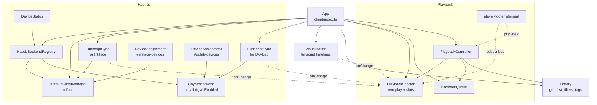
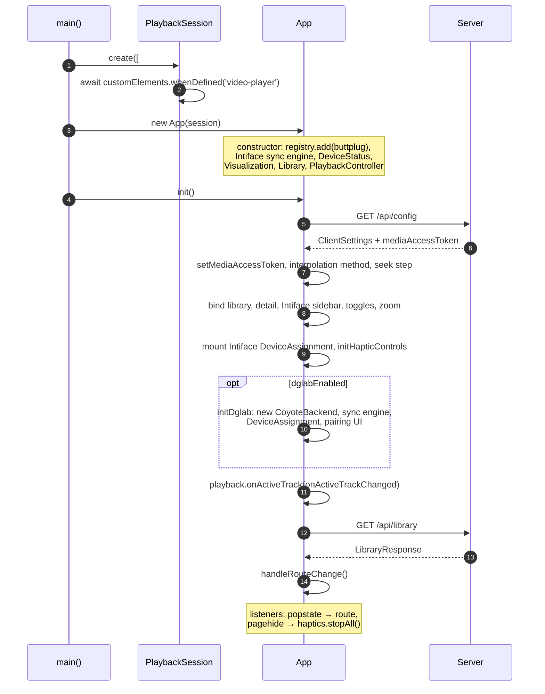
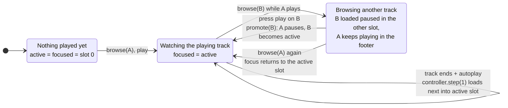
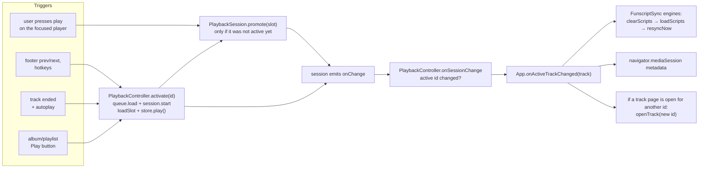

[← Developer Guide](README.md)

# Client

The client is a single-page app bundled from [src/client/index.ts](../../src/client/index.ts). It uses no framework: plain TypeScript classes, Bootstrap for layout and Video.js 10 (`<video-player>`) for the players. The login page is a separate bundle from [src/client/login.ts](../../src/client/login.ts).

## Object graph

`App` creates every long-lived object once at startup. The arrows point from owner to the thing it creates or subscribes to.

Note that each `FunscriptSync` engine and each `DeviceAssignment` list is bound to **one backend**, not to the registry, because each backend has its own delay slider and settings section. Only `DeviceStatus` and the `pagehide` → `stopAll()` handler use the registry.

## Player theming

The Video.js skin takes its look from Bootstrap's CSS variables. The mapping lives in [public/css/scss/_videojs.scss](../../public/css/scss/_videojs.scss):

- `:root` sets the accent color and font.
- An unlayered `.media-skin` block sets the control size (the height of a `.btn`), the radii (`--bs-border-radius*`) and the focus ring (`--bs-focus-ring-*`). It must stay unlayered so it overrides the skin's `@layer base.theme` defaults.

To restyle the player, change the Bootstrap theme instead of the skin CSS.

## Bootstrap

User settings live in `localStorage` (all keys start with `happy-`). Server values from `/api/config` are only **defaults** for keys that have no stored value.

Auto-reconnect: `happy-intiface-last-state` / `happy-dglab-last-state` become `connected` on a successful connection and `disconnected` only on an explicit Disconnect click. `happy-dglab-last-seen` is refreshed on every relay frame (heartbeats every 30 s) and on `pagehide`; DG-Lab reconnects only while it is younger than `DGLAB_DETACH_GRACE_MS` (`src/shared/dglab.ts`), otherwise the section stays *Disconnected*.

## Routing

All state that should survive a reload is in the query string. `navigateTo(url)` pushes history and calls `handleRouteChange()`, and so does the browser back button.

| URL | View |
| --- | --- |
| `./` | Library grid or list, filters in `localStorage` |
| `./?tag=a&tag=b` | Library filtered by tags |
| `./?view=album&id=…` | Album detail |
| `./?view=playlist&id=…` | Playlist detail |
| `./?view=player&id=<trackId>` | Track page |
| `./?view=docs&id=<page>` | In-app user documentation |

## The two-player model

There are two `<video-player>` elements. `PlaybackSession` decides which one does what:

- **active slot**: owns playback. The footer bar, the OS media controls and **haptics** follow it.
- **focused slot**: the one visible on the track page you are looking at.

Usually they are the same slot. They differ when you browse to another track while something is playing: the new track loads **stopped** into the other slot, and the playing one keeps going (in the footer). If you press play on the browsed track, that slot becomes active and the other one pauses. Nothing is reloaded or moved, so fullscreen and picture-in-picture survive the handoff.

Everything that changes the active track goes through one path:

The detailed sequence is in [Browse and play a track](use-cases/browse-and-play.md).

### Funscripts on the client

`App.fetchTrackScripts(track)` downloads each funscript listed in `track.funscripts` once and caches the promise per track id in `scriptCache`. The same raw `Funscript` objects then go to:

- `Visualization.mount()` for the browsed track (timelines),
- every `FunscriptSync.loadScripts()` for the active track (device output).

Both call `prepareScript()` from [shared/interpolation.ts](../../src/shared/interpolation.ts) themselves. See [haptics.md](haptics.md#funscript-pipeline).

## Video.js integration

The `@/components/videojs/` folder holds the ejected Video.js skin and small feature add-ons:

| Feature | File | Used by |
| --- | --- | --- |
| Loop (repeat one) | `features/loop.ts` | `PlaybackSession.setLoop` |
| Repeat mode | `features/repeat.ts` | `PlaybackController.applyRepeat`, `advance` |
| Skip prev/next | `features/skip.ts` | `PlaybackController` registers itself with `setSkipTarget` |
| Chapters | `features/chapters.ts` | `PlaybackSession.loadSlot` → `setMediaChapters` |

## Code map

| Topic | Files |
| --- | --- |
| App, routing, views | [src/client/index.ts](../../src/client/index.ts), [utils/routes.ts](../../src/client/utils/routes.ts) |
| Playback | [player/session.ts](../../src/client/components/player/session.ts), [player/controller.ts](../../src/client/components/player/controller.ts), [player/queue.ts](../../src/client/components/player/queue.ts), [player/footer.ts](../../src/client/components/player/footer.ts) |
| Library UI | [components/library/index.ts](../../src/client/components/library/index.ts), [shared/libraryFiltering.ts](../../src/shared/libraryFiltering.ts) |
| Server API calls | [utils/api.ts](../../src/client/utils/api.ts) |
| Timelines | [haptic/visualization/index.ts](../../src/client/components/haptic/visualization/index.ts) |
| Video.js | [@/components/videojs/player.ts](../../@/components/videojs/player.ts), `@/components/videojs/features/` |
