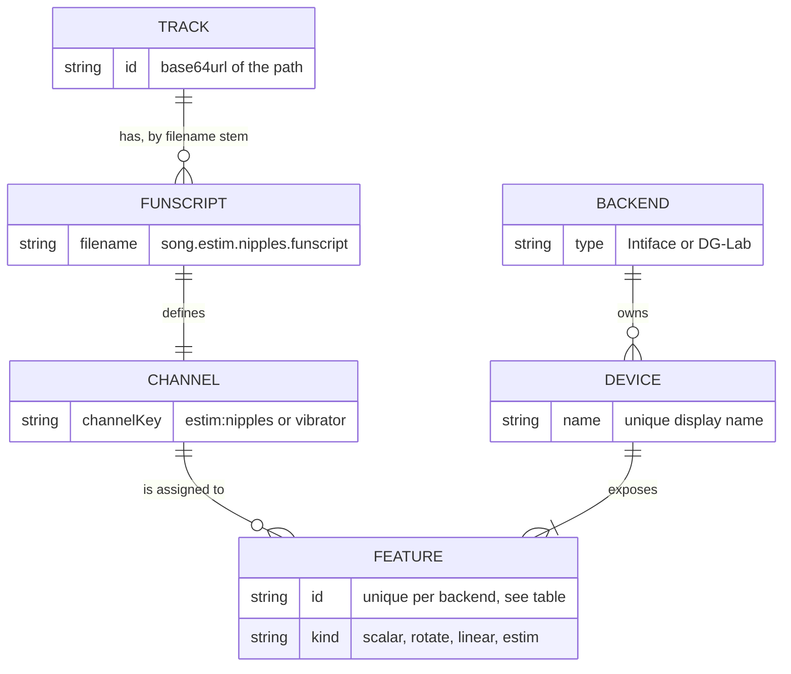
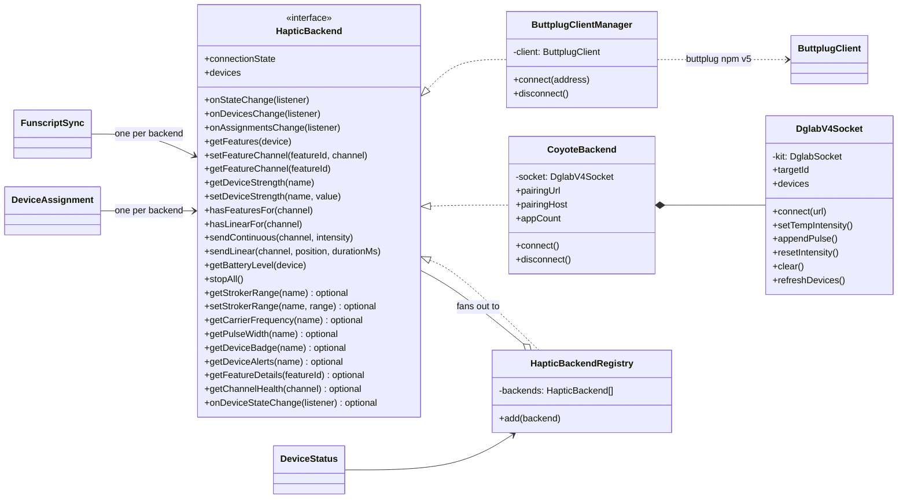
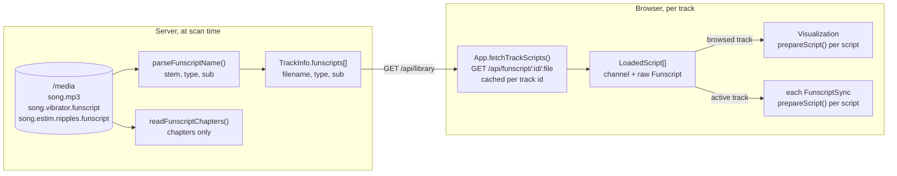
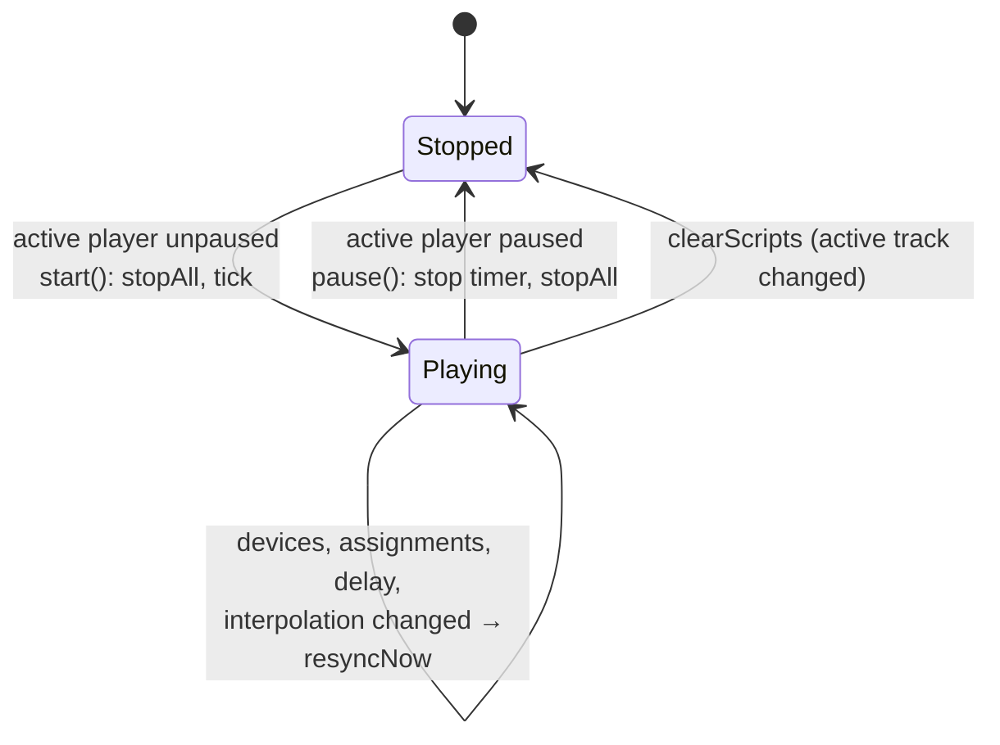
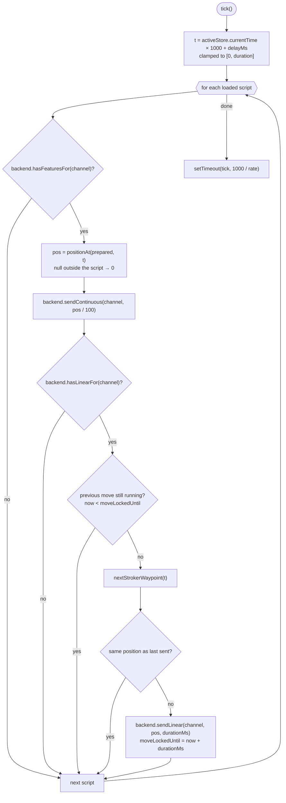
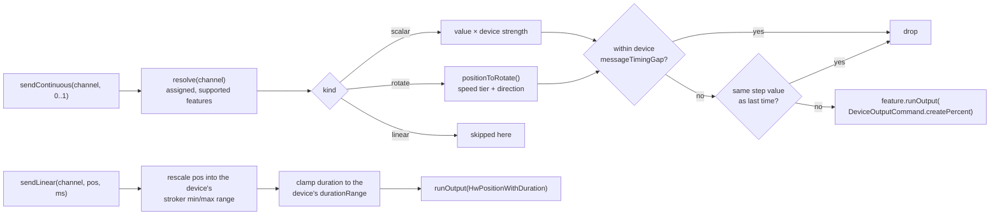
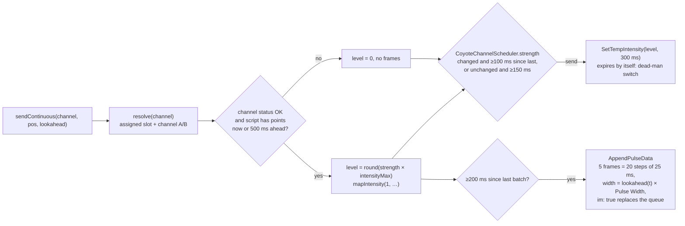

[← Developer Guide](README.md)

# Haptics

This page covers everything between "a funscript file exists" and "a toy moves". All of it runs in the browser. The server only lists and serves funscript files. It does **not** interpolate or modify them.

## Concepts

- A **channel** is `{ type, sub? }` ([shared/haptics.ts](../../src/shared/haptics.ts)). `channelKey()` turns it into the string used as map key, DOM attribute and stored value.
- A **feature** is one actuator. The user assigns features to channel keys, and each backend stores these assignments per feature id in `localStorage`.
- The **kind** of the feature decides how it is driven, not the funscript type. A vibrator script can drive a stroker, and one toy's two motors can follow two different scripts.

| Backend | Feature id format | Kinds | Stored in `localStorage` |
| --- | --- | --- | --- |
| Intiface (`ButtplugClientManager`) | device name, kind, feature index joined by `#` | `scalar`, `rotate`, `linear` | `happy-feature-assignments`, `happy-device-strengths`, `happy-stroker-ranges` |
| DG-Lab (`CoyoteBackend`) | `dglab`, slot id, channel 0/1 joined by `#` | `estim` | `happy-dglab-assignments`, `happy-dglab-strengths`, `happy-dglab-pulse-rate`, `happy-dglab-pulse-width`, `happy-dglab-pairing-host` |

## Backend interface

Every transport implements `HapticBackend` ([backend.ts](../../src/client/components/haptic/backend.ts)). The UI and the sync loop only use this interface.

`HapticBackendRegistry` makes all backends look like one: devices are concatenated, the connection state is the "best" of all (`connected` > `connecting` > `error` > `disconnected`), per-device calls go to the owning backend, and per-channel calls fan out. Today only `DeviceStatus` and `stopAll()` on `pagehide` go through it. The sync engines and the device lists talk to their own backend directly.

### Channel status badges

`DeviceStatus` asks the registry for `getChannelHealth(channel)`: `total` assigned actuators, how many are `usable`, and the `DeviceAlert`s for them. The registry sums connected backends only; a backend without the method (Intiface) counts `hasFeaturesFor()` as 1/1 with no alerts. `CoyoteBackend` reports a `danger` alert (not usable) when the slot has no hardware (`hasDevice: false`) or the channel status is no circuit / damaged / masked, and a `warning` when the channel is muted or has no `intensityMax`.

| Badge | Condition |
| --- | --- |
| Disconnected (grey) | `total === 0` |
| Error (red) | `usable === 0` |
| Warning (yellow) | any alert |
| Connected (green) | otherwise |

`describeChannel()` maps health to label and popover text. The popover is Bootstrap's, taken from the globally loaded bundle (`window.bootstrap`, typed in `src/client/types/bootstrap.d.ts`) with `trigger: 'focus'`, so it closes on the next click. Its text is plain (`html: false`); popovers of badges removed by a track change are disposed on the next refresh.

## Funscript pipeline

`prepareScript(actions, method)` sorts the actions and precomputes one cubic polynomial per segment, so `positionAt(prepared, ms)` is a binary search plus a polynomial evaluation. The methods are:

| Method | Continuous output (vibrate, rotate, e-stim) | Linear output (stroker) |
| --- | --- | --- |
| `none` | holds each point until the next one | jumps to the point just reached, 50 ms move |
| `linear` (default) | straight line between points | moves to the next point, duration = time until it |
| `pchip` | smooth, overshoot-free curve | same as `linear` (the device interpolates the move itself) |

The method comes from `FUNSCRIPT_INTERPOLATION_METHOD` (server config). The app prepares each funscript once with `prepareScript()` when it is fetched and caches the result per track as `LoadedScript { channel, prepared }`; the sync engines and the timeline view share these prepared scripts.

## The sync loop

`FunscriptSync` ([funscriptSync.ts](../../src/client/components/funscriptSync.ts)) is a timer loop that reads the **active** player's time and writes to **one** backend. `App` creates one engine for Intiface and, if DG-Lab is enabled, a second one for the Coyote, so each can have its own delay.

What one tick does:

Continuous output is sent **every tick**, even if the value did not change. The backends deduplicate, and resending makes the output self-correcting: if one Bluetooth write is lost, the next tick fixes it. The update rate slider (10–240 Hz, default from `HAPTIC_FREQUENCY`) sets the tick interval for all engines.

## Backend output paths

### Intiface

### DG-Lab Coyote

The Coyote has no position or speed. It emits pulses whose voltage comes from the channel strength and whose charge comes from the pulse width. Strength can only change once per 100 ms frame, but each frame carries four 25 ms width steps, so HAPPY **holds the strength** at the user's level and plays the funscript through the **pulse width**, planned ahead from the script. The DG-Lab app owns the safety limits, and HAPPY never asks for more than the ceiling the app reports.

The sync loop passes `lookahead(offsetMs)`, the interpolated position that far ahead; Intiface ignores it. Batches overlap (500 ms of frames every 200 ms), so relay jitter never empties the queue, and each new batch replaces the old one with fresher positions.

#### Pulse frames

The V4 protocol carries Coyote 3.0 pulse frames unchanged (`ver: 3`), so the [Coyote V3 Bluetooth protocol](https://github.com/dungeonlab-open/dglab-bluetooth-protocol/blob/main/coyote/v3/README.md) and its [waveform explanation](https://github.com/dungeonlab-open/dglab-bluetooth-protocol/blob/main/coyote/README.md) define the format. A frame is 16 hex characters covering 100 ms: four 25 ms steps, each with a period byte and a pulse width byte. See also the [V4 Protocol Reference](https://github.com/dungeonlab-open/dglab-kit#v4-%E5%8D%8F%E8%AE%AE%E5%8F%82%E8%80%83)

| Byte | Range | Meaning | HAPPY setting |
| --- | --- | --- | --- |
| Period ("waveform frequency") | 10–240 | Pulse period in ms. 10–100 is literal; 101–1000 ms is compressed into 101–240. Out of range drops all four steps. | Pulse Frequency, 10–100 Hz (default 50), sent as `round(1000 / Hz)` |
| Waveform intensity | 0–100 | Relative pulse width. The pulse voltage comes from the channel strength. | Pulse Width, 10–100 % (default 100): the width at script position 100 |

`positionStep()` turns a position into one step; the period stays constant. `encodeFrame()` / `decodeFrame()` convert between frames and per-step `{ periodMs, width }`.

The timing decisions and frame building live in `CoyoteChannelScheduler` and `lookaheadFrames()` in `channelScheduler.ts`, together with `mapIntensity()`. It has no socket dependency: `CoyoteBackend` keeps one scheduler per channel and sends the commands it returns, and both sandboxes reuse it.

#### DG-Lab sandbox page

`?view=dglab-sandbox` (button under the DG-Lab device cards, `DGLAB_SANDBOX_ENABLED`, only with `DGLAB_ENABLED`) plays a looping pattern from `patterns.ts` on one Coyote channel, so users can test strength and pulse settings without funscript media. `DglabSandbox` (`sandboxView.ts`) samples the pattern with `patternSampler()` (interpolation from `shared/interpolation.ts`) and calls `CoyoteBackend.sendToFeature()` at 30 Hz, the same path the sync loop takes. The canvas draws the position and the pulses each 25 ms step would play. Starting pauses media playback; leaving the route (`Router` `before` hook) or stopping calls `stopAll()`.

#### E-stim sandbox

`sandbox/` is a standalone debugging page that plots how a funscript becomes Coyote output: interpolated position, the commands sent, the decoded frame steps and the modelled output against an ideal curve. It imports `interpolation.ts`, `waveform.ts` and `channelScheduler.ts` directly; nothing from it ships with the app.

- Run `npm run sandbox` (esbuild serve with live reload on port 8100, `PORT` overrides), or the **E-stim Sandbox** launch config, which also opens a Chrome debug session.
- Bootstrap and Plotly come from a CDN.
- `strategies.ts` wraps the production scheduler. To compare an alternative, append an `EstimStrategy` to `STRATEGIES`.
- `appModel.ts` is an **assumption** about the DG-Lab app, not its code: it plays one queued frame and forwards the current strength every 100 ms, after a fixed latency. `SetTempIntensity` expires after its duration, and `im: true` replaces the queue from the next tick.

`stopAll()` sends `device.op.clear` and resets both channel intensities to 0. See [Pair a DG-Lab Coyote](use-cases/coyote-pairing.md) for the connection side.

#### DG-Lab client

The wire protocol, device cache and patch merging come from [dglab-kit](https://github.com/dungeonlab-open/dglab-kit) (`DglabSocket`). Protocol types (`V4Channel`, `V4ActionType`, `V4DeviceInfo`, …) are imported from the kit directly; `Device` is `V4DeviceInfo` plus the app's untyped slot `id`. `DglabV4Socket` wraps it and adds what the kit leaves to the caller:

- Reconnects with backoff (1 s doubling to 15 s), except after the relay closes with `replaced` (another tab took over).
- Requests devices when an app attaches and every 30 s, since battery level only arrives with a full snapshot.
- Sends each operation only to the app that owns the slot.
- Sets `p: 1`, `im: true` and `ver: 3` explicitly; the kit leaves them out by default.
- Fire-and-forget: every operation's promise is caught. Timeouts and disconnects are ignored, and other errors are logged once per kind.
- Tracing via `localStorage['happy-log'] = 'dglab=debug'` or `LOG_LEVEL=debug` on the server, including `custom.action` events. Client code logs through `createLogger(namespace)` in `src/client/utils/logger.ts`; levels are set per namespace with `setLogLevel()` or the `happy-log` override.

## Safety behaviour

| Situation | What stops the output |
| --- | --- |
| Pause | `FunscriptSync.pause()` → `backend.stopAll()` |
| Track changes | `clearScripts()` → `stop()` → `stopAll()` |
| Devices or assignments change | `resyncNow()` → `stopAll()` and immediately resend the current values |
| Tab closed or navigated away | `pagehide` → `HapticBackendRegistry.stopAll()` |
| Tab crashes or network drops (Coyote) | every strength command expires after 300 ms |
| Script has no point at the current time | `positionAt()` returns null → 0 is sent |

## Possible e-stim improvements

Ideas for Coyote playback, taken from the [Restim stim theory wiki](https://github.com/diglet48/restim/wiki). None is implemented yet. Each one should be tried on real hardware before it becomes a default.

| Idea | Theory | Sketch | Caveat |
| --- | --- | --- | --- |
| Perceptual intensity curve | Perceived intensity grows as $M = \alpha I^{\beta}$ with $\beta \approx 1.5$–2.5 ([nerve activation](https://github.com/diglet48/restim/wiki/nerve-activation)). A linear mapping makes the lower half of a script feel almost empty. | In `mapIntensity()`: $out = floor + (1 - floor) \cdot pos^{\gamma}$ for $pos > 0$, with $\gamma \approx 0.5$ and a floor of about 15–25 %. Both per device. | The floor must stay below the ceiling the app reports. Position 0 must still send 0. |
| Onset ramp | A sudden jump in strength causes an onset spike that can hurt ([volume ramp](https://github.com/diglet48/restim/wiki/volume-ramp)). | Limit how fast strength can rise per update, and ramp up over a few seconds after play or seek. Decreases stay immediate. | The DG-Lab app has its own soft-start. Both together must not make fast scripts feel mushy. |
| Random pulse spacing | Randomising the gap between pulses (5–10 ms) slows numbing and softens sudden changes ([pulse rate](https://github.com/diglet48/restim/wiki/pulse-rate)). | Vary the period byte by about ±20 % per 25 ms step in `positionStep()`. Opt-in. | DG-Lab says periods longer than 25 ms, or periods that change between steps, are processed in an undocumented way. Only predictable at 40 Hz and above. |
| A/B position mode | Moving the sensation between electrodes; the Coyote can do the two simplest three-phase patterns ([three-phase effects](https://github.com/diglet48/restim/wiki/threephase-effects)). | Drive channel A with $f(pos)$ and channel B with $f(1 - pos)$ from one `estim` script. | Needs a new assignment option. It only makes sense when both channels share an electrode area. |
| Narrow pulses by default | Narrow pulses at higher voltage reach the same nerve activation with less charge and less heating ([nerve activation](https://github.com/diglet48/restim/wiki/nerve-activation), [safety](https://github.com/diglet48/restim/wiki/estim-safety)). | Once the Pulse Width setting has been tested, consider a lower default. | A narrower pulse needs a higher strength, which the app caps. Users would have to raise their comfort limit. |
| Safety docs | One isolated channel per nipple. Keep electrodes below the waist otherwise ([safety](https://github.com/diglet48/restim/wiki/estim-safety)). | Add a note to the user docs for `estim:nipples`. | — |

## Code map

| Topic | Files |
| --- | --- |
| Channel model | [shared/haptics.ts](../../src/shared/haptics.ts), [shared/types.ts](../../src/shared/types.ts) |
| Interpolation | [shared/interpolation.ts](../../src/shared/interpolation.ts) |
| Sync loop | [components/funscriptSync.ts](../../src/client/components/funscriptSync.ts) |
| Interface and registry | [haptic/backend.ts](../../src/client/components/haptic/backend.ts), [haptic/backendRegistry.ts](../../src/client/components/haptic/backendRegistry.ts) |
| Intiface | [haptic/buttplugClient.ts](../../src/client/components/haptic/buttplugClient.ts) |
| DG-Lab | [dglab/index.ts](../../src/client/components/haptic/dglab/index.ts) (debug tracing), [dglab/coyoteBackend.ts](../../src/client/components/haptic/dglab/coyoteBackend.ts), [dglab/channelScheduler.ts](../../src/client/components/haptic/dglab/channelScheduler.ts), [dglab/patterns.ts](../../src/client/components/haptic/dglab/patterns.ts), [dglab/sandboxView.ts](../../src/client/components/haptic/dglab/sandboxView.ts), [dglab/waveform.ts](../../src/client/components/haptic/dglab/waveform.ts), [dglab/v4/pairing.ts](../../src/client/components/haptic/dglab/v4/pairing.ts), [dglab/v4/socket.ts](../../src/client/components/haptic/dglab/v4/socket.ts) |
| E-stim sandbox | [sandbox/src/main.ts](../../sandbox/src/main.ts), [sandbox/src/strategies.ts](../../sandbox/src/strategies.ts), [sandbox/src/appModel.ts](../../sandbox/src/appModel.ts), [sandbox/src/simulate.ts](../../sandbox/src/simulate.ts), [sandbox/src/plot.ts](../../sandbox/src/plot.ts) |
| Device UI | [haptic/deviceAssignment.ts](../../src/client/components/haptic/deviceAssignment.ts), [haptic/deviceStatus.ts](../../src/client/components/haptic/deviceStatus.ts), [haptic/templates.ts](../../src/client/components/haptic/templates.ts) |
| Timelines | [haptic/visualization/index.ts](../../src/client/components/haptic/visualization/index.ts), [haptic/visualization/geometry.ts](../../src/client/components/haptic/visualization/geometry.ts) |
