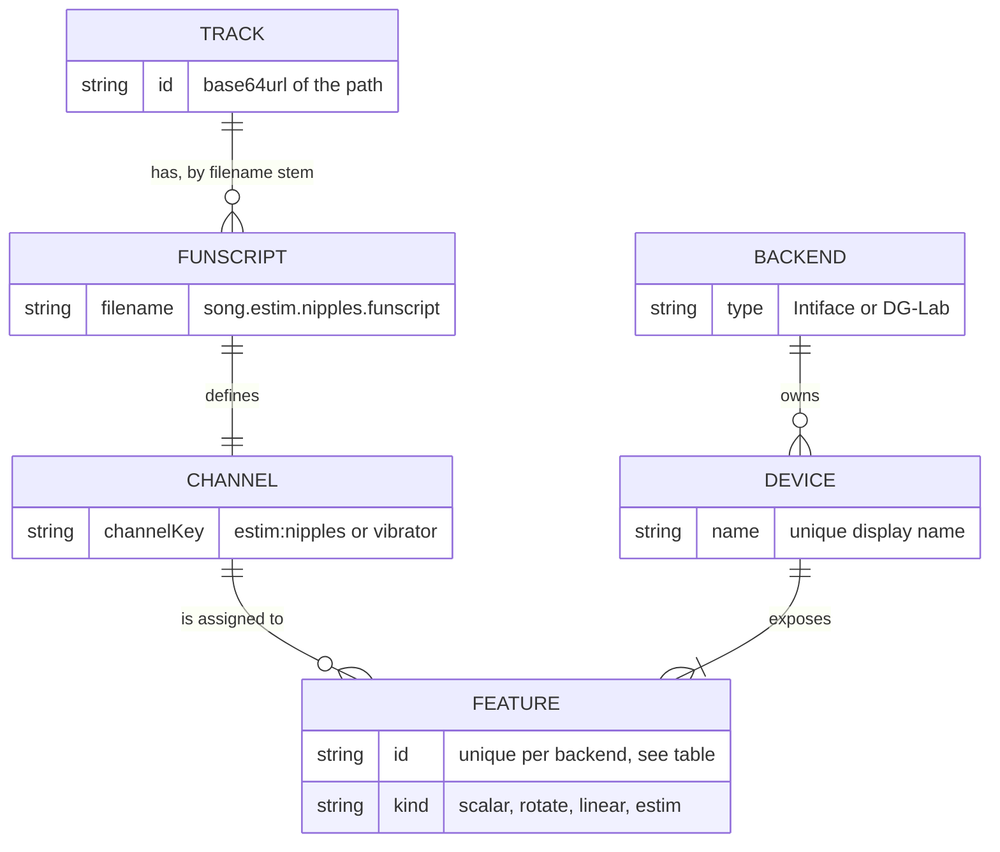
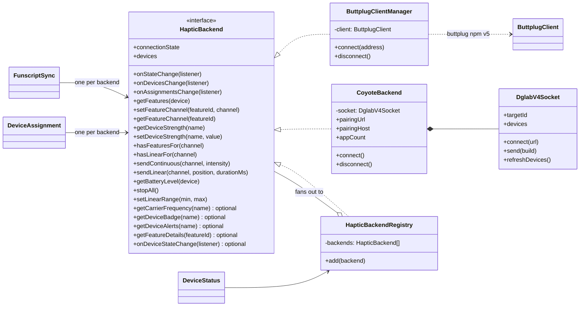
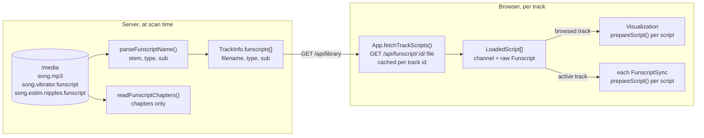
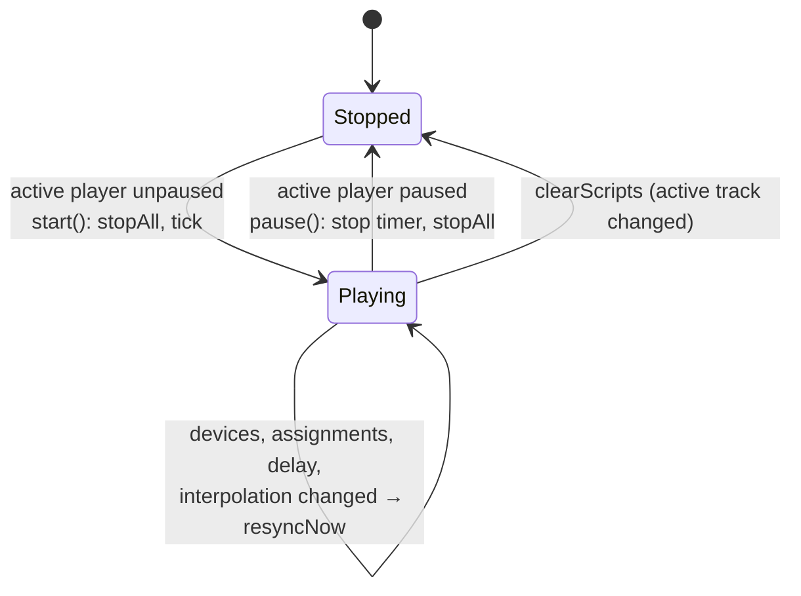
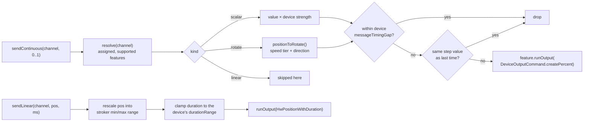
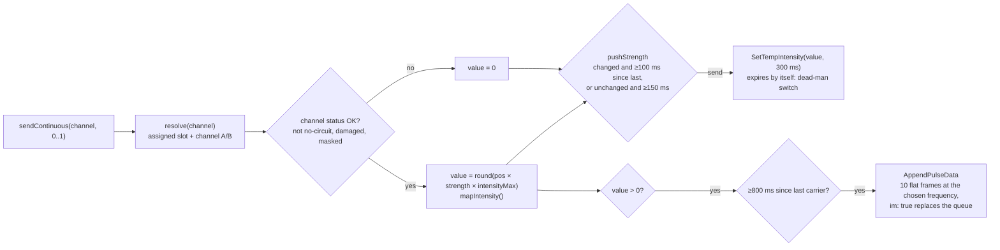

[← Developer Guide](README.md)

# Haptics

This page covers everything between "a funscript file exists" and "a toy moves". All of it runs in the browser. The server only lists and serves funscript files. It does **not** interpolate or modify them.

## Concepts

- A **channel** is `{ type, sub? }` ([shared/haptics.ts](../../src/shared/haptics.ts)). `channelKey()` turns it into the string used as map key, DOM attribute and stored value.
- A **feature** is one actuator. The user assigns features to channel keys, and each backend stores these assignments per feature id in `localStorage`.
- The **kind** of the feature decides how it is driven, not the funscript type. A vibrator script can drive a stroker, and one toy's two motors can follow two different scripts.

| Backend | Feature id format | Kinds | Stored in `localStorage` |
| --- | --- | --- | --- |
| Intiface (`ButtplugClientManager`) | device name, kind, feature index joined by `#` | `scalar`, `rotate`, `linear` | `happy-feature-assignments`, `happy-device-strengths`, `happy-stroker-range` |
| DG-Lab (`CoyoteBackend`) | `dglab`, slot id, channel 0/1 joined by `#` | `estim` | `happy-dglab-assignments`, `happy-dglab-strengths`, `happy-dglab-frequency`, `happy-dglab-pairing-host` |

## Backend interface

Every transport implements `HapticBackend` ([backend.ts](../../src/client/components/haptic/backend.ts)). The UI and the sync loop only use this interface.

`HapticBackendRegistry` makes all backends look like one: devices are concatenated, the connection state is the "best" of all (`connected` > `connecting` > `error` > `disconnected`), per-device calls go to the owning backend, and per-channel calls fan out. Today only `DeviceStatus` and `stopAll()` on `pagehide` go through it. The sync engines and the device lists talk to their own backend directly.

## Funscript pipeline

`prepareScript(actions, method)` sorts the actions and precomputes one cubic polynomial per segment, so `positionAt(prepared, ms)` is a binary search plus a polynomial evaluation. The methods are:

| Method | Continuous output (vibrate, rotate, e-stim) | Linear output (stroker) |
| --- | --- | --- |
| `none` | holds each point until the next one | jumps to the point just reached, 50 ms move |
| `linear` (default) | straight line between points | moves to the next point, duration = time until it |
| `pchip` | smooth, overshoot-free curve | same as `linear` (the device interpolates the move itself) |

The method comes from `FUNSCRIPT_INTERPOLATION_METHOD` (server config). Changing it calls `setInterpolation()`, which re-prepares all loaded scripts.

## The sync loop

`FunscriptSync` ([funscriptSync.ts](../../src/client/components/funscriptSync.ts)) is a timer loop that reads the **active** player's time and writes to **one** backend. `App` creates one engine for Intiface and, if DG-Lab is enabled, a second one for the Coyote, so each can have its own delay.

What one tick does:

Continuous output is sent **every tick**, even if the value did not change. The backends deduplicate, and resending makes the output self-correcting: if one Bluetooth write is lost, the next tick fixes it. The update rate slider (10–240 Hz, default from `HAPTIC_FREQUENCY`) sets the tick interval for all engines.

## Backend output paths

### Intiface

### DG-Lab Coyote

The Coyote has no position or speed. It emits pulses: a carrier waveform whose strength can be set. HAPPY keeps a flat carrier queued and uses the funscript to drive the channel **strength**. The DG-Lab app owns the safety limits, and HAPPY never asks for more than the ceiling the app reports.

`stopAll()` sends `device.op.clear` and resets both channel intensities to 0. All messages go through `DglabV4Socket.send()` to the relay, which forwards them to every attached app. See [Pair a DG-Lab Coyote](use-cases/coyote-pairing.md) for the connection side.

## Safety behaviour

| Situation | What stops the output |
| --- | --- |
| Pause | `FunscriptSync.pause()` → `backend.stopAll()` |
| Track changes | `clearScripts()` → `stop()` → `stopAll()` |
| Devices or assignments change | `resyncNow()` → `stopAll()` and immediately resend the current values |
| Tab closed or navigated away | `pagehide` → `HapticBackendRegistry.stopAll()` |
| Tab crashes or network drops (Coyote) | every strength command expires after 300 ms |
| Script has no point at the current time | `positionAt()` returns null → 0 is sent |

## Code map

| Topic | Files |
| --- | --- |
| Channel model | [shared/haptics.ts](../../src/shared/haptics.ts), [shared/types.ts](../../src/shared/types.ts) |
| Interpolation | [shared/interpolation.ts](../../src/shared/interpolation.ts) |
| Sync loop | [components/funscriptSync.ts](../../src/client/components/funscriptSync.ts) |
| Interface and registry | [haptic/backend.ts](../../src/client/components/haptic/backend.ts), [haptic/backendRegistry.ts](../../src/client/components/haptic/backendRegistry.ts) |
| Intiface | [haptic/buttplugClient.ts](../../src/client/components/haptic/buttplugClient.ts) |
| DG-Lab | [dglab/coyoteBackend.ts](../../src/client/components/haptic/dglab/coyoteBackend.ts), [dglab/waveform.ts](../../src/client/components/haptic/dglab/waveform.ts), [dglab/v4/protocol.ts](../../src/client/components/haptic/dglab/v4/protocol.ts), [dglab/v4/socket.ts](../../src/client/components/haptic/dglab/v4/socket.ts) |
| Device UI | [haptic/deviceAssignment.ts](../../src/client/components/haptic/deviceAssignment.ts), [haptic/deviceStatus.ts](../../src/client/components/haptic/deviceStatus.ts), [haptic/templates.ts](../../src/client/components/haptic/templates.ts) |
| Timelines | [haptic/visualization/index.ts](../../src/client/components/haptic/visualization/index.ts), [haptic/visualization/geometry.ts](../../src/client/components/haptic/visualization/geometry.ts) |
