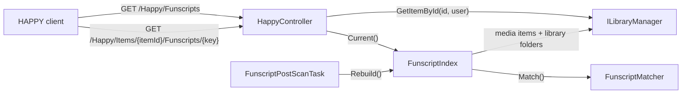

# Jellyfin plugin

HAPPY is moving to Jellyfin for the library, metadata, artwork, trickplay, chapters, authentication and streaming. Jellyfin has no idea what a funscript is, so a small companion plugin in [jellyfin-plugin/](../../jellyfin-plugin/) indexes `.funscript` files next to the media and serves them to signed-in users.

The plugin is deliberately dumb. It only maps files to items and checks access. Parsing the script type and subcategory, funscript chapters and VR detection stay in the TypeScript client, where they are already tested.



## Endpoints

All routes require a Jellyfin token (`Authorization: MediaBrowser … Token="…"`), the same one the client uses for the rest of the Jellyfin API. JSON uses Jellyfin's PascalCase.

| Route | Returns |
| --- | --- |
| `GET /Happy/Info` | `{ "Version": "0.1.0.0" }` for compatibility checks |
| `GET /Happy/Funscripts` | `{ "<itemId>": [{ "Key": "<16 hex>", "FileName": "clip.stroker.funscript" }] }`. Only items the user can see, and only items that have scripts. |
| `GET /Happy/Items/{itemId}/Funscripts/{key}` | The raw funscript JSON. Returns 404 for unknown, hidden or script-less items and for unknown keys alike. |

The client never sends a path back. A key is a hash of the script's absolute path, and the server only serves files that are in its own index, so there is nothing to traverse.

## Matching

`FunscriptMatcher` needs no list of type suffixes. A script `a.b.c.funscript` belongs to the media whose file stem is the longest separator-bounded prefix of `a.b.c` (`a.b.c`, then `a.b`, then `a`). Stems compare case-insensitively.

1. A media file with that stem **in the script's own directory** wins.
2. Otherwise the script is attached to **every** media file with that stem in the same library folder. This matches the old server's "basename anywhere" behaviour without crossing library boundaries.

The separator defaults to `.` and is `FunscriptSeparator` in the plugin's XML configuration. It must match HAPPY's `FUNSCRIPT_SUFFIX_SEPARATOR`.

## Index lifetime

`FunscriptIndex` walks the library folders itself, because Jellyfin does not track `.funscript` files. It is rebuilt:

- after every library scan (`FunscriptPostScanTask`, an `ILibraryPostScanTask`)
- on the next request once it is older than 30 s, so scripts added without a media change still appear shortly after

Concurrent callers share one build.

## Build, test, install

The plugin targets the Jellyfin version it is built against (`targetAbi` in [build.yaml](../../jellyfin-plugin/build.yaml)). Bump `Jellyfin.Controller`/`Jellyfin.Model` and `targetAbi` together for each new Jellyfin minor release.

```bash
# With the .NET 10 SDK installed, or inside mcr.microsoft.com/dotnet/sdk:10.0:
dotnet test jellyfin-plugin/Jellyfin.Plugin.Happy.slnx
sh jellyfin-plugin/package.sh        # → jellyfin-plugin/artifacts/HAPPY_<version>/
```

To install by hand, copy the `HAPPY_<version>` folder into Jellyfin's `plugins/` directory (inside the Jellyfin config/data volume) and restart Jellyfin. Afterwards, *Dashboard → Plugins* lists **HAPPY**.

CI runs the tests and uploads the packaged folder as a build artifact (`jellyfin-plugin` job in `.github/workflows/test.yml`).

## Testing against a real Jellyfin

`npm run test:jellyfin` runs the integration tests in `test/integration/jellyfin/` against a live server. Connection details come only from the environment, normally from `config/test.env` (gitignored like the rest of `config/`):

```bash
HAPPY_JELLYFIN_URL=https://jellyfin.example.com
HAPPY_JELLYFIN_USER=your-test-user
HAPPY_JELLYFIN_PASSWORD=…
```

- Without these variables every test is skipped, so `npm test` and CI never need a server. The integration tests are not part of `npm test`.
- If the plugin is not installed, the plugin tests skip with a message.
- Use a dedicated non-admin user. That exercises the per-user access checks.
- Tests assert shapes and invariants only, never library contents, and never print names, paths or server addresses. Keep it that way: test output ends up in CI logs and issue reports.

## Code map

| Topic | Files |
| --- | --- |
| Plugin entry, configuration, DI | [Plugin.cs](../../jellyfin-plugin/Jellyfin.Plugin.Happy/Plugin.cs), [PluginConfiguration.cs](../../jellyfin-plugin/Jellyfin.Plugin.Happy/Configuration/PluginConfiguration.cs), [PluginServiceRegistrator.cs](../../jellyfin-plugin/Jellyfin.Plugin.Happy/PluginServiceRegistrator.cs) |
| Endpoints | [Api/HappyController.cs](../../jellyfin-plugin/Jellyfin.Plugin.Happy/Api/HappyController.cs) |
| Index and matching | [Funscripts/FunscriptIndex.cs](../../jellyfin-plugin/Jellyfin.Plugin.Happy/Funscripts/FunscriptIndex.cs), [Funscripts/FunscriptMatcher.cs](../../jellyfin-plugin/Jellyfin.Plugin.Happy/Funscripts/FunscriptMatcher.cs), [Funscripts/FunscriptPostScanTask.cs](../../jellyfin-plugin/Jellyfin.Plugin.Happy/Funscripts/FunscriptPostScanTask.cs) |
| Tests | [Jellyfin.Plugin.Happy.Tests/](../../jellyfin-plugin/Jellyfin.Plugin.Happy.Tests/), [test/integration/jellyfin/](../../test/integration/jellyfin/) |
| Packaging | [build.yaml](../../jellyfin-plugin/build.yaml), [package.sh](../../jellyfin-plugin/package.sh) |
