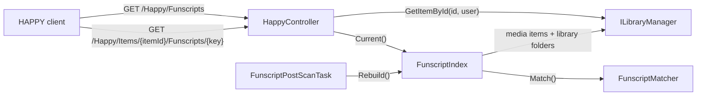

# Jellyfin plugin

HAPPY uses Jellyfin for the library, metadata, artwork, trickplay, chapters, users and streaming. The HAPPY plugin in [jellyfin-plugin/](../../jellyfin-plugin/) adds everything else HAPPY needs from a server: it serves the built web app, the client settings (edited on its dashboard page), the version and the user docs, and, since Jellyfin has no idea what a funscript is, it indexes `.funscript` files next to the media and serves them to signed-in users. There is no other HAPPY server; only the optional [DG-Lab relay](../../dglab-relay/README.md) runs separately.

The plugin is deliberately dumb. It serves files and settings, maps scripts to items and checks access. Parsing the script type and subcategory, funscript chapters and VR detection stay in the TypeScript client, where they are already tested.



## Endpoints

All routes except the docs require a Jellyfin token (`Authorization: MediaBrowser … Token="…"`), the same one the client uses for the rest of the Jellyfin API. JSON uses Jellyfin's PascalCase, except `/Happy/Config` and `/Happy/Docs`, which keep the client's camelCase shapes.

| Route | Returns |
| --- | --- |
| `GET /Happy/Info` | `{ "Version": "0.15.0.0", "Channel": "stable", "Commit": "<sha>", "BuiltAt": "<ISO time>" }`. Commit and build time come from `-p:HappyCommit`/`-p:HappyBuiltAt` (`HAPPY_COMMIT`/`HAPPY_BUILT_AT` for `package.sh`, set in CI) and are `null` otherwise. Debug builds report the channel `dev`. |
| `GET /Happy/Config` | The client settings (`ClientSettings` in `src/shared/types.ts`), built from the plugin configuration by `Configuration/ClientSettings.cs`, which also repairs invalid values. Admins edit them on the plugin's dashboard page (`Configuration/configPage.html`). |
| `GET /Happy/Web/{path}` | The HAPPY web app: the built client from `public/` (`index.html`, `js/`, `css/`, `img/`, Bootstrap), embedded in the DLL without source maps. **Anonymous**; the page shows the Jellyfin sign-in. `/Happy/Web` redirects to `/Happy/Web/` so relative asset URLs resolve. Served with `Cache-Control: no-cache` and an ETag per plugin build (the files are not fingerprinted). A Release build fails without `public/js/app.js`, so `npm run build:client` and `build:vendor` come first. |
| `GET /Happy/Web/theme.css` | The stylesheet of the theme chosen in the settings (`css/themes/<theme>.css`; unknown themes fall back to `oled`). **Anonymous**, like the rest of the app, so the sign-in card is themed too. Its ETag combines the plugin build and the theme, so browsers notice a changed setting. A literal route, so it wins over `{path}`. |
| `GET /Happy/Docs`, `/Happy/Docs/{page}`, `/Happy/Docs/assets/{path}` | The user docs (`docs/*.md` and their images), embedded in the DLL. **Anonymous**, like the docs on GitHub; `` tags carry no token. |
| `GET /Happy/Funscripts` | `{ "<itemId>": [{ "Key": "<16 hex>", "FileName": "clip.stroker.funscript" }] }`. Only items the user can see, and only items that have scripts. |
| `GET /Happy/Items/{itemId}/Funscripts/{key}` | The raw funscript JSON. Returns 404 for unknown, hidden or script-less items and for unknown keys alike. |

Besides its routes, the plugin rewrites two responses of Jellyfin's own:

- `GET …/web/config.json` gets a `menuLinks` entry `{ "name": "HAPPY", "icon": "vibration", "url": "../Happy/Web/" }`, which jellyfin-web shows in its side menu and top bar for every user.
- With the menu icon set to `happy` (the default), `GET …/web/` and `…/web/index.html` get `<link rel="stylesheet" href="../Happy/Web/jellyfin-menu.css">` before `</head>`. [public/jellyfin-menu.css](../../public/jellyfin-menu.css) hides the Material glyph inside links to `…/Happy/Web/` (a transparent text fill, so the icon keeps its size) and paints `icon.svg` as a mask in the link's text colour. jellyfin-web draws that glyph as a ligature (drawer and top bar) or with `::before` (legacy drawer); the CSS covers both. `vibration` stays in `config.json` as the fallback.

- `Web/WebConfigStartupFilter.cs` is an `IStartupFilter` registered in `PluginServiceRegistrator`. It buffers only those responses, without compression or conditional request headers, and drops their `ETag`/`Last-Modified` (`Cache-Control: no-cache`). A failed rewrite serves Jellyfin's original.
- `Web/WebConfigMenuLink.cs` holds the pure transforms. It keeps admin-added links, adds the entry and the stylesheet once, and returns the input unchanged if it is not a JSON object or has no `</head>`.
- Any error serves Jellyfin's file unchanged. The *Show HAPPY in Jellyfin's menu* setting turns it off without a restart.
- This is data, not script: see "Jellyfin web client integration" in ARCHITECTURE.md for why HAPPY injects no JavaScript into jellyfin-web.

The client never sends a path back. A key is a hash of the script's absolute path, and the server only serves files that are in its own index, so there is nothing to traverse.

## Matching

`FunscriptMatcher` needs no list of type suffixes. A script `a.b.c.funscript` belongs to the media whose file stem is the longest separator-bounded prefix of `a.b.c` (`a.b.c`, then `a.b`, then `a`). Stems compare case-insensitively.

1. A media file with that stem **in the script's own directory** wins.
2. Otherwise the script is attached to **every** media file with that stem in the same library folder. This matches the old server's "basename anywhere" behaviour without crossing library boundaries.

The separator defaults to `.` and is `FunscriptSeparator` in the plugin configuration (*Separator* on the settings page). The client gets the same value as `funscriptSuffixes.separator` from `/Happy/Config`, so matching and parsing always agree. A changed separator takes effect with the next index rebuild.

Only the folders of the libraries in `LibraryIds` (*Libraries* on the settings page) are indexed; empty means all. The index remembers which libraries it was built for and rebuilds as soon as the selection changes. `GET /Happy/Config` returns the selection as `libraryIds` (32-hex item ids, libraries deleted since dropped), and the client loads one `/Items?ParentId=` per library. When no selected library exists any more, both fall back to all libraries.

## Index lifetime

`FunscriptIndex` walks the library folders itself, because Jellyfin does not track `.funscript` files. It is rebuilt:

- after every library scan (`FunscriptPostScanTask`, an `ILibraryPostScanTask`)
- on the next request once it is older than 30 s, so scripts added without a media change still appear shortly after

Concurrent callers share one build.

## Build, test, install

The plugin targets the Jellyfin version it is built against (`targetAbi` in [build.yaml](../../jellyfin-plugin/build.yaml)). Bump `Jellyfin.Controller`/`Jellyfin.Model` and `targetAbi` together for each new Jellyfin minor release.

```bash
npm run test:plugin                  # dotnet test in the .NET SDK container, no local SDK needed
# With the .NET 10 SDK installed, or inside mcr.microsoft.com/dotnet/sdk:10.0:
dotnet test jellyfin-plugin/Jellyfin.Plugin.Happy.slnx
sh jellyfin-plugin/package.sh        # → jellyfin-plugin/artifacts/HAPPY_<version>/ and happy_<version>.zip (needs zip)
```

To install by hand, copy the `HAPPY_<version>` folder into Jellyfin's `plugins/` directory (inside the Jellyfin config/data volume) and restart Jellyfin. Afterwards, *Dashboard → Plugins* lists **HAPPY**.

CI runs the tests and uploads the packaged folder as a build artifact (`jellyfin-plugin` job in `.github/workflows/test.yml`).

## Releases and the plugin repository

The plugin is released together with HAPPY and shares its version.

- **Versioning.** The release PR bumps the `x-release-please-version` markers in `build.yaml` and `Directory.Build.props` (`extra-files` of the root package in `release-please-config.json`). `build.yaml` is listed with `"type": "generic"`: as a plain path release-please would treat it as YAML, set `version` to `x.y.z` and reformat the file, which breaks `package.sh` and the plugin version. Jellyfin uses four-part versions, so HAPPY `x.y.z` is plugin `x.y.z.0`.
- **Publishing.** For every HAPPY release, the `publish-jellyfin-plugin` job in `.github/workflows/release.yml` tests and packages the plugin, attaches `happy_<x.y.z.0>.zip` to the GitHub release `v<x.y.z>`, and adds the version to `manifest.json` on the orphan branch `jellyfin-plugin-repository` (created on the first release). `scripts/jellyfin-plugin-manifest.ts` writes the entry: package fields from `build.yaml`, the release notes as changelog, the download URL and the zip's MD5 (Jellyfin verifies it).
- **Repository URL** (what users add in Jellyfin): `https://raw.githubusercontent.com/lumbar-spine-support/docker-haptic-player/refs/heads/jellyfin-plugin-repository/manifest.json`. Older versions stay in the manifest, so a Jellyfin that is not yet on the newest `targetAbi` keeps getting the last version built for it.
- **Auto-update.** Jellyfin copies `autoUpdate` from a bundled `meta.json` when it installs from a repository, so `package.sh` writes `"autoUpdate": true`. With `false`, repository installs would never update.

To re-publish a version (for example after a failed job), re-run the job: the zip is uploaded with `--clobber` and the manifest entry of the same version is replaced.

## Testing against a real Jellyfin

`npm run test:jellyfin` runs the integration tests in `test/integration/jellyfin/` against a live server. Connection details come only from the environment, normally from `config/test.env` (gitignored like the rest of `config/`):

```bash
HAPPY_JELLYFIN_URL=https://jellyfin.example.com
HAPPY_JELLYFIN_USER=your-test-user
HAPPY_JELLYFIN_PASSWORD=…
```

- Without these variables every test is skipped, so `npm test` and CI never need a server. The integration tests are not part of `npm test`.
- If the plugin is not installed, the plugin tests skip with a message.
- Use a dedicated non-admin user. That exercises the per-user access checks.
- Tests assert shapes and invariants only, never library contents, and never print names, paths or server addresses. Keep it that way: test output ends up in CI logs and issue reports.

## Demo library from the test fixtures

`test/fixtures/media` doubles as a small Jellyfin library with every kind of metadata HAPPY reads, for manual testing and for `scripts/screenshot-app.js`. `npm run dev:jellyfin` sets it up automatically in a local Jellyfin ([local-jellyfin.md](local-jellyfin.md)). `npm run screenshot` uses that Jellyfin by default (credentials from `config/dev-jellyfin.env`, page `<url>/Happy/Web/`); `SCREENSHOT_JELLYFIN_URL`/`USER`/`PASSWORD` point it at another Jellyfin that serves only the fixtures. To use your own Jellyfin, run `git lfs pull` first, then point Jellyfin at the folder (copy or mount it):

| Library | Jellyfin type | What it shows |
| --- | --- | --- |
| Videos | *Mixed movies and shows* (or *Movies*), NFO metadata reader on | `<name>.nfo` sidecars give Jellyfin **Tags** (`<tag>`), genres and a Markdown overview (`<plot>`); `VR180_*` clips test both VR layouts; `BigBuckBunny_320x180.*.funscript` cover all script types including subcategories |
| Audio | *Books* | `BigBuckBunny_dummy1-3.mp3` carry multi-value ID3v2.4 genres (HAPPY shows them as tags), a Markdown comment (the overview, audiobooks only), track numbers for album grouping and cover art |

Give each library its own path to the folder, for example two mounts of it. Libraries that share one path share their items, and the audio library then retypes the videos. Jellyfin's own *Tags* section stays empty for the audio files: no Jellyfin metadata reader fills Tags from audio files, which is why HAPPY also counts genres as tags. If you add or change an NFO after the first scan, use *Refresh metadata → Replace all metadata* on the item or library.

The audio tags are written by `node scripts/tag-fixture-audio.mjs`. It keeps the audio frames and the cover art byte for byte and only rewrites the text frames; ffmpeg cannot write the multi-value genre frames Jellyfin needs.

## Code map

| Topic | Files |
| --- | --- |
| Plugin entry, configuration, DI | [Plugin.cs](../../jellyfin-plugin/Jellyfin.Plugin.Happy/Plugin.cs), [PluginConfiguration.cs](../../jellyfin-plugin/Jellyfin.Plugin.Happy/Configuration/PluginConfiguration.cs), [PluginServiceRegistrator.cs](../../jellyfin-plugin/Jellyfin.Plugin.Happy/PluginServiceRegistrator.cs) |
| Client settings, dashboard page | [Configuration/ClientSettings.cs](../../jellyfin-plugin/Jellyfin.Plugin.Happy/Configuration/ClientSettings.cs), [Configuration/configPage.html](../../jellyfin-plugin/Jellyfin.Plugin.Happy/Configuration/configPage.html), [src/shared/types.ts](../../src/shared/types.ts) (`ClientSettings`) |
| Jellyfin menu link | [Web/WebConfigStartupFilter.cs](../../jellyfin-plugin/Jellyfin.Plugin.Happy/Web/WebConfigStartupFilter.cs), [Web/WebConfigMenuLink.cs](../../jellyfin-plugin/Jellyfin.Plugin.Happy/Web/WebConfigMenuLink.cs) |
| Endpoints | [Api/HappyController.cs](../../jellyfin-plugin/Jellyfin.Plugin.Happy/Api/HappyController.cs) (config, info, funscripts), [Api/WebController.cs](../../jellyfin-plugin/Jellyfin.Plugin.Happy/Api/WebController.cs) (web app), [Api/DocsController.cs](../../jellyfin-plugin/Jellyfin.Plugin.Happy/Api/DocsController.cs) (docs) |
| Embedded files | [Web/StaticFileSource.cs](../../jellyfin-plugin/Jellyfin.Plugin.Happy/Web/StaticFileSource.cs) (DLL resources, or `HAPPY_DEV_WEB_ROOT`/`HAPPY_DEV_DOCS_ROOT` in the dev Jellyfin), [Web/ContentTypes.cs](../../jellyfin-plugin/Jellyfin.Plugin.Happy/Web/ContentTypes.cs) |
| Index and matching | [Funscripts/FunscriptIndex.cs](../../jellyfin-plugin/Jellyfin.Plugin.Happy/Funscripts/FunscriptIndex.cs), [Funscripts/FunscriptMatcher.cs](../../jellyfin-plugin/Jellyfin.Plugin.Happy/Funscripts/FunscriptMatcher.cs), [Funscripts/FunscriptPostScanTask.cs](../../jellyfin-plugin/Jellyfin.Plugin.Happy/Funscripts/FunscriptPostScanTask.cs) |
| Tests | [Jellyfin.Plugin.Happy.Tests/](../../jellyfin-plugin/Jellyfin.Plugin.Happy.Tests/), [test/integration/jellyfin/](../../test/integration/jellyfin/) |
| Packaging | [build.yaml](../../jellyfin-plugin/build.yaml), [package.sh](../../jellyfin-plugin/package.sh) |
| Releases, plugin repository | [release-please-config.json](../../release-please-config.json), [.github/workflows/release.yml](../../.github/workflows/release.yml) (`publish-jellyfin-plugin`), [scripts/jellyfin-plugin-manifest.ts](../../scripts/jellyfin-plugin-manifest.ts) |
| Demo library | [test/fixtures/media/](../../test/fixtures/media/), [scripts/tag-fixture-audio.mjs](../../scripts/tag-fixture-audio.mjs) |
