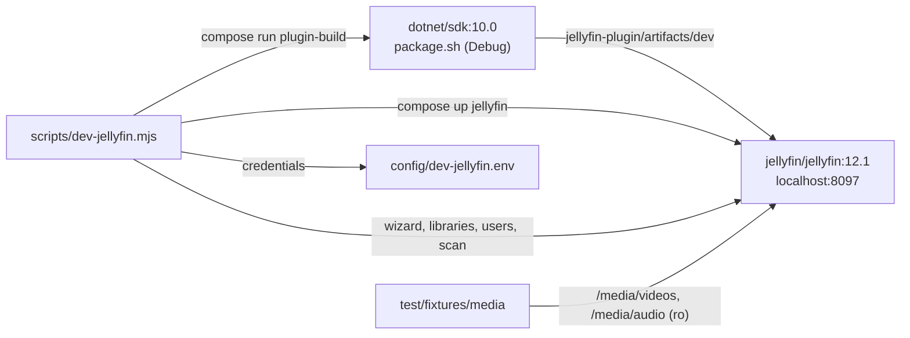

# Local Jellyfin for development

`npm run dev:jellyfin` starts a Jellyfin in Docker with the [demo library](jellyfin-plugin.md#demo-library-from-the-test-fixtures) from `test/fixtures/media` and the HAPPY plugin built from your working tree. Use it to test UI and plugin changes before a release, and to run the Jellyfin integration tests without a server of your own.

## Requirements

- Docker with Compose v2. It works on the host and in the devcontainer, which uses the host's Docker daemon. The devcontainer mounts the workspace at the same path, so the bind mounts resolve.
- `git lfs pull`, so the fixtures are real media rather than LFS pointers.
- No .NET SDK: the plugin is built in the `mcr.microsoft.com/dotnet/sdk:10.0` container.

## Commands

| Command | What it does |
| --- | --- |
| `npm run dev:jellyfin` | Build the plugin (Debug), start Jellyfin, and on first run complete the setup wizard, create the libraries and users and scan. Safe to run again. |
| `npm run dev:jellyfin:plugin` | Rebuild the plugin and recreate the Jellyfin container to load it |
| `npm run test:plugin` | `dotnet test` of the plugin in the .NET SDK container |
| `npm run dev:client` / `npm run dev:css` | Rebuild `public/js` and `public/css` on every change; reload the page to see it |
| `npm run dev:jellyfin:down` | Stop Jellyfin and keep its data |
| `npm run dev:jellyfin:reset` | Stop Jellyfin and delete its data. The next `dev:jellyfin` starts from the setup wizard. |
| `npm run test:jellyfin:dev` | The integration tests in `test/integration/jellyfin/`, run against this Jellyfin |

## Working on the client

Open **http://localhost:8097/Happy/Web/** and sign in as `happy-user`. The plugin serves the client straight from your working tree: compose sets `HAPPY_DEV_WEB_ROOT` and `HAPPY_DEV_DOCS_ROOT`, which point at the read-only mounts of `public/` and `docs/`, and it serves without caching. So a client change needs only `npm run dev:client` (and `dev:css` for SCSS) and a page reload, with no plugin rebuild and no Jellyfin restart.

To test what a release serves instead, start with the variables empty: `HAPPY_DEV_WEB_ROOT= HAPPY_DEV_DOCS_ROOT= npm run dev:jellyfin:plugin`. The plugin then serves the copies embedded in the DLL, with ETags and without source maps. Run `npm run build:client` and `build:vendor` first, since the DLL embeds whatever `public/` holds at build time.

VS Code:
- **HAPPY in local Jellyfin** starts the local Jellyfin, builds the vendor assets and CSS, starts the JS and CSS watches, and opens Chrome at `/Happy/Web/` with breakpoints in the TypeScript sources.
- The compound **Debug (local Jellyfin)** runs `dev:jellyfin` first, then starts the HAPPY server against it and Chrome. **Local Jellyfin Integration Tests** runs the integration tests. The tasks `npm: dev:jellyfin:plugin` and `npm: dev:jellyfin:down` are in *Run Task*.

## What gets set up

- **Jellyfin**: Docker image `jellyfin/jellyfin:12.1`. Keep the minor version in step with `Jellyfin.Controller` in the plugin's csproj. It is published on port **8097**, so it can run next to a real Jellyfin on 8096; change it with `HAPPY_DEV_JELLYFIN_PORT`. Data lives in the Docker volumes `happy-dev_config` and `happy-dev_cache`.
- **Libraries**:
  - **Videos**: *Mixed movies and shows* over `/media/videos`, NFO reader, trickplay during the scan.
  - **Audio**: *Books* over `/media/audio`.
  - Both are the same fixture folder, mounted read-only twice. Two libraries over one path would share their items, and the audio library would retype the videos.
- **Users**:
  - `happy-admin` (administrator)
  - `happy-user` (non-admin, all libraries). Sign in with this one, and the tests use it too.
  - Passwords are random. They are generated on first setup and kept in `config/dev-jellyfin.env` (gitignored).
- **Plugin**: `jellyfin-plugin/artifacts/dev` is bind-mounted as `/config/plugins/HAPPY_dev`. `dev:jellyfin` checks at the end that the plugin is *Active* and lists funscripts.
- **`config/dev-jellyfin.env`**: `HAPPY_JELLYFIN_URL/USER/PASSWORD` for the integration tests, the admin credentials, and `JELLYFIN_URL`/`JELLYFIN_INTERNAL_URL` for the HAPPY server launch config. Your own `config/test.env` is never touched.

From the devcontainer, `localhost:8097` is the devcontainer itself, so the script reaches Jellyfin through the Docker bridge gateway instead. It also tries `host.docker.internal`, and you can override it with `HAPPY_DEV_JELLYFIN_URL`. It writes the address that worked as `HAPPY_JELLYFIN_URL`. Your browser on the host always uses `http://localhost:8097`.

## Notes

- If the setup fails because the Jellyfin data was created without the current `config/dev-jellyfin.env`, run `npm run dev:jellyfin:reset`.
- The dummy audio fixtures are only a fraction of a second long, so the integration test that expects `durationSeconds > 0` fails on them.
- Logs: `docker compose -f dev/jellyfin/compose.yaml logs -f jellyfin`.
