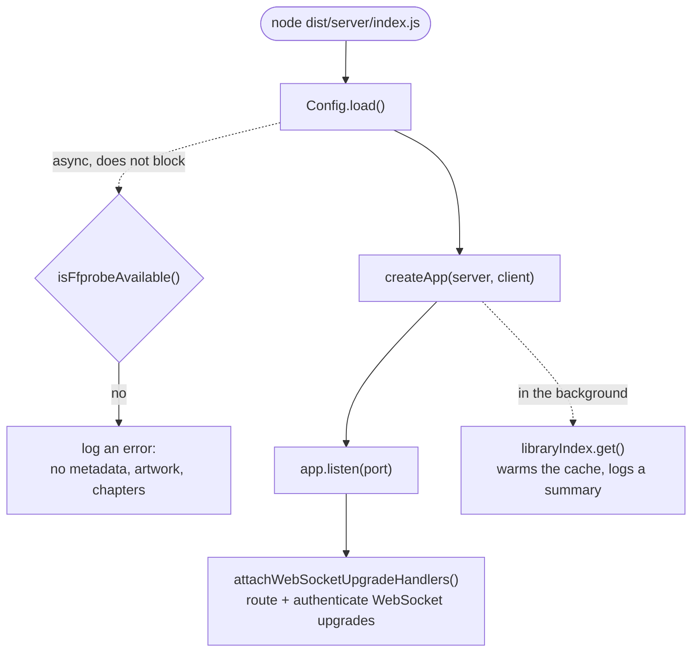
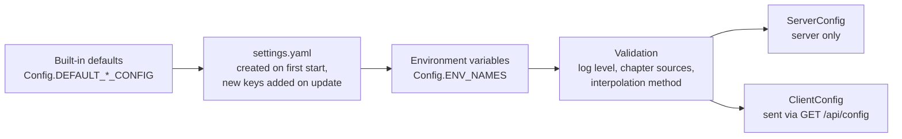
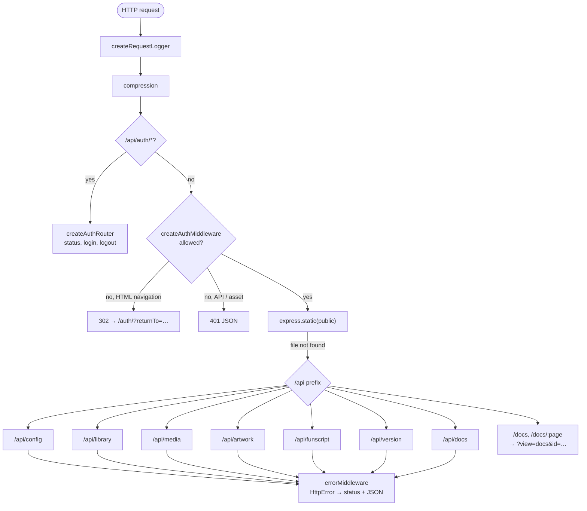
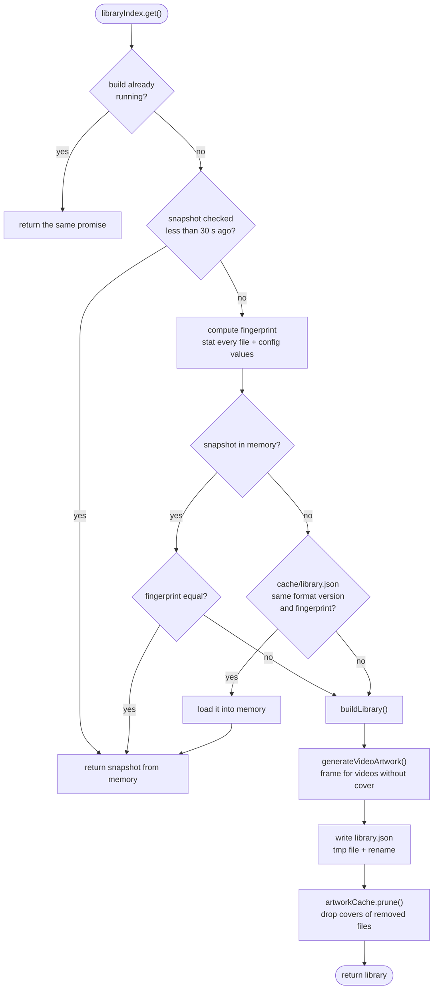
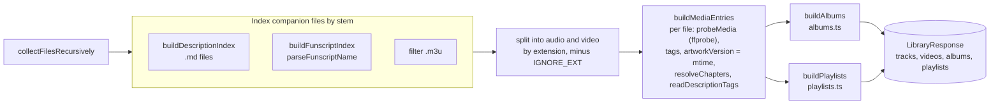
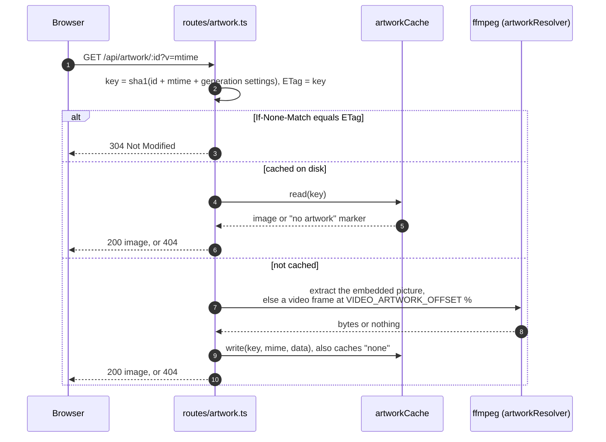
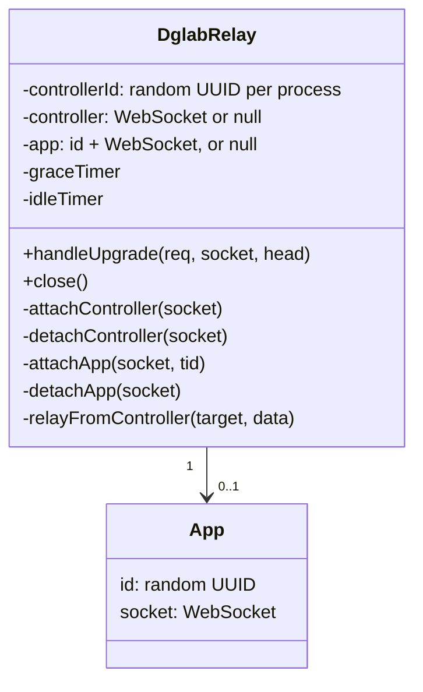

[← Developer Guide](README.md)

# Server

The server is an Express 5 app built by `createApp()` in [src/server/index.ts](../../src/server/index.ts). It has no database. All state lives in:

- the media directory (read-only),
- `settings.yaml` and `tokens.txt` in the config directory,
- the rebuildable `cache/` folder in the config directory,
- memory: the library snapshot, the login throttle, the relay sessions.

## Startup

`main()` is skipped when `NODE_ENV` contains `test`, so tests can call `createApp()` directly with a temporary media and config directory.

### Configuration precedence

Later sources win. `CONFIG_PATH` selects the config directory, and settings with no YAML key (`configDir`) come from the environment only. After changing an option, run `npm run docs:env` to regenerate the table in `docs/configuration.md`.

## Request pipeline

Every HTTP request passes through the middleware in this order. The order matters: auth routes and static assets for the login page must work without a token.

A request is allowed if **one** of these is true (see `createAuthMiddleware`):

1. No password is configured. The middleware then passes everything through and logs a warning at startup.
2. The path starts with a public prefix: `/api/auth`, `/auth`, `/vendor`, `/icon.svg`, `/favicon.ico`.
3. The `happy_token` cookie is a token in `tokens.txt`.
4. It is a `GET`/`HEAD` on `/api/media/…` with a valid `?mediaToken=`. This lets Chromecast/AirPlay receivers, which have no cookie, stream media.

### Routes

| Prefix | Router | Purpose |
| --- | --- | --- |
| `/api/auth` | `routes/auth.ts` | `GET /status`, `POST /login` (throttled), `POST /logout` |
| `/api/config` | `routes/config.ts` | Client defaults (`ClientSettings`) plus the media access token |
| `/api/library` | `routes/library.ts` | `GET /` the whole `LibraryResponse`, `POST /refresh` forces a rescan |
| `/api/media/:id` | `routes/media.ts` | File stream with range support. `/:id/description` looks up the track's `descriptionFilename` in the cached library index (404 if none) and returns the markdown without frontmatter. `/:id/chapters.vtt` renders the track's chapters as WebVTT (404 if none). `/:id/storyboard.vtt` waits for the video's storyboard (prioritized in the queue) and returns `#xywh=` cues pointing at `/:id/storyboard/<key>/<n>.jpg`, served `immutable`. Rate-limited per IP (`express-rate-limit`, 1000 requests/min) |
| `/api/artwork/:id` | `routes/artwork.ts` | Embedded cover, cached on disk, with ETag and `immutable` when `?v=` is given |
| `/api/funscript/:trackId/:file` | `routes/funscript.ts` | Raw funscript JSON. Rejects names that don't match the configured suffixes (403) |
| `/api/version` | `routes/version.ts` | Version and commit |
| `/api/docs` | `routes/docs.ts` | Lists and serves top-level `docs/*.md` for the in-app help. Subfolders such as `docs/developer/` are never listed |
| `/ws/dglab` | `services/dglabRelay.ts` | WebSocket upgrade, only when `DGLAB_ENABLED` |

Track ids are `base64url(relative path)`. `decodeTrackId()` and `requireMediaFile()` (in `utils/mediaFiles.ts`) turn an id back into a path and refuse anything outside the media directory.

## Library indexing

`GET /api/library` reads from `libraryIndex`, a cache in front of `buildLibrary()`. Scanning is expensive because it runs ffprobe on every file, so the index only rebuilds when a **fingerprint** changes. The fingerprint combines path, size and mtime of every file with the config values that affect the result.

`buildLibrary()` in [libraryService.ts](../../src/server/services/libraryService.ts) is a pipeline of pure-ish steps:

Chapters follow `CHAPTER_SOURCE_PRIORITY`. The first source that yields chapters wins: `embedded` (ffprobe) or `funscript` (`readFunscriptChapters` reads the chapter metadata of the track's funscripts). The server reads funscripts **only for chapters**. It does not interpolate or transform them.

See [Scan the library](use-cases/library-scan.md) for the use case view.

## Artwork

With `?v=` the response is `Cache-Control: immutable`, so the browser never asks again until the file's mtime changes.

When `VIDEO_ARTWORK_GENERATE` is on, every library build pre-generates the frame for videos without embedded art through the same `artworkResolver` and marks them `hasArtwork`. The player only sets a `poster` when `hasArtwork` is true; otherwise videos show their first frame and audio a black surface.

## Authentication

Passwords are compared in constant time. On success the server issues a random token, stores it in `tokens.txt` with a timestamp and the user agent, and sets it as an `httpOnly`, `SameSite=Lax` cookie that lasts 10 years. Logout deletes the token from the file. `tokenStore` re-reads the file when its mtime changes, so you can revoke a session by removing its line by hand.

The full flow is in [Log in](use-cases/login.md).

### WebSocket upgrades

Express middleware never runs on WebSocket upgrades, so `attachWebSocketUpgradeHandlers()` in `index.ts` is the single `upgrade` listener on the HTTP server. It maps paths to handlers, answers unknown paths with 404, and requires a valid session cookie (401 otherwise) whenever a password is set. A route can mark some requests as public with `isPublic(req)` when they carry their own credential; the DG-Lab route does this for app connections with a `tid`. Handlers therefore receive only routed, authenticated requests. To add a WebSocket service, register another path there instead of adding a second `upgrade` listener.

## DG-Lab relay

The relay is protocol-agnostic. It knows one **controller** (the browser tab) and one **app** (the DG-Lab app) and forwards `message` frames between them. Its state:

- HAPPY is single-user, so there is one controller slot. Any authenticated tab takes it over (the old socket is closed as `replaced`), so reloads and switching devices keep the paired app. The id changes on server restart.
- An app connects with `?tid=<controllerId>`. Because the id is unguessable, it acts as the app's credential. Cookie checks for the controller happen in the upgrade dispatcher, not in the relay.
- Timers: a heartbeat every 30 s, a native WebSocket ping every 10 s (a peer missing 3 pongs in a row is terminated, which runs the normal detach path), a 5 min grace period after the controller disconnects (`Config.DGLAB_DETACH_GRACE_MS`, defined in `src/shared/dglab.ts` so the client's auto-reconnect uses the same window), and a 5 min idle timeout while no app is attached.

The full sequence is in [Pair a DG-Lab Coyote](use-cases/coyote-pairing.md).

## Code map

| Topic | Files |
| --- | --- |
| Startup, pipeline | [src/server/index.ts](../../src/server/index.ts) |
| Config | [src/server/config.ts](../../src/server/config.ts), [scripts/update-env-docs.js](../../scripts/update-env-docs.js) |
| Auth | [middleware/auth.ts](../../src/server/middleware/auth.ts), [middleware/loginThrottle.ts](../../src/server/middleware/loginThrottle.ts), [routes/auth.ts](../../src/server/routes/auth.ts), [services/tokenStore.ts](../../src/server/services/tokenStore.ts) |
| Library | [services/libraryIndex.ts](../../src/server/services/libraryIndex.ts), [services/libraryService.ts](../../src/server/services/libraryService.ts), [services/mediaProbe.ts](../../src/server/services/mediaProbe.ts), [services/albums.ts](../../src/server/services/albums.ts), [services/playlists.ts](../../src/server/services/playlists.ts), [services/funscripts.ts](../../src/server/services/funscripts.ts), [services/chapterService.ts](../../src/server/services/chapterService.ts), [shared/chapters.ts](../../src/shared/chapters.ts) |
| Media, funscripts | [routes/media.ts](../../src/server/routes/media.ts), [routes/funscript.ts](../../src/server/routes/funscript.ts), [utils/mediaFiles.ts](../../src/server/utils/mediaFiles.ts), [utils/paths.ts](../../src/server/utils/paths.ts) |
| Artwork | [routes/artwork.ts](../../src/server/routes/artwork.ts), [services/artworkCache.ts](../../src/server/services/artworkCache.ts), [services/artworkResolver.ts](../../src/server/services/artworkResolver.ts) |
| Relay | [services/dglabRelay.ts](../../src/server/services/dglabRelay.ts) |
