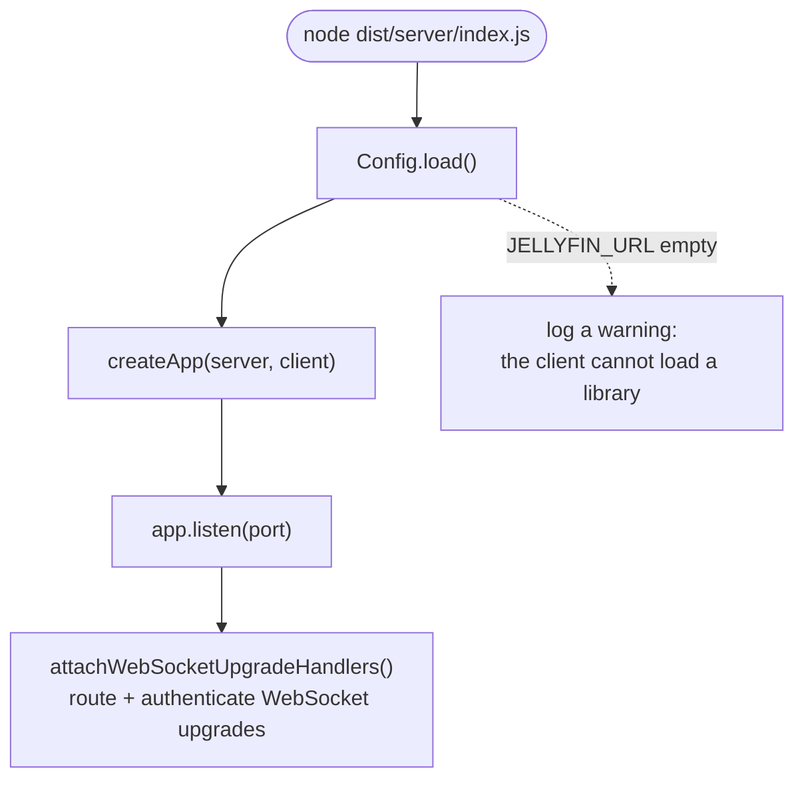
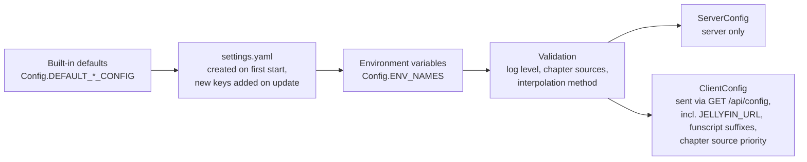
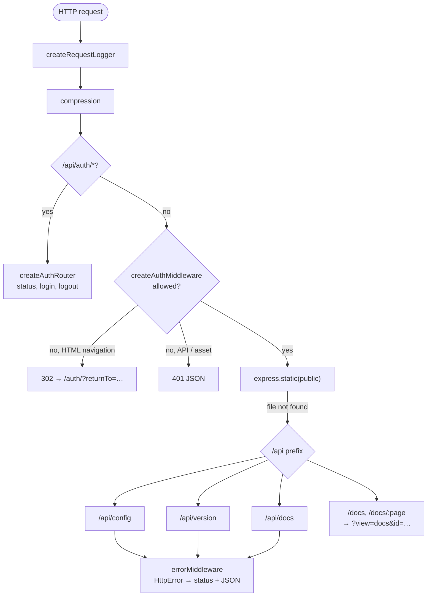
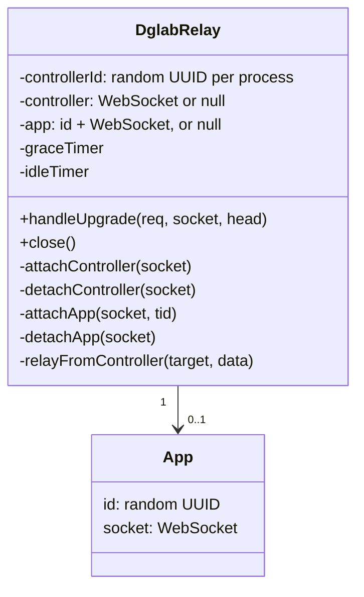

[← Developer Guide](README.md)

# Server

The server is an Express 5 app built by `createApp()` in [src/server/index.ts](../../src/server/index.ts). It serves the client, the client-visible configuration, the in-app docs, HAPPY's optional password gate and the DG-Lab relay. It has no media library: the browser loads the library and streams from Jellyfin (see [client.md](client.md#jellyfin-data-layer)), and funscripts come from the [Jellyfin plugin](jellyfin-plugin.md).

It has no database. All state lives in:

- `settings.yaml` and `tokens.txt` in the config directory,
- memory: the login throttle, the relay sessions.

## Startup

`main()` is skipped when `NODE_ENV` contains `test`, so tests can call `createApp()` directly with a temporary config directory.

### Configuration precedence

Later sources win. `CONFIG_PATH` selects the config directory, and settings with no YAML key (`configDir`) come from the environment only. After changing an option, run `npm run docs:env` to regenerate the table in `docs/configuration.md`.

## Request pipeline

Every HTTP request passes through the middleware in this order. The order matters: auth routes and static assets for the login page must work without a token.

A request is allowed if **one** of these is true (see `createAuthMiddleware`):

1. No password is configured. The middleware then passes everything through and logs a warning at startup.
2. The path starts with a public prefix: `/api/auth`, `/auth`, `/vendor`, `/icon.svg`, `/favicon.ico`.
3. The `happy_token` cookie is a token in `tokens.txt`.

Media never passes this gate: streams, artwork and funscripts come from Jellyfin and are authorized by the Jellyfin token, which is also what lets Chromecast/AirPlay receivers stream (`api_key` in the URL).

### Routes

| Prefix | Router | Purpose |
| --- | --- | --- |
| `/api/auth` | `routes/auth.ts` | `GET /status`, `POST /login` (throttled), `POST /logout` |
| `/api/config` | `routes/config.ts` | Client defaults (`ClientSettings`), including `jellyfinUrl`, `funscriptSuffixes` and `chapterSourcePriority` |
| `/api/version` | `routes/version.ts` | Version and commit |
| `/api/docs` | `routes/docs.ts` | Lists and serves top-level `docs/*.md` for the in-app help. Subfolders such as `docs/developer/` are never listed |
| `/ws/dglab` | `services/dglabRelay.ts` | WebSocket upgrade, only when `DGLAB_ENABLED` |

## Authentication

This is HAPPY's own, optional password gate (`PASSWORD`). Access to media is the Jellyfin sign-in, which lives entirely in the client.

Passwords are compared in constant time. On success the server issues a random token, stores it in `tokens.txt` with a timestamp and the user agent, and sets it as an `httpOnly`, `SameSite=Lax` cookie that lasts 10 years. Logout deletes the token from the file. `tokenStore` re-reads the file when its mtime changes, so you can revoke a session by removing its line by hand.

The full flow is in [Log in](use-cases/login.md).

### WebSocket upgrades

Express middleware never runs on WebSocket upgrades, so `attachWebSocketUpgradeHandlers()` in `index.ts` is the single `upgrade` listener on the HTTP server. It maps paths to handlers, answers unknown paths with 404, and requires a valid session cookie (401 otherwise) whenever a password is set. A route can mark some requests as public with `isPublic(req)` when they carry their own credential; the DG-Lab route does this for app connections with a `tid`. Handlers therefore receive only routed, authenticated requests. To add a WebSocket service, register another path there instead of adding a second `upgrade` listener.

## DG-Lab relay

The relay is protocol-agnostic. It knows one **controller** (the browser tab) and one **app** (the DG-Lab app) and forwards `message` frames between them. Its state:

- HAPPY is single-user, so there is one controller slot. Any authenticated tab takes it over (the old socket is closed as `replaced`), so reloads and switching devices keep the paired app. The id changes on server restart.
- An app connects with `?tid=<controllerId>`. Because the id is unguessable, it acts as the app's credential. Cookie checks for the controller happen in the upgrade dispatcher, not in the relay.
- Timers: a heartbeat every 30 s, a native WebSocket ping every 10 s (a peer missing 3 pongs in a row is terminated, which runs the normal detach path), a 5 min grace period after the controller disconnects (`Config.DGLAB_DETACH_GRACE_MS`, defined in `src/shared/dglab.ts` so the client's auto-reconnect uses the same window), and a 5 min idle timeout while no app is attached.

The full sequence is in [Pair a DG-Lab Coyote](use-cases/coyote-pairing.md).

## Code map

| Topic | Files |
| --- | --- |
| Startup, pipeline | [src/server/index.ts](../../src/server/index.ts) |
| Config | [src/server/config.ts](../../src/server/config.ts), [scripts/update-env-docs.js](../../scripts/update-env-docs.js) |
| Auth | [middleware/auth.ts](../../src/server/middleware/auth.ts), [middleware/loginThrottle.ts](../../src/server/middleware/loginThrottle.ts), [routes/auth.ts](../../src/server/routes/auth.ts), [services/tokenStore.ts](../../src/server/services/tokenStore.ts) |
| Client config, version, docs | [routes/config.ts](../../src/server/routes/config.ts), [routes/version.ts](../../src/server/routes/version.ts), [routes/docs.ts](../../src/server/routes/docs.ts) |
| Logging | [middleware/requestLog.ts](../../src/server/middleware/requestLog.ts), [utils/logger.ts](../../src/server/utils/logger.ts) |
| Relay | [services/dglabRelay.ts](../../src/server/services/dglabRelay.ts) |
