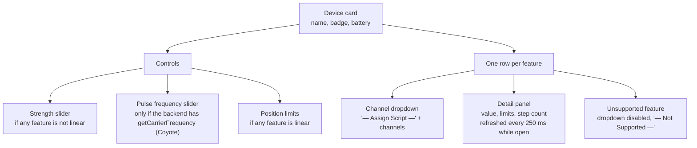
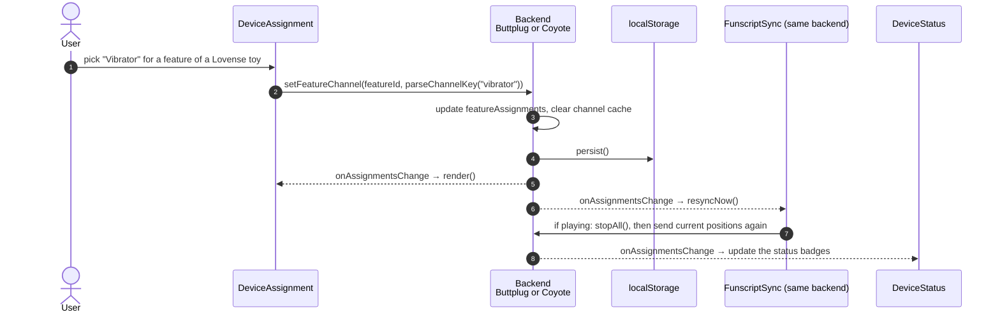
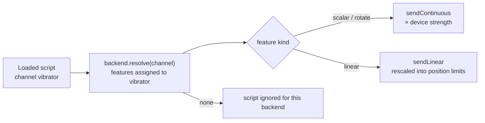

[← Developer Guide](../README.md)

# Use case: Assign a device feature to a channel

**Goal:** the user decides which part of which toy follows which funscript. For example, a vibrator follows the `vibrator` script, a stroker follows `stroker`, and Coyote channel A follows `estim:nipples`.

Precondition: a backend is connected and has at least one device. See [Connect Intiface](intiface-pairing.md) or [Pair a DG-Lab Coyote](coyote-pairing.md).

## The device card

Each backend has its own `DeviceAssignment` instance that renders one card per device.

The dropdown offers the base types (`FUNSCRIPT_TYPES`: `stroker`, `buttplug`, `vibrator`, `estim`, `machine`, `unknown`) plus every sub channel the **current track** has. A file `song.estim.nipples.funscript` becomes the channel key `estim:nipples`, shown as "E-Stim — Nipples". The sub channels come from `App.publishChannels()`, which runs on every track change.

## Sequence

Strength, pulse settings and position limits skip the event: the backend stores the value and uses it on the next command it sends.

## What is stored where

| Setting | Scope | localStorage key |
| --- | --- | --- |
| Intiface feature → channel | per feature id `deviceName#kind#index` | `happy-feature-assignments` |
| Intiface strength | per device name | `happy-device-strengths` |
| Intiface position limits | per device name (defaults to 0–100 %) | `happy-stroker-ranges` |
| Coyote channel → funscript channel | per feature id (Ch. A / Ch. B of one Coyote) | `happy-dglab-assignments` |
| Coyote strength | per Coyote (both channels) | `happy-dglab-strengths` |
| Coyote pulse frequency (Hz) | per Coyote (both channels) | `happy-dglab-pulse-rate` |

## How assignments are used at playback

A script whose channel has no assigned feature is simply ignored. A sub channel like `estim:nipples` matches only features assigned to exactly that key, not features assigned to plain `estim`.

## Code map

| Step | Files |
| --- | --- |
| Card, sliders, dropdown | [haptic/deviceAssignment.ts](../../../src/client/components/haptic/deviceAssignment.ts), [haptic/templates.ts](../../../src/client/components/haptic/templates.ts) |
| Channel keys and labels | [src/shared/haptics.ts](../../../src/shared/haptics.ts) |
| Intiface storage and output | [haptic/buttplugClient.ts](../../../src/client/components/haptic/buttplugClient.ts) |
| Coyote storage and output | [haptic/dglab/coyoteBackend.ts](../../../src/client/components/haptic/dglab/coyoteBackend.ts) |
| Status badges | [haptic/deviceStatus.ts](../../../src/client/components/haptic/deviceStatus.ts) |
| Channel publishing | `publishChannels` in [src/client/index.ts](../../../src/client/index.ts) |
