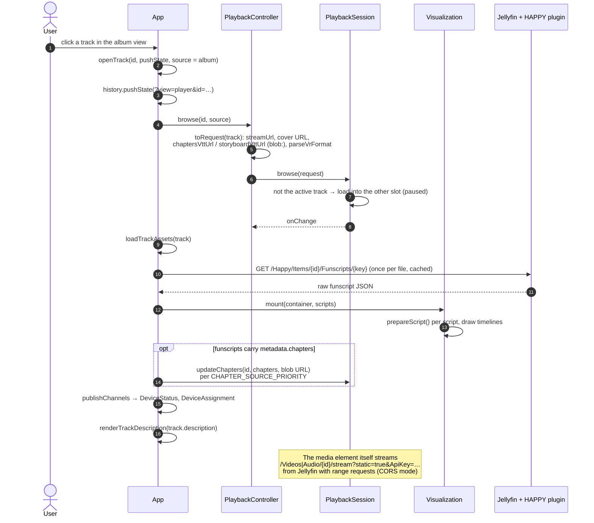
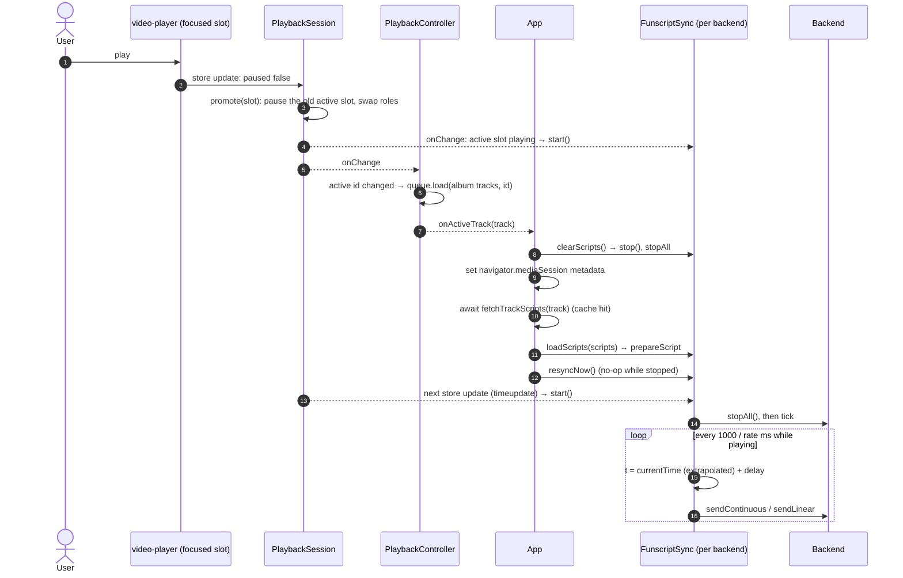
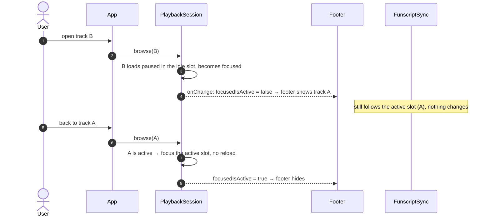
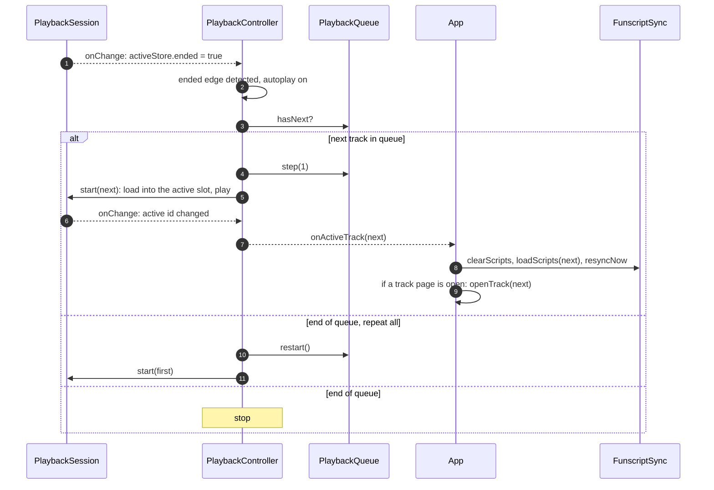

[← Developer Guide](../README.md)

# Use case: Browse and play a track

**Goal:** the user opens a track from an album, presses play and their toy follows the funscript. Then they browse to another track while the first keeps playing, and finally the album continues with the next track automatically.

For the background, read [client.md → two-player model](../client.md#the-two-player-model) first.

## 1. Open a track page

Browsing never touches what is currently playing. The new track loads **paused** into the slot that is not active.

## 2. Press play

Playing is what makes a slot **active**, and becoming active is what makes haptics follow it.

Session listeners run in registration order. The Intiface `FunscriptSync` subscribes before `PlaybackController`, so when switching from one playing track to another it may start with the **previous** track's scripts until `onActiveTrackChanged` clears them. The engine then restarts on the next store update. Keep this in mind when you change the wiring.

## 3. Browse elsewhere while it plays

## 4. Track ends, next one starts

Repeat-one does not go through the controller at all: it sets `loop` on the media element (`PlaybackSession.setLoop`).

## Code map

| Step | Files |
| --- | --- |
| Track page, asset loading | `openTrack`, `loadTrackAssets`, `fetchTrackScripts`, `applyFunscriptChapters`, `onActiveTrackChanged` in [src/client/index.ts](../../../src/client/index.ts) |
| URLs and WebVTT | [src/client/api.ts](../../../src/client/api.ts), [jellyfin/urls.ts](../../../src/client/jellyfin/urls.ts) |
| Slots and handoff | [player/session.ts](../../../src/client/components/player/session.ts) |
| Queue and autoplay | [player/controller.ts](../../../src/client/components/player/controller.ts), [player/queue.ts](../../../src/client/components/player/queue.ts) |
| Footer | [player/footer.ts](../../../src/client/components/player/footer.ts) |
| Timelines | [haptic/visualization/index.ts](../../../src/client/components/haptic/visualization/index.ts) |
| Device output | [funscriptSync.ts](../../../src/client/components/funscriptSync.ts), [haptics.md](../haptics.md) |
