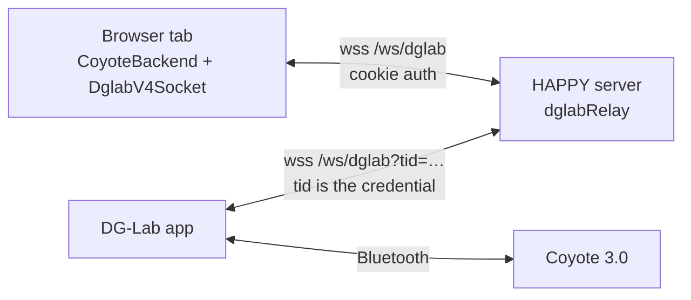
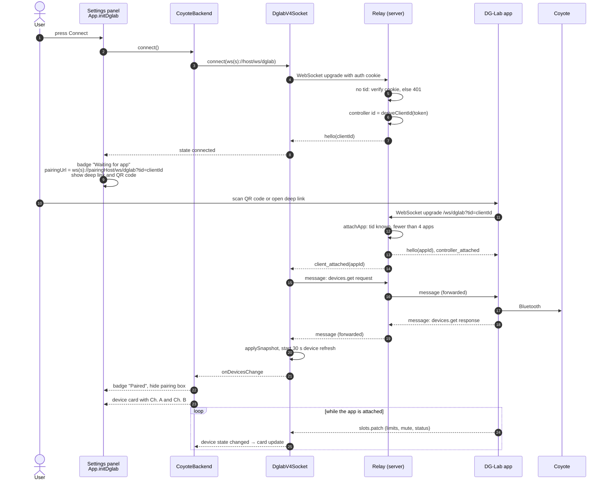
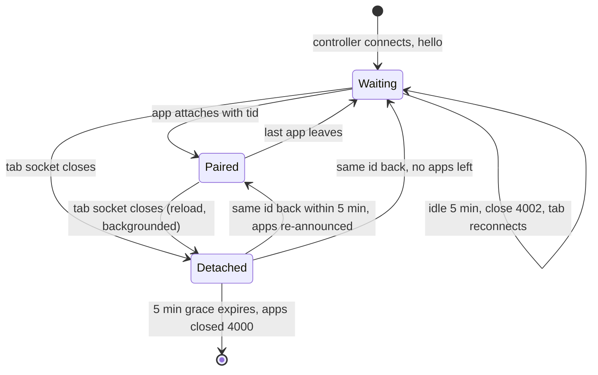

[← Developer Guide](../README.md)

# Use case: Pair a DG-Lab Coyote

**Goal:** the user connects a DG-Lab Coyote 3.0 so it follows e-stim scripts.

The Coyote talks Bluetooth only to the **DG-Lab app** on a phone. The app, in turn, connects to a WebSocket relay using the DG-Lab V4 socket protocol. HAPPY hosts that relay itself at `/ws/dglab`. The relay is a dumb passthrough: it pairs one browser tab (the **controller**) with up to four apps and forwards opaque frames. All haptic logic stays in the browser and all safety limits stay in the app.

## Preconditions

- `DGLAB_ENABLED=true`. Without it the server does not attach the relay, and the client removes the DG-Lab section from the settings panel (`App.initDglab`).
- The phone must reach the HAPPY server. When the browser uses `localhost`, the server cannot know its own LAN address, so the user enters the host in the pairing host field (`happy-dglab-pairing-host`).

## Sequence

Next, the user assigns Ch. A and Ch. B to e-stim channels. See [Assign a device feature](assign-feature.md). The output itself is described in [haptics.md → Coyote output](../haptics.md).

## Pairing UI states

| Badge | Condition | What the UI shows |
| --- | --- | --- |
| Disconnected | not connected | host field, Connect button |
| Connecting | socket opening | pairing URL field |
| Waiting for app | relay said hello, no app attached | pairing URL, deep link, QR code |
| Paired | at least one app attached and a device snapshot was received | device cards |
| Error | socket closed unexpectedly | reconnect runs automatically |

The deep link opens the DG-Lab app directly (`pairingDeepLink`). The QR code uses the format the app scans (`pairingQrPayload`). Both wrap the same pairing URL.

## The relay's view of a controller

The controller id is derived from the auth token, so a reloaded tab gets the **same** id and the phone does not have to pair again. Without authentication the id comes from the client address instead.

The grace period exists because switching to the DG-Lab app on a phone often backgrounds the browser, and mobile browsers may close its WebSocket. The relay keeps the slot so the `tid` the user just scanned still works.

The idle timeout is sent as an `idle_timeout` frame, but the client does not handle it specially. It sees a closed socket and reconnects with backoff, so in practice the controller stays registered while the tab is open.

## Errors and limits

| Situation | Result |
| --- | --- |
| Controller without a valid cookie (auth enabled) | HTTP 401 at the upgrade |
| Path other than `/ws/dglab` | HTTP 404 at the upgrade |
| App with an unknown `tid` | closed with 4001 `controller_not_found` |
| A fifth app on one controller | closed with 4001 `too_many_clients` |
| A ninth controller | closed with 4002 `too_many_controllers` |
| Same id connects again (second tab, same login) | the old socket is closed with 4000 `replaced` and does not reconnect |
| Frame over 64 KiB | connection closed by `ws` |
| Controller socket drops | client reconnects after 1 s, 2 s, 4 s … up to 15 s |
| Every 30 s | relay sends `heartbeat` to all sockets; while paired, the client re-requests the device list |

## Debugging

- Set `localStorage['happy-dglab-debug'] = 'true'` in the browser to log every frame (`[dglab] <-` / `->`).
- Server-side relay logs use the `[dglab]` tag at debug level.
- A channel that stays silent is usually muted or has a limit of 0 in the DG-Lab app. The backend logs a one-time warning for both.

## Code map

| Step | Files |
| --- | --- |
| Pairing UI | `initDglab` in [src/client/index.ts](../../../src/client/index.ts) |
| Backend, pairing URL, output | [haptic/dglab/coyoteBackend.ts](../../../src/client/components/haptic/dglab/coyoteBackend.ts) |
| Socket, reconnect, device refresh | [haptic/dglab/v4/socket.ts](../../../src/client/components/haptic/dglab/v4/socket.ts) |
| Deep link, QR payload | [haptic/dglab/v4/pairing.ts](../../../src/client/components/haptic/dglab/v4/pairing.ts) |
| Carrier waveform | [haptic/dglab/waveform.ts](../../../src/client/components/haptic/dglab/waveform.ts) |
| Relay | [src/server/services/dglabRelay.ts](../../../src/server/services/dglabRelay.ts) |
| Upgrade wiring | `attachUpgradeHandlers` in [src/server/index.ts](../../../src/server/index.ts) |
| User docs | [docs/dg-lab.md](../../dg-lab.md) |
