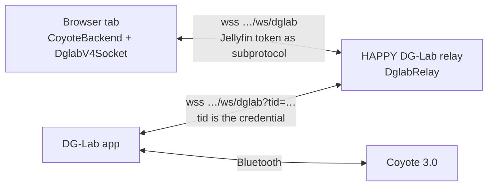
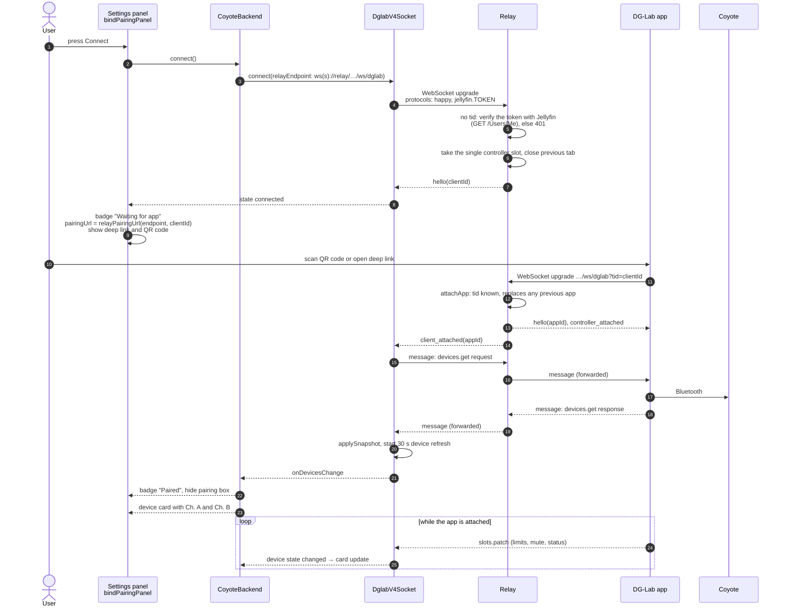
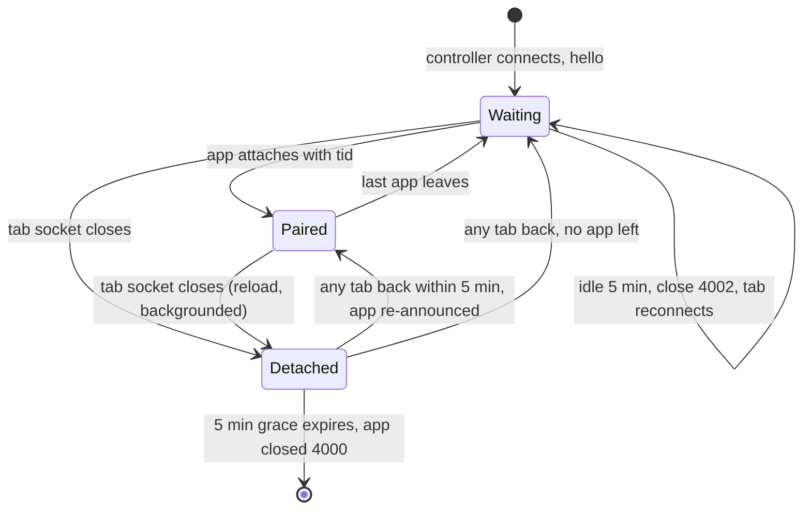

[← Developer Guide](../README.md)

# Use case: Pair a DG-Lab Coyote

**Goal:** the user connects a DG-Lab Coyote 3.0 so it follows e-stim scripts.

The Coyote talks Bluetooth only to the **DG-Lab app** on a phone. The app, in turn, connects to a WebSocket relay using the DG-Lab V4 socket protocol. HAPPY ships that relay as its own optional Docker image ([dglab-relay/](../../../dglab-relay/README.md)), reached at the `dglabRelayUrl` setting plus `/ws/dglab`. The relay is a dumb passthrough: it pairs one browser tab (the **controller**) with one app and forwards opaque frames. All haptic logic stays in the browser and all safety limits stay in the app.

## Preconditions

- The relay runs, and *Enable DG-Lab Coyote 3.0* (`dglabEnabled`) is on in the plugin settings. Without it the client removes the DG-Lab section from the settings panel and never opens a relay socket (`App.initDglab`).
- The browser reaches the relay at `relayEndpoint(dglabRelayUrl, location)`: the configured address with `/ws/dglab` appended, or `/ws/dglab` on the page's own origin when the setting is empty.
- The phone must reach the relay too. The pairing URL is that same endpoint; the plugin setting is the single source of truth and the client shows it read-only. When it is a loopback address there is no pairing URL and the panel tells the user to change *Relay address* in the plugin settings.

## Sequence

Next, the user assigns Ch. A and Ch. B to e-stim channels. See [Assign a device feature](assign-feature.md). The output itself is described in [haptics.md → Coyote output](../haptics.md).

## Pairing UI states

| Badge | Condition | What the UI shows |
| --- | --- | --- |
| Disconnected | not connected | host field, Connect button |
| Connecting | socket opening | pairing URL field |
| Waiting for app | relay said hello, no app attached | pairing URL, deep link, QR code |
| Paired | at least one app attached and a device snapshot was received | device cards |
| Error | socket closed unexpectedly | reconnect runs automatically |

The deep link opens the DG-Lab app directly (`pairingDeepLink`). The QR code uses the format the app scans (`pairingQrPayload`). Both wrap the same pairing URL.

## The relay's view of a controller

There is one controller slot with a random id created when the relay starts. Every tab signed in to Jellyfin gets that **same** id, so neither a reload nor switching to another device requires pairing again. A relay restart does.

The grace period exists because switching to the DG-Lab app on a phone often backgrounds the browser, and mobile browsers may close its WebSocket. The relay keeps the slot so the `tid` the user just scanned still works.

The idle timeout is sent as an `idle_timeout` frame, but the client does not handle it specially. It sees a closed socket and reconnects with backoff, so in practice the controller stays registered while the tab is open.

## Errors and limits

| Situation | Result |
| --- | --- |
| Controller without a valid Jellyfin token, or Jellyfin unreachable | HTTP 401 at the upgrade |
| Path not ending in `/ws/dglab` | HTTP 404 at the upgrade |
| App with an unknown `tid` | closed with 4001 `controller_not_found` |
| A second app connects | the old app is closed with 4000 `replaced`, the controller gets `client_disconnected` then `client_attached` |
| App connects while no controller exists (never connected, or grace expired) | closed with 4001 `controller_not_found` |
| Another tab or device connects | the old socket is closed with 4000 `replaced` and does not reconnect |
| Frame over 64 KiB | connection closed by `ws` |
| Controller socket drops | client reconnects after 1 s, 2 s, 4 s … up to 15 s |
| Every 30 s | relay sends `heartbeat` to all sockets; while paired, the client re-requests the device list |
| Every 10 s | relay sends a native WebSocket ping; a peer that misses 3 pongs is terminated and detached as if it had closed |

## Debugging

- Set `localStorage['happy-log'] = 'dglab=debug'` in the browser, or turn on *Debug output in the browser console* (`debugLogging`) in the plugin settings, to log every frame (`[dglab:socket] <-` / `->`).
- The relay logs connections under the `dglab:relay` tag when it runs with `LOG_LEVEL=debug`.
- A channel that stays silent is usually muted or has a limit of 0 in the DG-Lab app. The backend logs a one-time warning for both.

## Code map

| Step | Files |
| --- | --- |
| Pairing UI | [haptic/dglab/pairingPanel.ts](../../../src/client/components/haptic/dglab/pairingPanel.ts) |
| Backend, pairing URL, output | [haptic/dglab/coyoteBackend.ts](../../../src/client/components/haptic/dglab/coyoteBackend.ts) |
| Socket, reconnect, device refresh | [haptic/dglab/v4/socket.ts](../../../src/client/components/haptic/dglab/v4/socket.ts) |
| Deep link, QR payload | [haptic/dglab/v4/pairing.ts](../../../src/client/components/haptic/dglab/v4/pairing.ts) |
| Carrier waveform | [haptic/dglab/waveform.ts](../../../src/client/components/haptic/dglab/waveform.ts) |
| Relay address | `relayEndpoint`, `relayPairingUrl` in [haptic/dglab/coyoteBackend.ts](../../../src/client/components/haptic/dglab/coyoteBackend.ts), [src/shared/dglab.ts](../../../src/shared/dglab.ts) |
| Relay | [dglab-relay/src/relay.ts](../../../dglab-relay/src/relay.ts), [dglab-relay/README.md](../../../dglab-relay/README.md) |
| Upgrade wiring and auth | `createRelayServer` in [dglab-relay/src/server.ts](../../../dglab-relay/src/server.ts), [dglab-relay/src/jellyfinAuth.ts](../../../dglab-relay/src/jellyfinAuth.ts) |
| User docs | [docs/dg-lab.md](../../dg-lab.md) |
