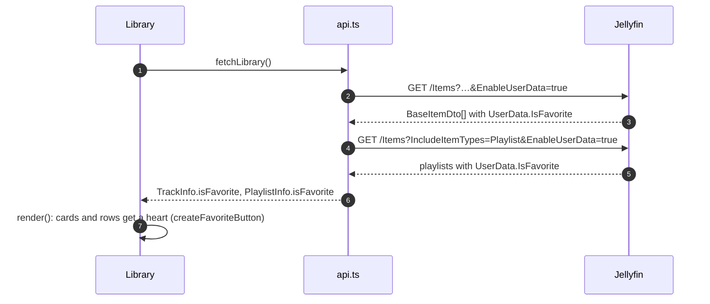
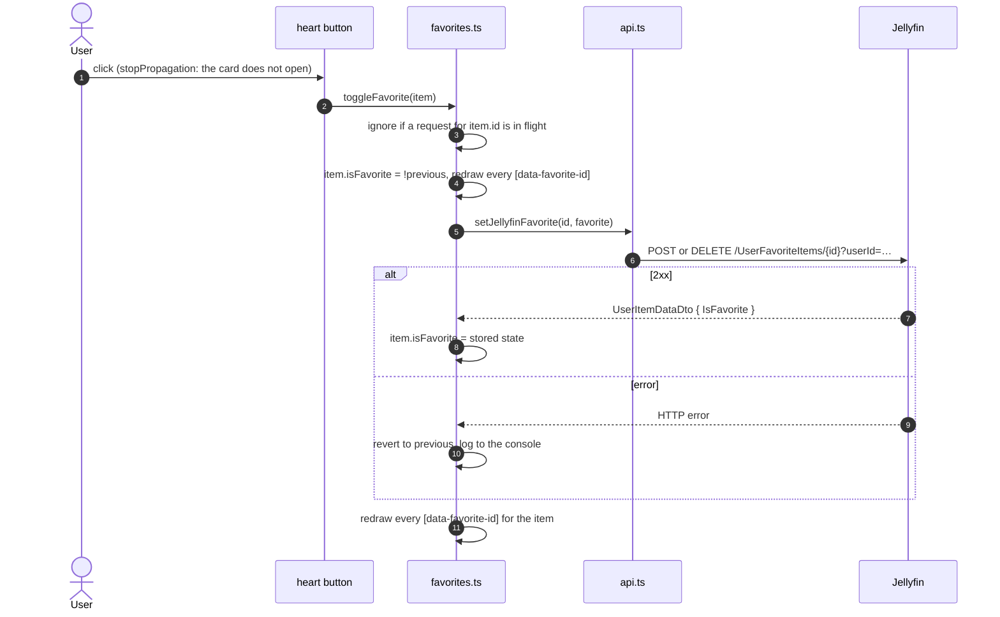

[← Developer Guide](../README.md)

# Use case: Mark a favorite

**Goal:** the user marks a video as a favorite in HAPPY, Jellyfin stores it, and the favorites filter shows it.

Favorites belong to the signed-in Jellyfin user. HAPPY keeps no copy of its own: it reads the flag with the library and writes changes straight back, so Jellyfin's own apps show the same hearts.

## 1. Favorites arrive with the library

## 2. Toggle the heart

The flag lives on the in-memory `TrackInfo`/`PlaylistInfo`, which the library, the player and the playlist page share. The player's heart is `<media-favorite-button>` in the Video.js control bar: it reads its slot's `data-track-id` and asks the `FavoriteTarget` the app published (`setFavoriteTarget()`); `renderAll()` calls `notifyFavoriteChanged()` so both slots redraw. The library is not re-rendered, so the grid does not jump; the favorites filter picks up the change on the next `render()`.

## 3. Filter

The heart next to the haptics dropdown sets `Library.favoritesOnly` (saved in `happy-library-filters`). `render()` then keeps favorite tracks, videos and playlists, and albums with at least one favorite track (`albumHasFavorite()`).

## Code map

| Step | Files |
| --- | --- |
| Loading and writing back | [jellyfin/library.ts](../../../src/client/jellyfin/library.ts), [jellyfin/mapper.ts](../../../src/client/jellyfin/mapper.ts), [api.ts](../../../src/client/api.ts) |
| Heart buttons | [components/library/favorites.ts](../../../src/client/components/library/favorites.ts), [videojs/ui/favorite-button.ts](../../../@/components/videojs/ui/favorite-button.ts), [videojs/features/favorite.ts](../../../@/components/videojs/features/favorite.ts), [components/library/index.ts](../../../src/client/components/library/index.ts), [components/library/detail.ts](../../../src/client/components/library/detail.ts), [index.ts](../../../src/client/index.ts) |
| Filter | [components/library/index.ts](../../../src/client/components/library/index.ts), [shared/libraryFiltering.ts](../../../src/shared/libraryFiltering.ts) |
