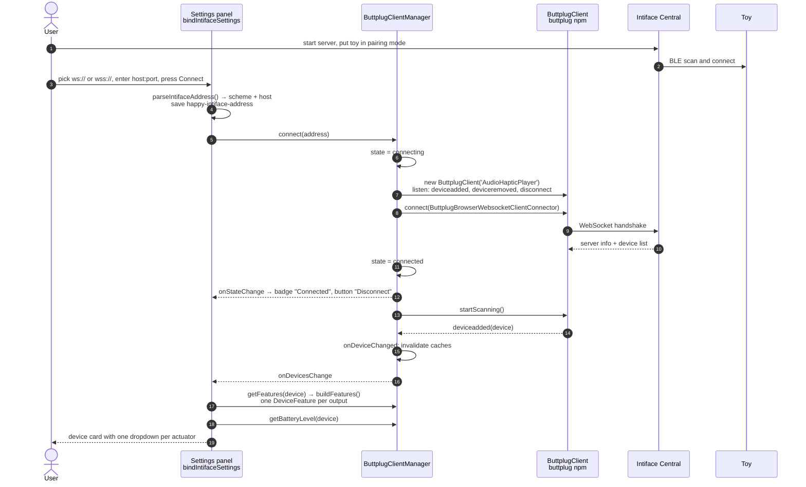
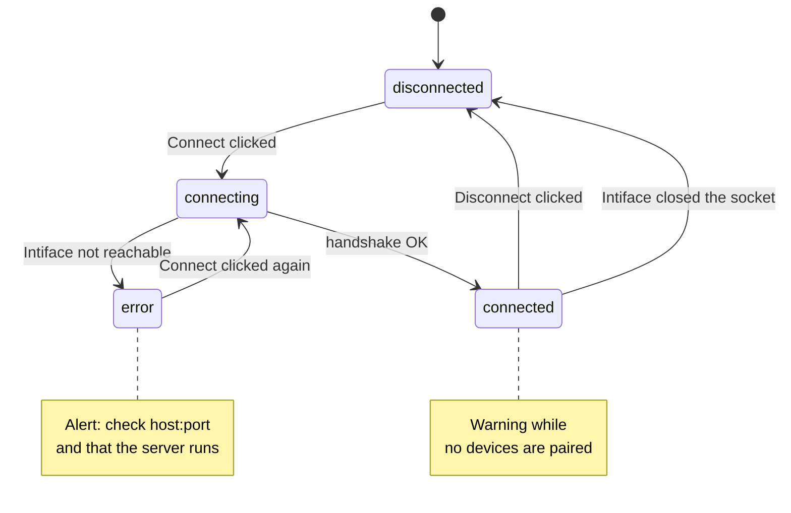
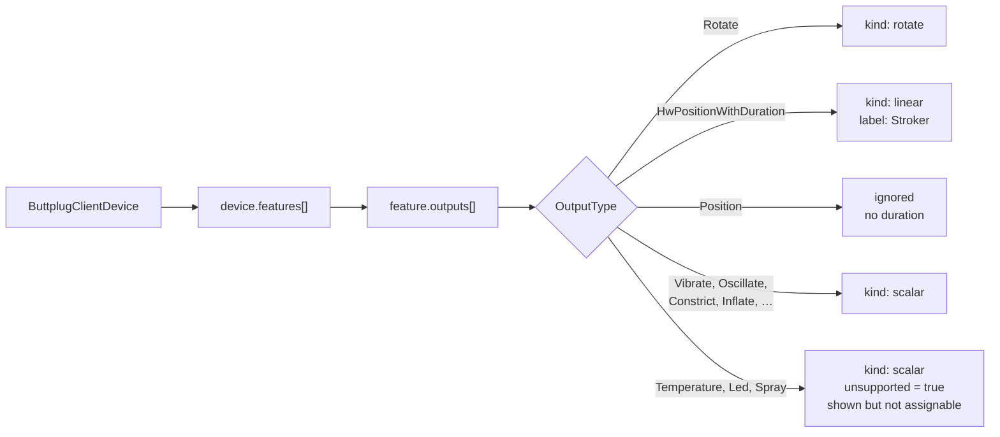

[← Developer Guide](../README.md)

# Use case: Connect Intiface and a toy

**Goal:** the user connects HAPPY to Intiface Central so their Bluetooth toy shows up in the settings panel.

HAPPY does not pair Bluetooth devices itself. Intiface Central does that, and the browser connects to Intiface over a WebSocket using the [buttplug](https://github.com/buttplugio/buttplug-js) library (v5). Neither Jellyfin nor the HAPPY plugin is involved.

## Sequence

After this the user assigns the actuators to channels. See [Assign a device feature](assign-feature.md).

## Connection states

There is **no automatic reconnect** and no auto-connect on page load. The user presses Connect each time. Leaving `connected` clears all device caches and the last sent values.

## How a Buttplug device becomes features

## Things to know

- The address must be reachable **from the browser**. `localhost` works only if Intiface runs on the same machine as the browser.
- `parseIntifaceAddress()` takes the scheme from the dropdown (default `ws://`) unless the host field itself starts with `ws://` or `wss://`. Browsers accept `ws://localhost` from an `https://` page, but block other `ws://` hosts as mixed content; use `wss://` (e.g. Intiface behind a TLS proxy) in that case.
- Assignments are keyed by device name, so the same toy keeps its assignments across reconnects and page reloads. Two toys with the same name share them.

## Code map

| Step | Files |
| --- | --- |
| Address input, Connect button, alerts | [settings/intiface.ts](../../../src/client/components/settings/intiface.ts), [utils/intifaceAddress.ts](../../../src/client/utils/intifaceAddress.ts) |
| Connection, features, output | [haptic/buttplugClient.ts](../../../src/client/components/haptic/buttplugClient.ts) |
| Device cards | [haptic/deviceAssignment.ts](../../../src/client/components/haptic/deviceAssignment.ts), [haptic/templates.ts](../../../src/client/components/haptic/templates.ts) |
| User docs | [docs/intiface.md](../../intiface.md) |
