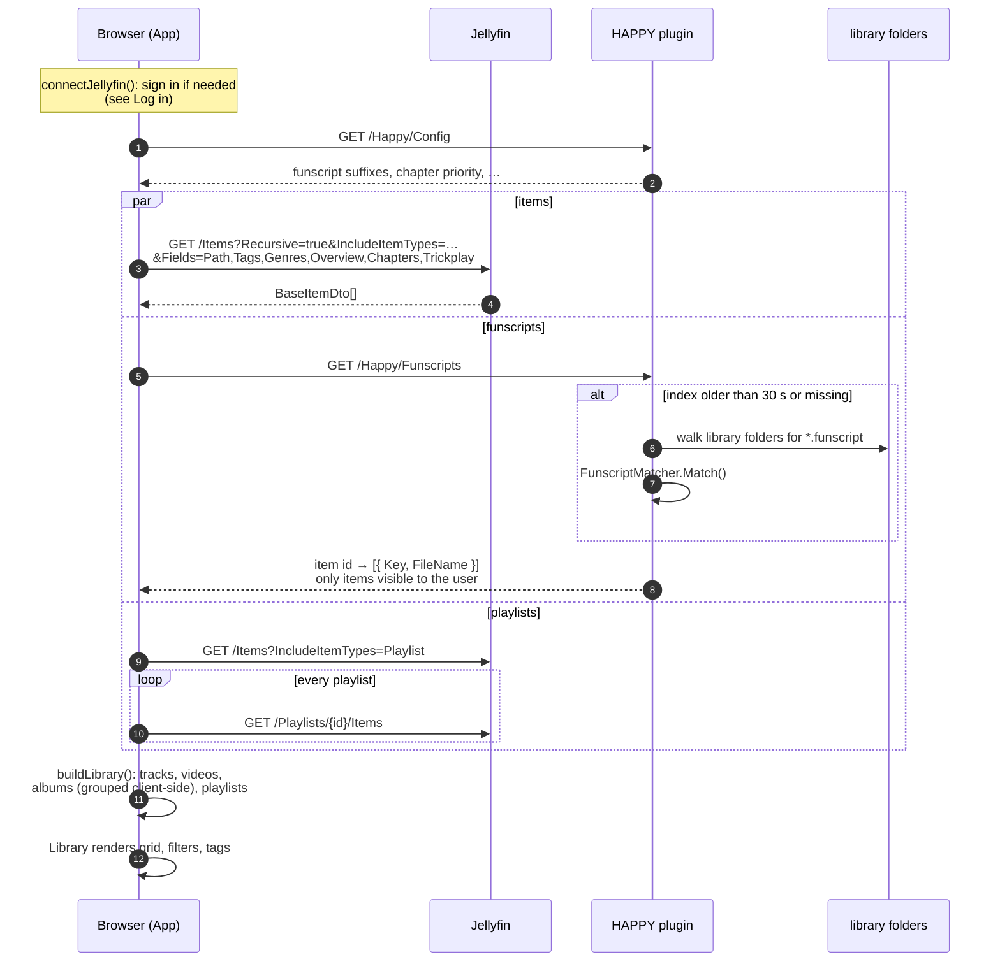
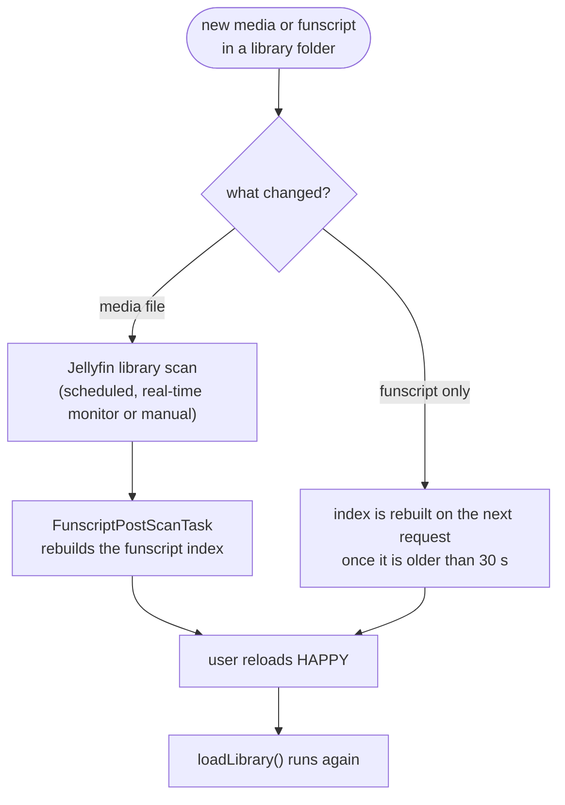

[← Developer Guide](../README.md)

# Use case: Load the library from Jellyfin

**Goal:** the user opens HAPPY and sees every audio and video item their Jellyfin user can access, with funscripts, tags, albums and playlists.

HAPPY does not scan anything. Jellyfin scans the files (on its own schedule or when you trigger a library scan); the HAPPY plugin indexes the funscripts next to them. The browser loads the result once per page load and keeps it in memory.

## Timeline

`buildLibrary()` in [mapper.ts](../../../src/client/jellyfin/mapper.ts) makes every item a `TrackInfo`:

- `MediaType` decides audio or video; anything else (folders, books) is skipped.
- `filename` is the basename of `Path`, used for VR detection and as the artist fallback.
- Tags are `Tags` ∪ `Genres`, the description is `Overview`, the cover is `ImageTags.Primary`.
- Funscript type and subcategory come from `parseFunscriptName()` with the configured suffixes.
- Embedded chapters are normalized when `embedded` is in the `chapterSourcePriority` setting. Funscript chapters follow later, when the track is opened (see [Browse and play a track](browse-and-play.md)).
- Trickplay picks the resolution closest to 320 px.

Albums are built by `buildAlbums()` ([shared/albums.ts](../../../src/shared/albums.ts)) from album artist + album, because Jellyfin only creates album entities for Music libraries. Playlist entries that are not playable items are dropped; playlists without entries disappear.

## When new files appear

| Situation | Behaviour |
| --- | --- |
| HAPPY plugin not installed | `/Happy/Funscripts` is 404; the library loads without funscripts and a warning is logged in the console |
| Jellyfin token revoked or expired | First request returns 401; `JellyfinConnection` forgets the session and reloads, which shows the sign-in card |
| Page not opened from `<jellyfin>/Happy/Web/` | The app shows a notice and does not load a library |
| User lacks access to a library | Jellyfin omits its items; the plugin omits their scripts |

## Code map

| Step | Files |
| --- | --- |
| Loader | [jellyfin/library.ts](../../../src/client/jellyfin/library.ts) |
| Mapping, albums | [jellyfin/mapper.ts](../../../src/client/jellyfin/mapper.ts), [shared/albums.ts](../../../src/shared/albums.ts), [shared/funscriptNames.ts](../../../src/shared/funscriptNames.ts), [shared/chapters.ts](../../../src/shared/chapters.ts) |
| Session | [jellyfin/connection.ts](../../../src/client/jellyfin/connection.ts) |
| Funscript index | [FunscriptIndex.cs](../../../jellyfin-plugin/Jellyfin.Plugin.Happy/Funscripts/FunscriptIndex.cs), [FunscriptMatcher.cs](../../../jellyfin-plugin/Jellyfin.Plugin.Happy/Funscripts/FunscriptMatcher.cs), [FunscriptPostScanTask.cs](../../../jellyfin-plugin/Jellyfin.Plugin.Happy/Funscripts/FunscriptPostScanTask.cs), [HappyController.cs](../../../jellyfin-plugin/Jellyfin.Plugin.Happy/Api/HappyController.cs) |
| Facade, rendering | [src/client/api.ts](../../../src/client/api.ts), [components/library/index.ts](../../../src/client/components/library/index.ts) |
