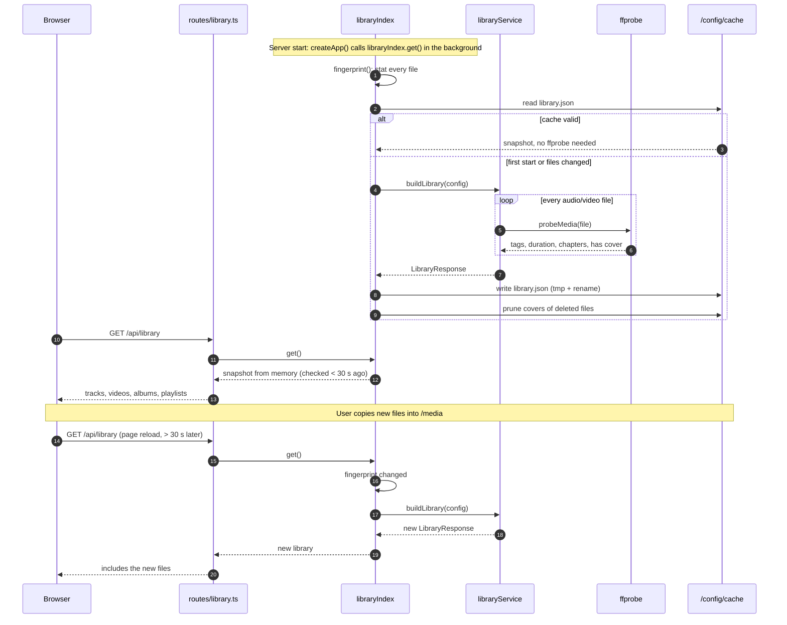
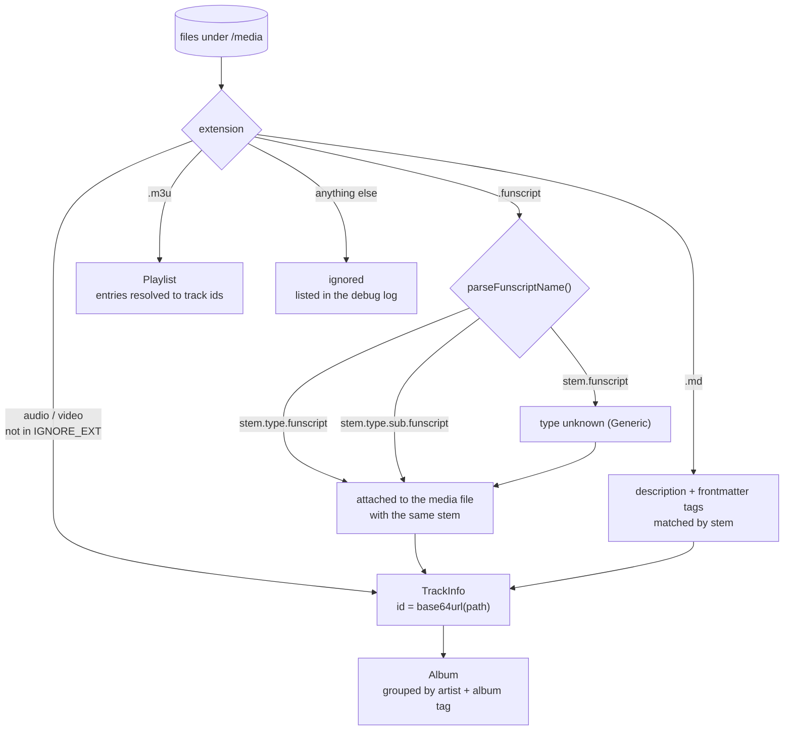

[← Developer Guide](../README.md)

# Use case: Scan the library

**Goal:** the user drops new files into the media folder and sees them in HAPPY without restarting the container.

There is no file watcher. The library is checked lazily, when a client asks for it.

## Timeline



## How files become library entries



## Forcing a rescan

Network shares sometimes don't update mtimes, so the fingerprint can miss changes. `POST /api/library/refresh` rebuilds unconditionally. There is no button for it in the UI, so call it with the session cookie, for example from the browser console:

```js
await fetch('api/library/refresh', { method: 'POST' }).then((r) => r.json());
```

Deleting `/config/cache/` also forces a full rebuild on the next request.

## What invalidates the cache

| Change | Detected by |
| --- | --- |
| File added, removed, renamed, resized, touched | media fingerprint (path, size, mtime) |
| `MEDIA_DIR`, `IGNORE_EXT`, funscript suffixes, `CHAPTER_SOURCE_PRIORITY` | config part of the fingerprint |
| Change to the cached JSON shape in code | bump `CACHE_FORMAT_VERSION` in `libraryIndex.ts` |
| Change to scan logic that doesn't change the shape | not detected. Bump `CACHE_FORMAT_VERSION` anyway |

## Code map

| Step | Files |
| --- | --- |
| Endpoint | [routes/library.ts](../../../src/server/routes/library.ts) |
| Cache, fingerprint | [services/libraryIndex.ts](../../../src/server/services/libraryIndex.ts) |
| Scan pipeline | [services/libraryService.ts](../../../src/server/services/libraryService.ts) |
| Metadata | [services/mediaProbe.ts](../../../src/server/services/mediaProbe.ts) |
| Albums, playlists | [services/albums.ts](../../../src/server/services/albums.ts), [services/playlists.ts](../../../src/server/services/playlists.ts) |
| Funscript names, chapters | [services/funscripts.ts](../../../src/server/services/funscripts.ts), [services/chapterService.ts](../../../src/server/services/chapterService.ts), [shared/chapters.ts](../../../src/shared/chapters.ts) |
| Covers | [services/artworkCache.ts](../../../src/server/services/artworkCache.ts) |
