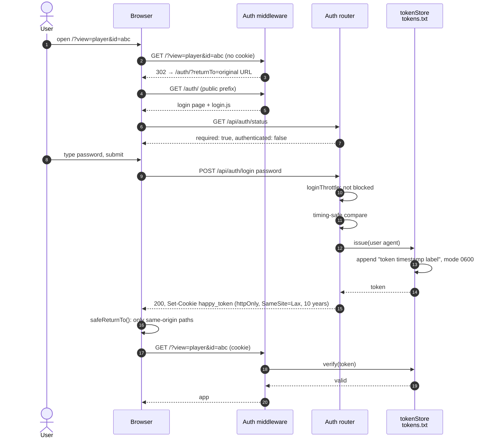

[← Developer Guide](../README.md)

# Use case: Log in

**Goal:** a user opens HAPPY on a new device, enters the password and lands on the page they asked for.

Authentication is on when `PASSWORD` is not empty. With an empty password, every request is allowed and `/api/auth/status` reports `required: false`.

## Happy path

## Other paths

| Situation | Behaviour |
| --- | --- |
| Already signed in and opens `/auth/` | `skipIfSignedIn()` sees `authenticated: true` and redirects to `returnTo` |
| An API call returns 401 later (token revoked) | `handleUnauthorized()` in `utils/api.ts` redirects to `/auth/?returnTo=…` once |
| Logout | `POST /api/auth/logout` → `tokenStore.revoke(token)` + clear cookie → login page |
| Admin revokes a device | Delete its line from `tokens.txt`. The store re-reads the file when its mtime changes |
| Chromecast / AirPlay | No cookie. `/api/config` hands out a per-process `mediaAccessToken`, which `mediaUrl()` appends as `?mediaToken=`. It only unlocks `GET`/`HEAD` on `/api/media/*` |
| DG-Lab relay | The browser's WebSocket upgrade carries the cookie. The app side uses the unguessable `tid` instead. See [Pair a DG-Lab Coyote](coyote-pairing.md) |

## Code map

| Step | Files |
| --- | --- |
| Gatekeeping | [middleware/auth.ts](../../../src/server/middleware/auth.ts) |
| Login, logout, status | [routes/auth.ts](../../../src/server/routes/auth.ts), [middleware/loginThrottle.ts](../../../src/server/middleware/loginThrottle.ts) |
| Token persistence | [services/tokenStore.ts](../../../src/server/services/tokenStore.ts) |
| Login page | [src/client/login.ts](../../../src/client/login.ts), [public/auth/index.html](../../../public/auth/index.html) |
| 401 handling in the app | [src/client/utils/api.ts](../../../src/client/utils/api.ts) |
