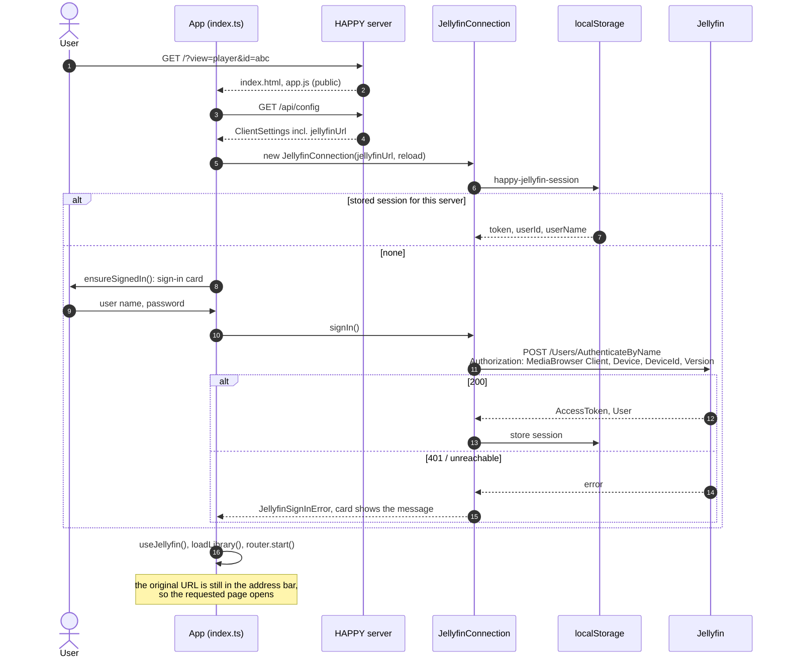
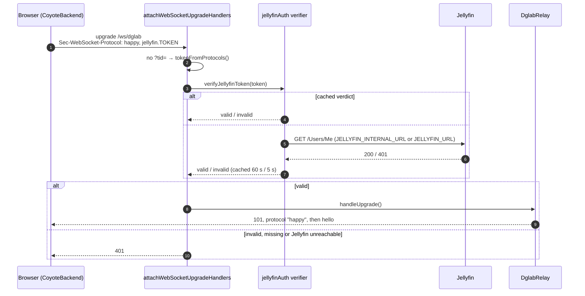

[← Developer Guide](../README.md)

# Use case: Log in

**Goal:** a user opens HAPPY on a new device, signs in with their Jellyfin account and lands on the page they asked for.

There is exactly one sign-in: Jellyfin's. The HAPPY server keeps no accounts. It serves the shell, `/api/config`, `/api/version` and `/api/docs` without authentication because none of them holds media; media, artwork and funscripts come from Jellyfin and need the user's token.

## Sign in

| Situation | Behaviour |
| --- | --- |
| No `JELLYFIN_URL` configured | `connectJellyfin()` shows `showMissingServerNotice()` and stops; nothing else loads |
| Token rejected later (401) | `JellyfinConnection.request()` forgets the session and reloads; the sign-in card appears again |
| Session ended in Jellyfin (*Dashboard → Devices*) or user removed | The next request gets a 401, see above |
| Logout | The lock button runs `logout()` → `POST /Sessions/Logout` to Jellyfin, then a reload, which shows the card |
| Chromecast / AirPlay | The stream URL carries the Jellyfin token as `api_key`, so receivers need no sign-in of their own |
| Device list | `DeviceId` is a random id stored once per browser (`happy-jellyfin-device-id`), so Jellyfin lists one device per browser |

## DG-Lab relay

The relay is the only HAPPY server feature that needs a signed-in user. `initDglab()` runs after the sign-in, so `CoyoteBackend` can hand the token to every relay connection.

The relay's `handleProtocols` selects `happy`, so the token is never echoed in the handshake, and because it travels as a subprotocol it never appears in a URL or a log. DG-Lab apps connect with `?tid=` and no token; the unguessable `tid` is their credential (see [Pair a DG-Lab Coyote](coyote-pairing.md)).

## Code map

| Topic | Files |
| --- | --- |
| Session, sign-in, sign-out | [jellyfin/connection.ts](../../../src/client/jellyfin/connection.ts), [jellyfin/signIn.ts](../../../src/client/jellyfin/signIn.ts), [jellyfin/signIn.html](../../../src/client/jellyfin/signIn.html) |
| App wiring, logout button | [src/client/index.ts](../../../src/client/index.ts) (`connectJellyfin`, `bindLogout`), [src/client/api.ts](../../../src/client/api.ts) (`logout`) |
| Relay token check | [src/server/index.ts](../../../src/server/index.ts) (`attachWebSocketUpgradeHandlers`, `tokenFromProtocols`), [services/jellyfinAuth.ts](../../../src/server/services/jellyfinAuth.ts), [src/shared/dglab.ts](../../../src/shared/dglab.ts) |
| Relay side of the browser | [dglab/coyoteBackend.ts](../../../src/client/components/haptic/dglab/coyoteBackend.ts) |
| Tests | [test/server/jellyfinAuth.test.ts](../../../test/server/jellyfinAuth.test.ts), [test/server/dglabRelay.test.ts](../../../test/server/dglabRelay.test.ts), [test/integration/jellyfin/dglab.test.ts](../../../test/integration/jellyfin/dglab.test.ts) |
