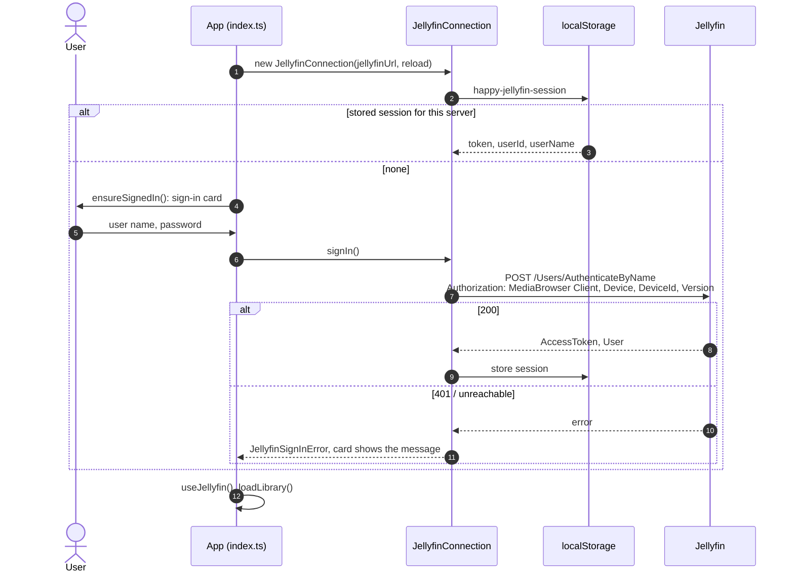
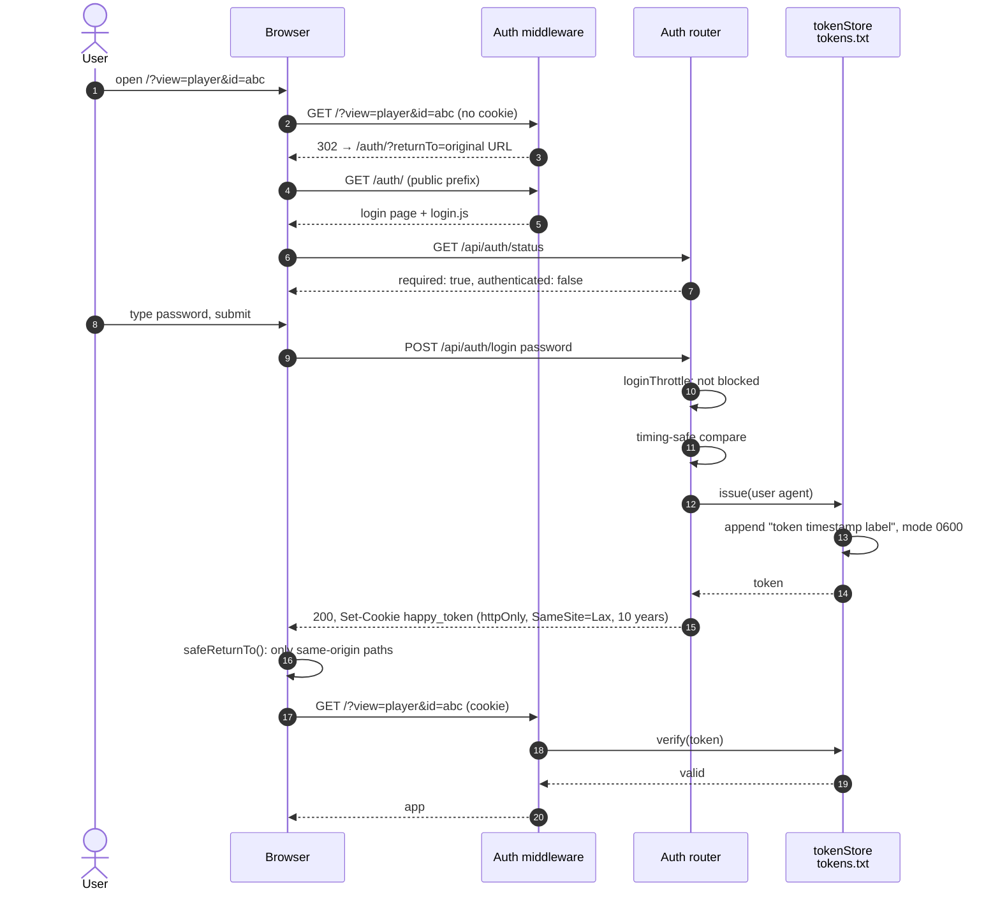
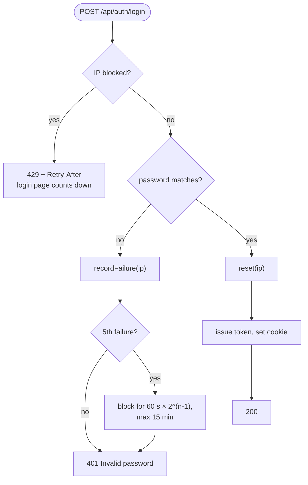

[← Developer Guide](../README.md)

# Use case: Log in

**Goal:** a user opens HAPPY on a new device, signs in and lands on the page they asked for.

There are two sign-ins:

1. **HAPPY's password** (`PASSWORD`) guards the HAPPY page itself. It is on when `PASSWORD` is not empty. With an empty password, every request to the HAPPY server is allowed and `/api/auth/status` reports `required: false`.
2. **The Jellyfin sign-in** gives access to media, artwork and funscripts. It always applies.

## Jellyfin sign-in

| Situation | Behaviour |
| --- | --- |
| Token rejected later (401) | `JellyfinConnection.request()` forgets the session and reloads; the card appears again |
| Logout | `logout()` → `POST /Sessions/Logout` to Jellyfin, then HAPPY's own logout when `PASSWORD` is on, otherwise a reload |
| Chromecast / AirPlay | The stream URL carries the Jellyfin token as `api_key`, so receivers need no cookie |
| Device list | `DeviceId` is a random id stored once per browser (`happy-jellyfin-device-id`), so Jellyfin lists one device per browser |

## HAPPY password: happy path

## HAPPY password: other paths

| Situation | Behaviour |
| --- | --- |
| Already signed in and opens `/auth/` | `skipIfSignedIn()` sees `authenticated: true` and redirects to `returnTo` |
| An API call returns 401 later (token revoked) | `handleUnauthorized()` in `api.ts` redirects to `/auth/?returnTo=…` once |
| Logout | Jellyfin sign-out first, then `POST /api/auth/logout` → `tokenStore.revoke(token)` + clear cookie → login page |
| Admin revokes a device | Delete its line from `tokens.txt`. The store re-reads the file when its mtime changes |
| DG-Lab relay | The browser's WebSocket upgrade carries the cookie. The app side uses the unguessable `tid` instead. See [Pair a DG-Lab Coyote](coyote-pairing.md) |

## Code map

| Step | Files |
| --- | --- |
| Gatekeeping | [middleware/auth.ts](../../../src/server/middleware/auth.ts) |
| Login, logout, status | [routes/auth.ts](../../../src/server/routes/auth.ts), [middleware/loginThrottle.ts](../../../src/server/middleware/loginThrottle.ts) |
| Token persistence | [services/tokenStore.ts](../../../src/server/services/tokenStore.ts) |
| Login page | [src/client/login.ts](../../../src/client/login.ts), [public/auth/index.html](../../../public/auth/index.html) |
| 401 handling in the app | [src/client/api.ts](../../../src/client/api.ts) |
| Jellyfin sign-in | [jellyfin/connection.ts](../../../src/client/jellyfin/connection.ts), [jellyfin/signIn.ts](../../../src/client/jellyfin/signIn.ts), [src/client/index.ts](../../../src/client/index.ts) (`connectJellyfin`, `bindLogout`) |
