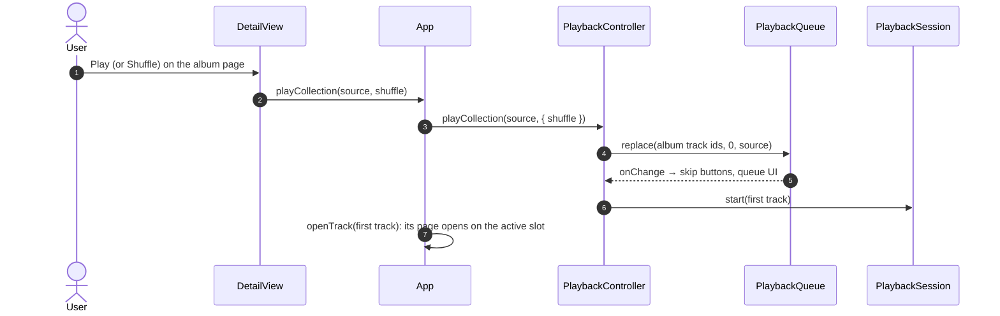
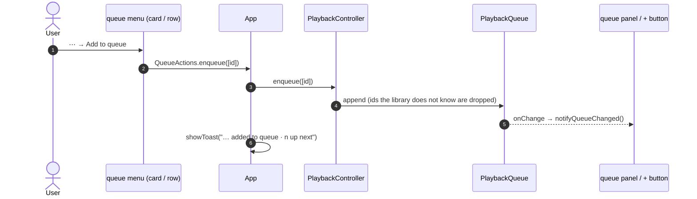
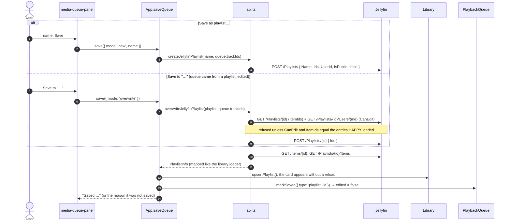

[← Developer Guide](../README.md)

# Use case: Queue and save as a playlist

**Goal:** the user starts an album, adds a video from the library, reorders what is up next in the player and saves the queue as a Jellyfin playlist.

The rules the queue follows are in [ARCHITECTURE.md](../../../ARCHITECTURE.md#playback-queue). In short: only `PlaybackController` changes `PlaybackQueue`; albums and playlists seed it, everything after that edits it.

## 1. An album seeds the queue



Pressing play on a file page works the same way through `PlaybackController.onSessionChange()`: the page remembers where it was opened from (`browse(id, source, index)`), and `applyStart()` either loads that album/playlist at the row's index or, for a file opened on its own, calls `PlaybackQueue.playNow()` so the rest of the queue stays.

## 2. Add from the library



"Play next" is the same with `insertNext()`. The **+** in the player of a browsed (not playing) file goes through `QueueTarget.enqueue()` instead of the menu; it reads the track from its own `<video-player>`'s `data-track-id` and shows a check while `placeOf(id)` is `upcoming`.

## 3. Reorder in the player

The queue button and `<media-queue-panel>` are part of the Video.js skin, so every player slot has them; the panel opens in a `media-popover` (top layer, works in fullscreen) and closes itself when its player is hidden.

```mermaid
sequenceDiagram
  autonumber
  actor U as User
  participant P as media-queue-panel
  participant T as QueueTarget (player/queueTarget.ts)
  participant PC as PlaybackController
  participant Q as PlaybackQueue

  U->>P: drag an entry by its handle (or Alt+↑/↓)
  P->>P: the row follows the pointer in the DOM; no re-render while dragging
  U->>P: release
  P->>T: moveUpcoming(from, to)
  T->>PC: moveUpcoming(from, to)
  PC->>Q: moveUpcoming(from, to) → edited = true
  Q-->>P: onChange → render from getState()
```

Clicking an entry calls `jumpTo(uid)`: entries are addressed by `uid`, never by track id, so a track queued twice is unambiguous.

## 4. Save as a playlist



Saves always send the full, ordered list. Jellyfin's `Move` and `DELETE /Playlists/{id}/Items?entryIds=` address entries by an id two copies of the same item share, so incremental edits could hit the wrong copy.

## Code map

| Step | Files |
| --- | --- |
| Queue model and rules | [player/queue.ts](../../../src/client/components/player/queue.ts), [player/controller.ts](../../../src/client/components/player/controller.ts) |
| Player UI | [videojs/features/queue.ts](../../../@/components/videojs/features/queue.ts), [videojs/ui/queue.ts](../../../@/components/videojs/ui/queue.ts), [player/queueTarget.ts](../../../src/client/components/player/queueTarget.ts), [videojs/video/skin.html](../../../@/components/videojs/video/skin.html) |
| Library entry points | [components/library/queueMenu.ts](../../../src/client/components/library/queueMenu.ts), [components/library/detail.ts](../../../src/client/components/library/detail.ts), [utils/toast.ts](../../../src/client/utils/toast.ts), [index.ts](../../../src/client/index.ts) |
| Saving | [jellyfin/playlists.ts](../../../src/client/jellyfin/playlists.ts), [api.ts](../../../src/client/api.ts), [index.ts](../../../src/client/index.ts) |
| Tests | [test/client/queue.test.ts](../../../test/client/queue.test.ts), [test/client/controller.test.ts](../../../test/client/controller.test.ts), [test/client/queueTarget.test.ts](../../../test/client/queueTarget.test.ts), [test/integration/jellyfin/playlists.test.ts](../../../test/integration/jellyfin/playlists.test.ts) |
