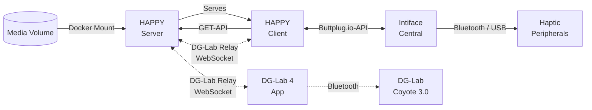

# Documentation

- [Installation](installation.md) — Docker Compose, volumes, authentication, reverse proxy
- [Intiface Central](intiface.md) — connecting haptic toys
- [DG-Lab Coyote 3.0](dg-lab.md) — experimental direct support
- [Library Setup](library.md) — file layout, funscripts, playlists, tags and descriptions
- [Configuration](configuration.md) — `settings.yaml`, environment variables, logging

## Overview

