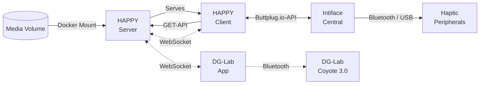

# Documentation

- [Installation](installation.md) — Docker Compose, volumes, authentication, reverse proxy
- [Configuration](configuration.md) — Description of available settings / environment variables
- [Authentication](authentication.md) — Explanation of simple token-based authentication system
- [Media Library](library.md) — file layout, funscripts, playlists, tags and descriptions
- [Intiface Central Integration](intiface.md) — connecting haptic toys
- [*(Experimental)* DG-Lab Coyote 3.0](dg-lab.md) — connecting vendor-specific e-stim toys

## Architecture

```mermaid
flowchart LR
  Media[(Media Volume)]
  Client[HAPPY\nClient]
  HAPPY[HAPPY\nServer]
  Intiface[Intiface\nCentral]
  Toys[Haptic\nPeripherals]
  DGLab[DG-Lab\nApp]
  Coyote[DG-Lab\nCoyote 3.0]

  Client -->|GET-API| HAPPY
  HAPPY -->|Serves| Client
  Client <-->|Buttplug.io-API| Intiface
  Intiface -->|Bluetooth / USB| Toys
  Media -->|Docker Mount| HAPPY
  Client <-.->|WebSocket| HAPPY
  HAPPY <-.->|WebSocket| DGLab
  DGLab -.->|Bluetooth| Coyote
```
